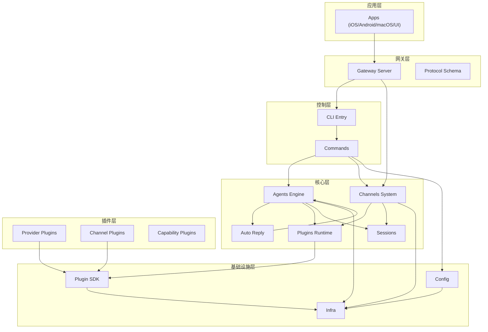
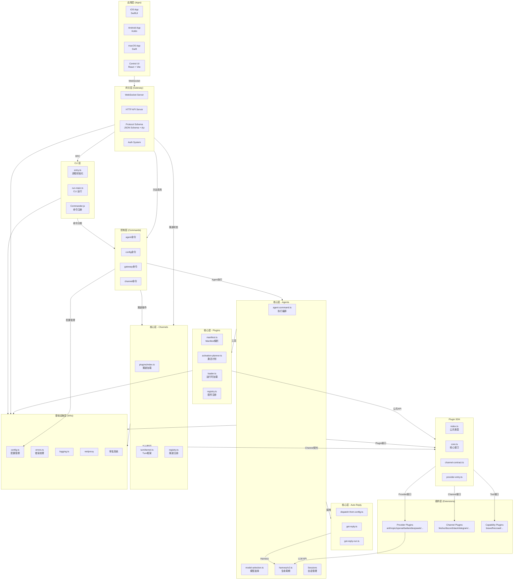
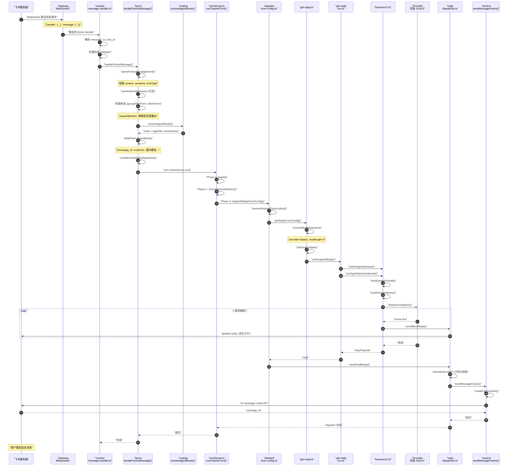

# 项目架构分析（OpenClaw）

> 本文档基于 OpenClaw 项目真实代码路径进行深度分析，用于后续学习和二次开发。
>
> 分析日期：2026-05-03 | 版本：2026.5.3

---

## 1. 项目概览

### 1.1 项目类型

OpenClaw 是一个**多类型复合项目**：

| 类型            | 说明                                      | 入口                            |
| --------------- | ----------------------------------------- | ------------------------------- |
| **CLI**         | 命令行工具，提供完整的管理和运维能力      | `openclaw.mjs` → `src/entry.ts` |
| **Agent SDK**   | AI Agent 执行引擎，支持多模型、多渠道     | `src/agents/agent-command.ts`   |
| **Gateway**     | WebSocket 网关服务器，支持 RPC 和事件推送 | `src/gateway/server.ts`         |
| **Plugin SDK**  | 插件开发 SDK，供第三方扩展使用            | `src/plugin-sdk/index.ts`       |
| **Mobile Apps** | iOS/Android/macOS 客户端                  | `apps/{ios,android,macos}/`     |

### 1.2 核心功能

1. **多渠道消息接入**
   - 支持 80+ 消息渠道插件（飞书、Discord、Slack、Telegram、微信等）
   - 统一的消息抽象层（Channel Plugin System）
   - 消息去重、权限控制、路由分发

2. **多模型 Provider 支持**
   - 支持 Anthropic、OpenAI、百炼、DeepSeek、Gemini 等 20+ Provider
   - 模型选择策略、fallback 机制
   - 流式响应处理、Tool Calling

3. **Agent 执行引擎**
   - 会话管理（Session Store、历史记录、Compaction）
   - 工具系统（Skills、Exec、MCP）
   - 嵌入式 Agent（Subagent、ACP）

4. **Gateway 协议**
   - WebSocket RPC 协议
   - HTTP API
   - 事件推送机制

5. **插件化扩展**
   - Manifest-driven 插件系统
   - 控制面与运行面分离
   - 延迟加载机制

### 1.3 技术栈

| 类别          | 技术                                           |
| ------------- | ---------------------------------------------- |
| **语言**      | TypeScript (ESM, strict mode)                  |
| **运行时**    | Node.js 22+, Bun（可选）                       |
| **CLI 框架**  | Commander.js                                   |
| **WebSocket** | 原生 WebSocket + 自定义协议                    |
| **配置验证**  | JSON Schema + Ajv                              |
| **测试**      | Vitest                                         |
| **构建**      | tsup, esbuild                                  |
| **包管理**    | pnpm (monorepo)                                |
| **移动端**    | SwiftUI (iOS), Kotlin (Android), Swift (macOS) |

---

## 2. 整体架构

### 2.1 架构层次

OpenClaw 采用**六层插件化架构**：

```
┌─────────────────────────────────────────────────────────────────┐
│                        应用层 (Apps)                             │
│  iOS App │ Android App │ macOS App │ Control UI (Web Dashboard) │
└─────────────────────────────────────────────────────────────────┘
                                ↕ WebSocket / HTTP
┌─────────────────────────────────────────────────────────────────┐
│                        网关层 (Gateway)                          │
│   WebSocket Server │ HTTP API │ Protocol Schema │ Auth System   │
└─────────────────────────────────────────────────────────────────┘
                                ↕ RPC / Events
┌─────────────────────────────────────────────────────────────────┐
│                        控制层 (Commands)                         │
│      CLI Commands │ Agent Management │ Config Management        │
└─────────────────────────────────────────────────────────────────┘
                                ↕
┌─────────────────────────────────────────────────────────────────┐
│                        核心层 (Core)                             │
│  Agents Engine │ Channels System │ Plugins Runtime │ Sessions  │
└─────────────────────────────────────────────────────────────────┘
                                ↕ Plugin SDK
┌─────────────────────────────────────────────────────────────────┐
│                        插件层 (Extensions)                       │
│  Provider Plugins │ Channel Plugins │ Capability Plugins       │
│  (anthropic, openai, bailian, feishu, discord, slack, ...)      │
└─────────────────────────────────────────────────────────────────┘
                                ↕
┌─────────────────────────────────────────────────────────────────┐
│                      基础设施层 (Infra)                          │
│   Config │ Logging │ Networking │ Process │ Approval │ Errors  │
└─────────────────────────────────────────────────────────────────┘
```

### 2.2 模块划分与职责

**核心目录结构对应模块**：

| 模块           | 目录路径          | 核心职责                                                           |
| -------------- | ----------------- | ------------------------------------------------------------------ |
| **CLI**        | `src/cli/`        | 命令行入口、参数解析、命令注册、进度显示、帮助系统                 |
| **Gateway**    | `src/gateway/`    | WebSocket 服务器、HTTP API、协议定义、认证授权、节点通信           |
| **Agents**     | `src/agents/`     | Agent 执行引擎、会话管理、模型选择、工具调用、Harness 生命周期     |
| **Channels**   | `src/channels/`   | 渠道抽象层、插件接口、消息适配、绑定管理、Turn 执行框架            |
| **Plugins**    | `src/plugins/`    | 插件发现、Manifest 解析、激活计划、运行时加载、注册表管理          |
| **Commands**   | `src/commands/`   | CLI 命令实现（agent、gateway、config、channel 等子命令）           |
| **Config**     | `src/config/`     | 配置 Schema、加载验证、会话存储、绑定配置、路径解析                |
| **Infra**      | `src/infra/`      | 错误处理、网络代理、进程管理、审批系统、事件系统                   |
| **Plugin SDK** | `src/plugin-sdk/` | 插件公共 API、类型定义、运行时接口、契约定义                       |
| **Auto Reply** | `src/auto-reply/` | 回复生成系统、Dispatch 逻辑、Block Reply、流式处理                 |
| **Routing**    | `src/routing/`    | Session Key 解析、路由策略、Agent 路由解析                         |
| **Extensions** | `extensions/`     | 插件实现：Provider（LLM）+ Channel（消息平台）+ Capability（工具） |

### 2.3 模块依赖关系

**依赖方向**：上层依赖下层，插件依赖 SDK，核心不依赖插件具体实现。



**关键依赖规则**（来自 `CLAUDE.md`）：

- **核心层保持插件无关**：核心不捆绑特定插件 ID，通过 manifest/registry 契约工作
- **插件通过 SDK 通信**：插件只能通过 `openclaw/plugin-sdk/*` 访问核心
- **控制面与运行面分离**：discovery/validation 在控制面，execution 在运行面

---

## 3. 目录结构解析

### 3.1 项目根目录

```
openclaw/
├── src/                    # 【核心】核心源码（TypeScript）
├── extensions/             # 【核心】插件实现（80+ 插件）
├── packages/               # 【辅助】子包（SDK、plugin-sdk）
├── apps/                   # 【核心】移动端应用
├── ui/                     # 【核心】Web Dashboard
├── docs/                   # 【辅助】文档
├── scripts/                # 【辅助】构建脚本
├── test/                   # 【辅助】测试辅助
├── skills/                 # 【辅助】Skills 定义
├── learn/                  # 【辅助】学习材料
├── openclaw.mjs            # 【核心】CLI 入口 wrapper
├── package.json            # 【核心】包定义、exports
└── tsconfig.json           # 【核心】TypeScript 配置
```

### 3.2 核心源码目录 (`src/`)

```
src/
├── entry.ts                # 【核心入口】CLI 主入口，进程初始化
├── index.ts                # 【库入口】库模式导出
├── cli/                    # 【核心模块】CLI 系统
│   ├── run-main.ts         # CLI 运行主逻辑
│   ├── argv.ts             # 参数解析
│   ├── program.ts          # Commander 程序构建
│   ├── argv-invocation.ts  # 调用解析
│   ├── command-registration-policy.ts
│   ├── gateway-cli/        # Gateway 子命令
│   └── program/            # Program 相关
│       ├── command-registry.ts
│       ├── root-help.ts
│       └── program-context.ts
│
├── gateway/                # 【核心模块】WebSocket 网关
│   ├── server.ts           # WebSocket 服务器
│   ├── server-http.ts      # HTTP API 服务器
│   ├── boot.ts             # Gateway 启动（BOOT.md 处理）
│   ├── call.ts             # 客户端调用工具
│   ├── auth-token-resolution.ts
│   ├── channel-health-monitor.ts
│   ├── config-reload.ts    # 配置热加载
│   ├── protocol/           # 【核心子模块】协议定义
│   │   ├── index.ts        # 协议入口
│   │   ├── schema/         # JSON Schema
│   │   │   ├── agent.ts
│   │   │   ├── sessions.ts
│   │   │   ├── commands.ts
│   │   │   ├── config.ts
│   │   │   └── protocol-schemas.ts
│   │   └── types.ts
│   └── server-methods/     # RPC 方法实现
│       ├── agent.ts
│       ├── sessions.ts
│       ├── config.ts
│       └── commands.ts
│
├── agents/                 # 【核心模块】Agent 执行引擎
│   ├── agent-command.ts    # 【核心文件】Agent 命令执行主逻辑
│   ├── agent-scope.ts      # Agent 范围/会话管理
│   ├── model-selection.ts  # 【核心文件】模型选择逻辑
│   ├── model-catalog.ts    # 模型目录
│   ├── model-fallback.ts   # Model fallback 策略
│   ├── defaults.ts         # 默认值
│   ├── timeout.ts          # Timeout 配置
│   ├── fast-mode.ts        # Fast mode
│   ├── lanes.ts            # Agent lanes
│   ├── acp-spawn.ts        # ACP spawn
│   ├── skills.ts           # Skills 系统
│   ├── workspace.ts        # Workspace 管理
│   ├── harness/            # 【核心子模块】Harness 生命周期
│   │   ├── selection.ts    # Harness 选择
│   │   ├── v2.ts           # V2 Harness 实现
│   │   └── runtime-api.ts
│   ├── command/            # 【核心子模块】命令执行
│   │   ├── attempt-execution.runtime.ts
│   │   ├── delivery.runtime.ts
│   │   ├── session.ts
│   │   └── run-context.ts
│   └── skills/             # Skills 子模块
│       ├── snapshot-hydration.ts
│       └── filter.ts
│
├── channels/               # 【核心模块】渠道系统
│   ├── registry.ts         # 渠道注册表
│   ├── chat-type.ts        # Chat type 定义
│   ├── model-overrides.ts  # 模型覆盖
│   ├── plugins/            # 【核心子模块】渠道插件接口
│   │   ├── index.ts        # 渠道插件加载器
│   │   ├── types.ts        # 类型定义
│   │   ├── types.plugin.ts
│   │   ├── types.adapters.ts
│   │   ├── types.config.ts
│   │   ├── binding-types.ts
│   │   ├── stateful-target-drivers.ts
│   │   ├── session-conversation.ts
│   │   └── gateway-auth-bypass.ts
│   ├── turn/               # 【核心子模块】Turn 执行框架
│   │   ├── kernel.ts       # Turn 核心逻辑
│   │   ├── context.ts      # Turn 上下文
│   │   ├── types.ts
│   │   └── dispatch-result.ts
│   ├── session.ts          # Channel session
│   └── reply/              # Channel reply（已迁移到 auto-reply）
│
├── plugins/                # 【核心模块】插件系统
│   ├── manifest.ts         # 【核心文件】Manifest 解析
│   ├── manifest-registry.ts
│   ├── manifest-command-aliases.ts
│   ├── activation-planner.ts # 【核心文件】激活计划
│   ├── loader.ts           # 插件加载器
│   ├── registry.ts         # 插件注册表
│   ├── active-runtime-registry.ts
│   ├── plugin-registry-contributions.ts
│   ├── runtime/            # 【核心子模块】运行时
│   │   ├── index.ts
│   │   ├── types.ts
│   │   └── model-auth-types.ts
│   └── types.ts            # 插件类型定义
│
├── commands/               # 【核心模块】CLI 命令实现
│   ├── agent-via-gateway.ts
│   ├── agents.commands.add.ts
│   ├── agents.commands.bind.ts
│   ├── agents.commands.list.ts
│   ├── configure.gateway.ts
│   ├── configure.wizard.ts
│   ├── dashboard.ts
│   └── ... (20+ 命令文件)
│
├── config/                 # 【核心模块】配置系统
│   ├── config.ts           # 【核心文件】配置主模块
│   ├── types.ts            # 配置类型
│   ├── types.openclaw.ts   # OpenClaw 配置类型
│   ├── paths.ts            # 路径解析
│   ├── bindings.ts         # 绑定配置
│   ├── sessions/           # 【核心子模块】会话配置
│   │   ├── store.ts
│   │   ├── paths.ts
│   │   ├── types.ts
│   │   └── transcript-resolve.runtime.ts
│   └── io.ts               # 配置 IO
│
├── infra/                  # 【基础设施】基础设施
│   ├── errors.ts           # 错误处理
│   ├── agent-events.ts     # Agent 事件系统
│   ├── outbound/           # Outbound 系统
│   ├── approval-*.ts       # 审批系统（10+ 文件）
│   ├── net/                # 网络层
│   │   └── proxy/          # 代理管理
│   └── unhandled-rejections.ts
│
├── plugin-sdk/             # 【核心 SDK】插件公共 API
│   ├── index.ts            # SDK 入口
│   ├── core.ts             # 核心接口
│   ├── runtime.ts          # 运行时接口
│   ├── provider-entry.ts   # Provider 入口契约
│   ├── channel-entry-contract.ts
│   ├── channel-contract.ts
│   ├── channel-runtime-context.ts
│   ├── channel-reply-pipeline.ts
│   ├── channel-config-helpers.ts
│   ├── inbound-reply-dispatch.ts
│   ├── reply-payload.ts
│   └── ... (30+ SDK 文件)
│
├── auto-reply/             # 【核心模块】回复生成
│   ├── reply/              # 【核心子模块】回复逻辑
│   │   ├── dispatch-from-config.ts
│   │   ├── get-reply.ts
│   │   ├── get-reply-run.ts
│   │   ├── route-reply.runtime.ts
│   │   └── block-reply-pipeline.ts
│   ├── dispatch.ts
│   ├── reply-payload.ts
│   ├── templating.ts
│   └── tokens.ts
│
├── routing/                # 【核心模块】路由系统
│   ├── session-key.ts      # Session Key 解析
│   └── agent-route.ts      # Agent 路由
│
├── sessions/               # 【核心模块】会话管理
│   ├── level-overrides.ts
│   ├── send-policy.ts
│   └── model-overrides.ts
│
├── i18n/                   # 【辅助】国际化
├── hooks/                  # 【辅助】Hooks 系统
├── bindings/               # 【辅助】绑定管理
├── process/                # 【辅助】进程管理
├── terminal/               # 【辅助】终端工具
├── logging.ts              # 【基础设施】日志系统
└── runtime.ts              # 【基础设施】运行时环境
```

### 3.3 插件目录 (`extensions/`)

```
extensions/
├── feishu/                 # 【核心 Channel】飞书/Lark
│   ├── index.ts            # 入口（defineBundledChannelEntry）
│   ├── channel-entry.ts    # 轻量入口（仅 metadata）
│   ├── channel-plugin-api.ts
│   ├── api.ts              # 公共 API 导出
│   ├── runtime-api.ts      # 运行时 API
│   ├── secret-contract-api.ts
│   ├── setup-entry.ts      # Setup 入口
│   ├── openclaw.plugin.json # Manifest
│   └── src/
│       ├── channel.ts      # Channel Plugin 实现
│       ├── channel.runtime.ts
│       ├── bot.ts          # 【核心文件】消息处理
│       ├── send.ts         # 【核心文件】发送消息
│       ├── reply-dispatcher.ts
│       ├── accounts.ts
│       ├── policy.ts
│       ├── client.ts
│       └── config-schema.ts
│
├── bailian/                # 【核心 Provider】百炼（阿里云）
│   ├── index.ts
│   ├── api.ts
│   ├── runtime-api.ts
│   └── src/
│       ├── provider.ts
│       ├── stream.ts
│       └── catalog.ts
│
├── anthropic/              # 【核心 Provider】Anthropic
├── openai/                 # 【核心 Provider】OpenAI
├── deepseek/               # 【核心 Provider】DeepSeek
├── discord/                # 【核心 Channel】Discord
├── slack/                  # 【核心 Channel】Slack
├── telegram/               # 【核心 Channel】Telegram
├── brave/                  # 【核心 Capability】Brave Search
├── firecrawl/              # 【核心 Capability】Firecrawl
└── ... (约 80 个插件)
```

### 3.4 应用目录 (`apps/`, `ui/`)

```
apps/
├── ios/                    # 【核心应用】iOS 客户端
│   ├── OpenClaw/
│   ├── OpenClaw.xcodeproj/
│   └── version.json
│
├── android/                # 【核心应用】Android 客户端
│   ├── app/
│   └── build.gradle.kts
│
├── macos/                  # 【核心应用】macOS 客户端
│   ├── OpenClaw/
│   └── Info.plist
│
└── macos-mlx-tts/          # 【辅助】macOS MLX TTS

ui/                         # 【核心应用】Web Dashboard
├── src/
│   ├── components/
│   ├── pages/
│   └── App.tsx
├── public/
├── index.html
└── vite.config.ts
```

---

## 4. 核心模块详解

### 4.1 核心模块列表

| 模块名称   | 目录路径          | 核心职责           | 关键文件数 |
| ---------- | ----------------- | ------------------ | ---------- |
| CLI        | `src/cli/`        | 命令行入口和执行   | ~30        |
| Gateway    | `src/gateway/`    | WebSocket 网关服务 | ~50        |
| Agents     | `src/agents/`     | Agent 执行引擎     | ~100       |
| Channels   | `src/channels/`   | 渠道抽象和插件接口 | ~50        |
| Plugins    | `src/plugins/`    | 插件发现和加载     | ~40        |
| Commands   | `src/commands/`   | CLI 命令实现       | ~100       |
| Config     | `src/config/`     | 配置管理           | ~60        |
| Auto Reply | `src/auto-reply/` | 回复生成系统       | ~40        |
| Plugin SDK | `src/plugin-sdk/` | 插件公共 API       | ~80        |

### 4.2 CLI 模块详解

**目录**：`src/cli/`

#### 关键文件

| 文件路径                                 | 核心函数/类                  | 作用说明                                                 |
| ---------------------------------------- | ---------------------------- | -------------------------------------------------------- |
| `src/entry.ts`                           | 主入口逻辑                   | 进程初始化、环境标准化、快速路径判断、CLI respawn 处理   |
| `src/cli/run-main.ts`                    | `runCli(argv)`               | CLI 完整运行流程：参数解析、代理启动、命令注册、错误处理 |
| `src/cli/argv.ts`                        | `parseCliArgv()`             | 解析 CLI 参数，提取命令和选项                            |
| `src/cli/argv-invocation.ts`             | `resolveCliArgvInvocation()` | 解析调用类型（命令、help、version）                      |
| `src/cli/program.ts`                     | `buildProgram()`             | 构建 Commander.js 程序实例                               |
| `src/cli/command-registration-policy.ts` | 注册策略                     | 决定何时注册命令（lazy vs eager）                        |
| `src/cli/gateway-cli/run.ts`             | `addGatewayRunCommand()`     | Gateway run 子命令实现                                   |

#### entry.ts 核心流程

```typescript
// src/entry.ts:77-175
if (isMainModule({ currentFile, wrapperEntryPairs })) {
  process.title = "openclaw";
  ensureOpenClawExecMarkerOnProcess(); // 设置进程标记
  installProcessWarningFilter(); // 安装警告过滤器
  normalizeEnv(); // 标准化环境变量
  enableOpenClawCompileCache({ installRoot }); // 启用编译缓存

  // 快速路径判断
  if (!tryHandleRootVersionFastPath(process.argv)) {
    await runMainOrRootHelp(process.argv);
  }
}
```

#### run-main.ts 核心流程

```typescript
// src/cli/run-main.ts:286-623
export async function runCli(argv: string[] = process.argv) {
  // 1. 解析 profile/container 参数
  const parsedProfile = parseCliProfileArgs(parsedContainer.argv);
  if (parsedProfile.profile) {
    applyCliProfileEnv({ profile: parsedProfile.profile });
  }

  // 2. 加载 .env 文件
  if (shouldLoadCliDotEnv()) {
    await loadCliDotEnv({ quiet: true });
  }

  // 3. 启动代理（如需要）
  if (shouldStartProxyForCli(normalizedArgv)) {
    proxyHandle = await startProxy(config?.proxy);
  }

  // 4. Gateway run 快速路径
  if (await tryRunGatewayRunFastPath(normalizedArgv, startupTrace)) {
    return;
  }

  // 5. 构建 Commander program
  const program = await buildProgram();

  // 6. 注册插件命令
  await registerPluginCliCommandsFromValidatedConfig(program, ...);

  // 7. 解析并执行命令
  await program.parseAsync(parseArgv);
}
```

---

### 4.3 Gateway 模块详解

**目录**：`src/gateway/`

#### 关键文件

| 文件路径                                | 核心函数/类         | 作用说明                               |
| --------------------------------------- | ------------------- | -------------------------------------- |
| `src/gateway/server.ts`                 | WebSocket 服务器    | WebSocket 连接管理、消息处理、生命周期 |
| `src/gateway/server-http.ts`            | HTTP API 服务器     | REST API 端点、健康检查、配置接口      |
| `src/gateway/boot.ts`                   | `runBootSequence()` | Gateway 启动逻辑、BOOT.md 处理         |
| `src/gateway/call.ts`                   | `callGateway()`     | 客户端调用 Gateway RPC 的工具函数      |
| `src/gateway/auth-token-resolution.ts`  | 认证解析            | 解析 Gateway 认证 token                |
| `src/gateway/channel-health-monitor.ts` | 健康监控            | 监控渠道连接状态                       |
| `src/gateway/protocol/index.ts`         | 协议入口            | 定义所有 RPC 方法和事件类型            |
| `src/gateway/protocol/schema/*.ts`      | JSON Schema         | 定义请求/响应的 JSON Schema            |

#### Gateway 协议方法

```typescript
// src/gateway/protocol/schema/*.ts 定义的 RPC 方法
type GatewayMethod =
  | "agent"              // 执行 Agent
  | "agent.wait"         // 等待 Agent 完成
  | "agents.list"        // 列出所有 Agents
  | "agents.create"      // 创建 Agent
  | "agents.update"      // 更新 Agent
  | "agents.delete"      // 删除 Agent
  | "agents.files.get"   // 获取 Agent 文件
  | "agents.files.list"  // 列出 Agent 文件
  | "agents.files.set"   // 设置 Agent 文件
  | "channels.start"     // 启动渠道
  | "channels.stop"      // 停止渠道
  | "channels.status"    // 渠道状态
  | "channels.logout"    // 渠道登出
  | "config.get"         // 获取配置
  | "config.set"         // 设置配置
  | "config.apply"       // 应用配置
  | "config.schema"      // 配置 Schema
  | "cron.add"           // 添加定时任务
  | "cron.list"          // 列出定时任务
  | "cron.remove"        // 删除定时任务
  | "cron.run"           // 运行定时任务
  | "commands.list"      // 列出命令
  | "chat.send"          // 发送消息
  | "chat.abort"         // 中止消息
  | "talk.config"        // Talk 配置
  | "talk.speak"         // TTS 说话
  | "devices.pair"       // 设备配对
  | "secrets.list"       // Secrets 列表
  | "plugins.list"       // 插件列表
  | ...;
```

---

### 4.4 Agents 模块详解

**目录**：`src/agents/`

#### 关键文件

| 文件路径                                          | 核心函数/类                           | 作用说明                                 |
| ------------------------------------------------- | ------------------------------------- | ---------------------------------------- |
| `src/agents/agent-command.ts`                     | `agentCommand()`                      | Agent 命令执行主入口，编排整个执行流程   |
| `src/agents/agent-scope.ts`                       | `resolveSessionAgentId()`             | 解析 Agent ID 和会话范围，Agent 配置解析 |
| `src/agents/model-selection.ts`                   | `resolveDefaultModelForAgent()`       | 模型选择逻辑，构建允许模型集合           |
| `src/agents/model-catalog.ts`                     | `loadManifestModelCatalog()`          | 加载 Manifest 中定义的模型目录           |
| `src/agents/model-fallback.ts`                    | `runWithModelFallback()`              | Model fallback 策略执行                  |
| `src/agents/defaults.ts`                          | `DEFAULT_MODEL`, `DEFAULT_PROVIDER`   | 默认模型和 Provider                      |
| `src/agents/harness/selection.ts`                 | `selectAgentHarness()`                | 选择 Agent Harness（V1/V2）              |
| `src/agents/harness/v2.ts`                        | `runAgentHarnessV2LifecycleAttempt()` | V2 Harness 生命周期执行                  |
| `src/agents/command/attempt-execution.runtime.ts` | `runAgentAttempt()`                   | Agent 执行运行时                         |
| `src/agents/command/delivery.runtime.ts`          | 消息投递                              | 将回复投递到渠道                         |
| `src/agents/command/session.ts`                   | `resolveSession()`                    | 解析会话                                 |

#### agent-command.ts 核心流程

```typescript
// src/agents/agent-command.ts:153-450
export async function agentCommand(opts: AgentCommandOpts) {
  // 1. 解析运行时配置
  const runtimeConfig = resolveAgentRuntimeConfig({ cfg, agentId, sessionKey });

  // 2. 解析会话
  const session = await resolveSession({ cfg, sessionKey, storePath });

  // 3. 选择模型
  const modelState = await resolveDefaultModelForAgent({ cfg, agentId, sessionEntry });
  const { provider, model } = modelState;

  // 4. 构建允许的工具集
  const allowedTools = buildAllowedToolSet({ cfg, agentId, provider });

  // 5. 执行 Agent（带 fallback）
  const result = await runWithModelFallback({
    primaryModel: model,
    primaryProvider: provider,
    fallbackChain: modelState.fallbacks,
    run: (model, provider) =>
      runAgentAttempt({
        harness: selectAgentHarness({ cfg, agentId, provider, model }),
        cfg,
        agentId,
        sessionKey,
        storePath,
        workspaceDir,
        promptContext,
        modelState,
        onBlockReply: dispatcher.sendBlockReply,
        onToolResult: dispatcher.sendToolResult,
      }),
  });

  return result;
}
```

#### Harness 生命周期

```typescript
// src/agents/harness/v2.ts:runAgentHarnessV2LifecycleAttempt
export async function runAgentHarnessV2LifecycleAttempt(harness, params) {
  // 1. 构建系统 prompt
  const systemPrompt = buildSystemPrompt({ agentConfig, sessionConfig });

  // 2. 构建工具定义
  const tools = buildToolDefinitions({ allowedTools, toolPolicy });

  // 3. 构建 API payload
  const apiPayload = { model, messages, tools, stream: true };

  // 4. 获取 Provider Runtime
  const providerRuntime = await getProviderRuntime({ provider });

  // 5. 调用 Provider API（流式）
  const stream = await providerRuntime.streamCompletion(apiPayload);

  // 6. 处理流式响应
  for await (const chunk of stream) {
    if (chunk.text) {
      await onBlockReply({ text: chunk.text }); // 流式发送
    }
    if (chunk.toolCall) {
      const toolResult = await executeToolCall(chunk.toolCall);
      await onToolResult(toolResult);
    }
  }

  // 7. 返回最终回复
  return { replyPayload: assembleFinalReply(stream) };
}
```

---

### 4.5 Channels 模块详解

**目录**：`src/channels/`

#### 关键文件

| 文件路径                                          | 核心函数/类                 | 作用说明                                                          |
| ------------------------------------------------- | --------------------------- | ----------------------------------------------------------------- |
| `src/channels/plugins/index.ts`                   | `getChannelPlugin()`        | 渠道插件加载器，获取已注册的渠道插件                              |
| `src/channels/plugins/types.ts`                   | 类型定义                    | 定义 `ChannelPlugin`, `ChannelMessageActionAdapter` 等核心类型    |
| `src/channels/plugins/binding-types.ts`           | 绑定类型                    | 定义 `ConfiguredBindingConversation`, `CompiledConfiguredBinding` |
| `src/channels/plugins/stateful-target-drivers.ts` | 状态驱动                    | 定义状态化目标驱动器（session 管理）                              |
| `src/channels/turn/kernel.ts`                     | `runChannelTurn()`          | Turn 执行框架核心：ingest → record → dispatch → finalize          |
| `src/channels/turn/context.ts`                    | `buildChannelTurnContext()` | 构建 Turn 上下文                                                  |
| `src/channels/session.ts`                         | `recordInboundSession()`    | 记录 inbound session                                              |
| `src/channels/reply.ts`                           | 回复相关                    | 已迁移到 `src/auto-reply/` 和 `src/plugin-sdk/`                   |

#### Channel Turn 执行框架

```typescript
// src/channels/turn/kernel.ts:runChannelTurn
export async function runChannelTurn<TRaw, TDispatchResult>(
  params: RunChannelTurnParams<TRaw, TDispatchResult>
) {
  const { adapter, channel, accountId } = params;

  // Phase 1: Ingest - 解析输入
  const ingested = adapter.ingest();

  // Phase 2: Record - 记录 inbound session
  const { routeSessionKey, storePath, ctxPayload, recordInboundSession, record } =
    adapter.resolveTurn();
  await recordInboundSession({ sessionKey: routeSessionKey, storePath, entry: ctxPayload });

  // Phase 3: Dispatch - 执行 Agent 并发送回复
  const dispatchResult = await adapter.resolveTurn().runDispatch();

  // Phase 4: Finalize - 清理 history、更新状态
  await finalizeHistory({ ... });

  return {
    ingested,
    dispatchCounts: resolveChannelTurnDispatchCounts(dispatchResult),
  };
}
```

---

### 4.6 Plugins 模块详解

**目录**：`src/plugins/`

#### 关键文件

| 文件路径                                 | 核心函数/类                        | 作用说明                                  |
| ---------------------------------------- | ---------------------------------- | ----------------------------------------- |
| `src/plugins/manifest.ts`                | `loadPluginManifest()`             | 解析 `openclaw.plugin.json` manifest 文件 |
| `src/plugins/manifest-registry.ts`       | `loadPluginManifestRegistry()`     | 加载所有插件的 manifest 注册表            |
| `src/plugins/activation-planner.ts`      | `resolveManifestActivationPlan()`  | 根据触发条件规划插件激活                  |
| `src/plugins/loader.ts`                  | `loadPluginRuntime()`              | 加载插件运行时代码                        |
| `src/plugins/registry.ts`                | `PluginRegistry`                   | 插件注册表（运行时）                      |
| `src/plugins/active-runtime-registry.ts` | `getActiveRuntimePluginRegistry()` | 获取当前活动的运行时注册表                |
| `src/plugins/runtime/index.ts`           | `setActivePluginRegistry()`        | 设置活动插件注册表                        |

#### Manifest 结构

```typescript
// extensions/*/openclaw.plugin.json
{
  "id": "feishu",
  "name": "Feishu",
  "description": "Feishu/Lark channel plugin",
  "version": "2026.5.3",
  "kind": "channel",
  "provides": {
    "channel": {
      "capabilities": ["messaging", "streaming", "reactions"],
      "configSchema": { ... },
      "setupWizard": { ... }
    }
  },
  "activation": {
    "commands": ["feishu"],
    "routes": ["feishu:*"]
  },
  "modelCatalog": {
    "providers": { ... },
    "models": [ ... ]
  },
  "tools": [ ... ],
  "hooks": [ ... ]
}
```

#### 激活计划逻辑

```typescript
// src/plugins/activation-planner.ts:62-100
export function resolveManifestActivationPlan(params: {
  trigger: PluginActivationPlannerTrigger;
  config?: OpenClawConfig;
}) {
  const registry = loadPluginManifestRegistryForPluginRegistry({ config, includeDisabled: true });

  const entries = registry.plugins.flatMap((plugin) => {
    const reasons = listManifestActivationTriggerReasons(plugin, trigger);
    if (reasons.length === 0) return [];
    return [{ pluginId: plugin.id, origin: plugin.origin, reasons }];
  });

  return {
    trigger,
    pluginIds: [...new Set(entries.map((e) => e.pluginId))],
    entries,
    diagnostics: registry.diagnostics,
  };
}
```

---

### 4.7 Plugin SDK 模块详解

**目录**：`src/plugin-sdk/`

#### 关键文件

| 文件路径                                    | 核心函数/类                 | 作用说明                                  |
| ------------------------------------------- | --------------------------- | ----------------------------------------- |
| `src/plugin-sdk/index.ts`                   | SDK 入口                    | 导出所有公共类型和接口                    |
| `src/plugin-sdk/core.ts`                    | 核心接口                    | 定义 `OpenClawPluginApi`, `PluginRuntime` |
| `src/plugin-sdk/runtime.ts`                 | 运行时接口                  | `RuntimeLogger`, `SubagentRunParams`      |
| `src/plugin-sdk/provider-entry.ts`          | Provider 入口               | `defineBundledProviderEntry()`            |
| `src/plugin-sdk/channel-entry-contract.ts`  | Channel 入口                | `defineBundledChannelEntry()`             |
| `src/plugin-sdk/channel-contract.ts`        | Channel 契约                | 定义 Channel Plugin 契约类型              |
| `src/plugin-sdk/channel-runtime-context.ts` | 渠道运行时上下文            | 构建渠道运行时上下文                      |
| `src/plugin-sdk/channel-reply-pipeline.ts`  | 回复管道                    | 创建回复管道                              |
| `src/plugin-sdk/inbound-reply-dispatch.ts`  | `dispatchReplyFromConfig()` | 分发回复                                  |
| `src/plugin-sdk/reply-payload.ts`           | `ReplyPayload`              | 回复 payload 类型                         |
| `src/plugin-sdk/acp-runtime-backend.ts`     | ACP 运行时后端              | ACP session 管理                          |

#### SDK 公共类型

```typescript
// src/plugin-sdk/index.ts 导出的主要类型
export type {
  // Channel 相关
  ChannelPlugin,
  ChannelAccountSnapshot,
  ChannelAgentTool,
  ChannelCapabilities,
  ChannelConfigSchema,
  ChannelGatewayContext,

  // Provider 相关
  OpenClawPluginApi,
  ProviderAuthContext,
  ProviderAuthResult,
  ProviderRuntimeModel,

  // Runtime 相关
  PluginRuntime,
  RuntimeLogger,
  SubagentRunParams,
  SubagentRunResult,

  // Config 相关
  OpenClawConfig,
  SecretInput,
  SecretRef,

  // Task 相关
  TaskFlowDetail,
  TaskRunDetail,

  // Reply 相关
  ReplyPayload,
};
```

---

### 4.8 Auto Reply 模块详解

**目录**：`src/auto-reply/`

#### 关键文件

| 文件路径                                       | 核心函数/类                 | 作用说明                 |
| ---------------------------------------------- | --------------------------- | ------------------------ |
| `src/auto-reply/reply/dispatch-from-config.ts` | `dispatchReplyFromConfig()` | 从配置分发回复，核心入口 |
| `src/auto-reply/reply/get-reply.ts`            | `getReplyFromConfig()`      | 获取回复，调用 Agent     |
| `src/auto-reply/reply/get-reply-run.ts`        | `runPreparedReply()`        | 执行准备好的回复         |
| `src/auto-reply/reply/route-reply.runtime.ts`  | `routeReply()`              | 路由回复到其他渠道       |
| `src/auto-reply/reply/block-reply-pipeline.ts` | Block Reply 管道            | 处理流式 block reply     |
| `src/auto-reply/dispatch.ts`                   | `withReplyDispatcher()`     | Dispatcher 包装器        |
| `src/auto-reply/reply-payload.ts`              | `ReplyPayload` 类型         | 定义回复 payload 结构    |
| `src/auto-reply/templating.ts`                 | `finalizeInboundContext()`  | 构建消息模板上下文       |
| `src/auto-reply/tokens.ts`                     | `SILENT_REPLY_TOKEN`        | 特殊 token 定义          |

#### dispatch-from-config.ts 核心流程

```typescript
// src/auto-reply/reply/dispatch-from-config.ts
export async function dispatchReplyFromConfig(params: {
  ctx: FinalizedMsgContext;
  cfg: OpenClawConfig;
  dispatcher: ReplyDispatcher;
}): Promise<DispatchFromConfigResult> {
  // 1. 解析 session store
  const { sessionKey, storePath, entry } = resolveSessionStoreLookup(ctx, cfg);

  // 2. 解析路由决策
  const routingDecision = resolveReplyRoutingDecision({ ctx, cfg, storePath, entry });

  // 3. 处理快速路径（如果有）
  const fastPathResult = await maybeHandleFastPath({ ctx, cfg });
  if (fastPathResult) return fastPathResult;

  // 4. 调用 getReplyFromConfig 执行 Agent
  const reply = await getReplyFromConfig(ctx, entry, {
    onBlockReply: dispatcher.sendBlockReply,
    onToolResult: dispatcher.sendToolResult,
  });

  // 5. 发送最终回复
  if (reply) {
    await dispatcher.sendFinalReply(reply);
  }

  // 6. 处理路由回复（如果需要）
  if (routingDecision.shouldRoute) {
    await routeReply({ payload: reply, to: routingDecision.routeTo });
  }

  return { dispatchCounts };
}
```

---

## 5. 消息处理流程（重点）

> 本节详细描述一条飞书消息从接收、处理、Agent 执行到回复发送的完整代码路径。
>
> **示例消息**: "国内模型和国外模型差距，可度量"

### 5.1 流程概览

**完整调用链**（10 个关键步骤）：

```
飞书服务器 → feishu/monitor.transport.ts → monitor.message-handler.ts →
bot.ts:handleFeishuMessage() → channels/turn/kernel.ts →
auto-reply/dispatch-from-config.ts → get-reply.ts → get-reply-run.ts →
agents/harness/v2.ts → Provider API (百炼) → reply-dispatcher.ts → send.ts → 飞书 API
```

> **注意**：飞书消息**不是**通过 Gateway WebSocket 进来的。Gateway WebSocket 用于 OpenClaw 客户端与 Gateway 通信。
> 飞书有独立的 transport 层处理消息接收（WebSocket 或 Webhook 模式）。

---

### 5.2 核心调用链图（清晰版）

> 以下图示展示函数调用的完整路径，每个节点标注核心函数和关键输出。

#### 5.2.1 主调用链（10 步完整路径）

```
飞书服务器推送消息（WebSocket 或 Webhook）
        │
        ├─────────────────────────────────────────┐
        │                                         │
        ▼ (WebSocket 模式)                  ▼ (Webhook 模式)
┌─────────────────────────────────────────────────────────────────────────────┐
│  (1) feishu/src/monitor.transport.ts                                           │
│     WebSocket 模式: monitorWebSocket()                                       │
│     ├── createFeishuWSClient()            → 连接飞书 WebSocket              │
│     └── wsClient.start({ eventDispatcher }) → 启动事件分发                  │
│                                                                              │
│     Webhook 模式: monitorWebhook()                                           │
│     ├── http.createServer()               → 创建 HTTP 服务器                │
│     ├── isFeishuWebhookSignatureValid()   → 验证签名                        │
│     └── eventDispatcher.invoke()          → 分发事件                        │
│                                                                              │
│     输出: eventDispatcher 分发到 message-handler                             │
└─────────────────────────────────────────────────────────────────────────────┘
        │
        ▼
┌─────────────────────────────────────────────────────────────────────────────┐
│  (2) feishu/src/monitor.message-handler.ts                                     │
│     createFeishuMessageReceiveHandler()                                      │
│     ├── parseFeishuMessageEventPayload()  → 解析消息 payload                │
│     ├── tryBeginFeishuMessageProcessing()  → 去重检查                       │
│     ├── inboundDebouncer.enqueue()         → debounce 处理                  │
│     └── dispatchFeishuMessage()            → 调用 handleMessage             │
│                                                                              │
│     输出: FeishuMessageEvent                                                 │
└─────────────────────────────────────────────────────────────────────────────┘
        │
        ▼
┌─────────────────────────────────────────────────────────────────────────────┐
│  (3) feishu/src/bot.ts:384                                                     │
│     handleFeishuMessage({ cfg, event, accountId })                          │
│     ├── parseFeishuMessageEvent()         → 解析消息内容                     │
│     ├── resolveFeishuSenderName()         → 获取发送者名称                   │
│     ├── isFeishuGroupAllowed()            → 权限检查                         │
│     ├── buildFeishuAgentBody():269        → 构建 Agent 输入文本              │
│     └── createFeishuReplyDispatcher()     → 创建回复分发器                   │
│                                                                              │
│     输出: { agentBody, dispatcher, sessionKey }                              │
└─────────────────────────────────────────────────────────────────────────────┘
        │
        ▼
┌─────────────────────────────────────────────────────────────────────────────┐
│  (4) channels/turn/kernel.ts:300                                               │
│     runChannelTurn({ channel, accountId, raw, adapter })                    │
│     ├── adapter.ingest()                   → 解析输入                        │
│     ├── adapter.preflight()                → 预检查                          │
│     ├── adapter.resolveTurn()              → 解析 Turn                       │
│     │   └── 返回: { routeSessionKey, storePath, ctxPayload, runDispatch }   │
│     └── adapter.resolveTurn().runDispatch()                                 │
│                                                                              │
│     Phase: ingest → preflight → resolve → dispatch → finalize               │
└─────────────────────────────────────────────────────────────────────────────┘
        │
        ▼
┌─────────────────────────────────────────────────────────────────────────────┐
│  (5) auto-reply/reply/dispatch-from-config.ts:334                              │
│     dispatchReplyFromConfig({ ctx, cfg, dispatcher })                       │
│     ├── resolveSessionStoreLookup()        → 解析 Session Store             │
│     ├── resolveSessionAgentId()            → 解析 Agent ID                  │
│     ├── resolveAgentConfig()               → 解析 Agent 配置                 │
│     ├── getReplyFromConfig()               → [跳转到 (6)]                     │
│     └── dispatcher.sendFinalReply()        → [跳转到 (10)]                    │
└─────────────────────────────────────────────────────────────────────────────┘
        │
        ▼
┌─────────────────────────────────────────────────────────────────────────────┐
│  (6) auto-reply/reply/get-reply.ts:173                                        │
│     getReplyFromConfig(ctx, opts)                                            │
│     ├── resolveDefaultModel()              → 模型选择                        │
│     │   └── 输出: { provider: "bailian", model: "glm-5" }                   │
│     ├── resolveAgentWorkspaceDir()         → 工作目录                        │
│     ├── ensureAgentWorkspace()             → 创建工作空间                    │
│     └── runPreparedReply()                 → [跳转到 (7)]                     │
└─────────────────────────────────────────────────────────────────────────────┘
        │
        ▼
┌─────────────────────────────────────────────────────────────────────────────┐
│  (7) auto-reply/reply/get-reply-run.ts:343                                    │
│     runPreparedReply(params)                                                 │
│     ├── resolvePromptSessionContext()      → 构建 Prompt 上下文              │
│     ├── resolveSilentReplySettings()       → 静默回复设置                    │
│     └── runAgentHarnessV2LifecycleAttempt() → [跳转到 (8)]                    │
└─────────────────────────────────────────────────────────────────────────────┘
        │
        ▼
┌─────────────────────────────────────────────────────────────────────────────┐
│  (8) agents/harness/v2.ts:187                                                 │
│     runAgentHarnessV2LifecycleAttempt(harness, params)                      │
│                                                                              │
│     Lifecycle:                                                               │
│     ├── harness.prepare(params)            → 准备运行                        │
│     │   ├── buildSystemPrompt()            → System Prompt                  │
│     │   ├── buildToolDefinitions()         → 工具定义                        │
│     │   └── resolveProviderRuntime()       → 获取 Provider                  │
│     ├── harness.start(prepared)            → 启动 Session                   │
│     ├── harness.send(session)              → 发送 API                       │
│     │   └── provider.streamCompletion()    → [跳转到 (9)]                    │
│     ├── harness.resolveOutcome()           → 解析结果                        │
│     │   └── 输出: ReplyPayload { text, usage }                              │
│     └── harness.cleanup()                  → 清理资源                        │
└─────────────────────────────────────────────────────────────────────────────┘
        │
        ▼
┌─────────────────────────────────────────────────────────────────────────────┐
│  (9) bailian/src/provider.ts                                                 │
│     streamCompletion({ model, messages, tools })                            │
│     ├── callBailianApi()                   → HTTP POST                      │
│     │   └── https://bailian.aliyuncs.com/v1/chat/completions               │
│     └── parseBailianStreamChunk()          → 解析流式响应                    │
│         └── AsyncIterable<StreamChunk>                                      │
│             ├── { text: "国内模型..." }                                      │
│             ├── { toolCall: { name, args } }                                │
│             └── { finishReason: "stop" }                                    │
└─────────────────────────────────────────────────────────────────────────────┘
        │  流式返回
        ▼
┌─────────────────────────────────────────────────────────────────────────────┐
│  (10) feishu/src/reply-dispatcher.ts:131                                     │
│     dispatcher.sendBlockReply() (流式)                                       │
│     ├── streamingSession.updateCard()      → 更新飞书卡片                   │
│     │   └── 实时显示生成内容                                                 │
│                                                                              │
│     dispatcher.sendFinalReply() (最终)                                       │
│     ├── shouldUseCard()                    → 判断是否卡片                   │
│     │   └── 条件: 代码块 | 表格                                              │
│     └── sendMessageFeishu() | sendCardFeishu() → [跳转到 (11)]               │
└─────────────────────────────────────────────────────────────────────────────┘
        │
        ▼
┌─────────────────────────────────────────────────────────────────────────────┐
│  (11) feishu/src/send.ts:549                                                 │
│     sendMessageFeishu({ to, text, replyToMessageId })                       │
│     ├── resolveFeishuSendTarget()          → 解析发送目标                   │
│     ├── buildFeishuPostMessagePayload()    → 构建消息体                     │
│     └── client.im.message.create()         → 飞书 API                      │
│         └── POST /im/v1/messages?receive_id_type=open_id                   │
│         └── 返回: { message_id: "om_xxx" }                                  │
└─────────────────────────────────────────────────────────────────────────────┘
        │
        ▼
    飞书服务器送达用户
```

#### 5.2.2 工具调用分支

```
(8) harness.send() → Provider API
        │
        ▼  返回 toolCall
│
│  ┌─────────────────────────────────────────────────────────────────────┐
│  │ agents/harness/v2.ts                                                 │
│  │ executeToolCall(toolCall)                                            │
│  │ ├── resolveToolDefinition()        → 获取工具定义                     │
│  │ ├── validateToolInput()            → 验证输入                         │
│  │ └── tool.execute(input)            → 执行工具                         │
│  │     │                                                               │
│  │     │  示例: brave/src/tool.ts                                       │
│  │     │  braveSearch({ query })                                        │
│  │     │  └── https://api.search.brave.com/res/v2/web/search            │
│  │     │  └── 返回: { results: [...] }                                  │
│  │     │                                                               │
│  │ ├── dispatcher.sendToolResult()    → 发送工具结果                   │
│  │ │   （飞书不显示，返回 false）                                       │
│  │ ├── appendToolResultToHistory()    → 记录到 Session                │
│  │ │                                                                   │
│  │ └── 继续调用 Provider API           → 循环直到结束                   │
│  │     └── streamCompletion() → (9)                                      │
│  └─────────────────────────────────────────────────────────────────────┘
```

#### 5.2.3 数据流演变

```
(1) 飞书原始事件
   {
     "sender": { "sender_id": { "open_id": "ou_cff0..." } },
     "message": {
       "message_id": "om_x100...",
       "chat_id": "user:ou_cff0...",
       "content": "{\"text\":\"国内模型和国外模型差距\"}"
     }
   }
        │
        ▼ (2) parseFeishuMessageEvent()
   FeishuMessageContext {
     chatId: "user:ou_cff0...",
     messageId: "om_x100...",
     senderOpenId: "ou_cff0...",
     senderName: "GL",
     content: "国内模型和国外模型差距",
     chatType: "p2p"
   }
        │
        ▼ (3) buildFeishuAgentBody()
   Agent 输入文本:
   "[message_id: om_x100...]\nGL: 国内模型和国外模型差距"
        │
        ▼ (4) resolveSessionStoreLookup()
   Session Key:
   "agent:main:feishu:direct:ou_cff0..."
        │
        ▼ (5) resolveDefaultModel()
   模型选择:
   { provider: "bailian", model: "glm-5" }
        │
        ▼ (6) buildPromptContext()
   API Payload:
   {
     model: "glm-5",
     messages: [
       { role: "system", content: "You are..." },
       { role: "user", content: "[message_id:...]\nGL: ..." }
     ],
     tools: [...],
     stream: true
   }
        │
        ▼ (9) Provider 返回
   StreamChunk {
     text: "国内模型和国外模型在多个维度上...",
     finishReason: "stop"
   }
        │
        ▼ (8) resolveOutcome()
   ReplyPayload {
     text: "国内模型和国外模型在多个维度上存在可度量的差距...",
     model: "glm-5",
     provider: "bailian",
     usage: { inputTokens: 49345, outputTokens: 10570 }
   }
        │
        ▼ (10) shouldUseCard() → false (纯文本)
        │
        ▼ (11) sendMessageFeishu()
   飞书 API Payload:
   {
     receive_id: "ou_cff0...",
     receive_id_type: "open_id",
     content: '{"zh_cn":{"content":[{"tag":"text","text":"..."}]}}',
     msg_type: "post"
   }
        │
        ▼
   用户收到回复
```

#### 5.2.4 模块边界简洁版

```
【Gateway 层】
gateway/server.ts → onMessage() → 路由到 feishu

【Feishu 插件层】
feishu/src/bot.ts:384 → handleFeishuMessage()
  ├── 解析消息 + 权限检查
  ├── buildFeishuAgentBody() → Agent 输入
  └── createFeishuReplyDispatcher() → 回复分发器

【Channels 核心层】
channels/turn/kernel.ts:300 → runChannelTurn()
  ├── ingest → 解析输入
  ├── resolveTurn → 构建 Session
  └── runDispatch → 执行 Agent

【Auto Reply 层】
dispatch-from-config.ts:334 → dispatchReplyFromConfig()
  └── get-reply.ts:173 → getReplyFromConfig()
      └── get-reply-run.ts:343 → runPreparedReply()

【Agents 执行引擎层】
agents/harness/v2.ts:187 → runAgentHarnessV2LifecycleAttempt()
  ├── prepare → 构建 API Payload
  ├── send → 调用 Provider
  └── resolveOutcome → 解析结果

【百炼 Provider 层】
bailian/src/provider.ts → streamCompletion()
  └── HTTP POST → 百炼 API → 返回流式响应

【回到 Feishu 发送层】
feishu/src/reply-dispatcher.ts:131 → dispatcher.sendFinalReply()
  └── feishu/src/send.ts:549 → sendMessageFeishu()
      └── client.im.message.create() → 飞书 API

【终点】飞书服务器 → 用户收到回复
```

---

### 5.3 步骤详解

#### 步骤 1：飞书 WebSocket 消息接收

**入口文件**：`src/gateway/server.ts`

**说明**：Gateway WebSocket 服务器接收飞书通过 Webhook 推送的消息事件。

**协议层**：

- `src/gateway/protocol/index.ts` - 定义消息事件协议
- `src/gateway/protocol/schema/messages.ts` - 消息 Schema 定义

---

#### 步骤 2：飞书消息事件处理入口

**核心文件**：`extensions/feishu/src/monitor.message-handler.ts:67-90`

**关键代码**：

```typescript
// monitor.message-handler.ts
const messageId = event.message?.message_id?.trim();
const messageDedupeKey = resolveFeishuMessageDedupeKey(event);

// 解析消息事件
const chatId = event.message.chat_id?.trim();
const rootId = event.message.root_id?.trim();

// 去重检查（防止飞书多次推送同一消息）
if (await hasProcessedMessage(messageDedupeKey, namespace, log)) {
  return;
}

// 调用主消息处理函数
await handleMessage({
  cfg,
  event,
  botOpenId,
  botName,
  runtime,
  chatHistories,
  accountId,
});
```

**做什么**：

1. 解析飞书 WebSocket 事件 payload
2. 提取 `message_id`, `chat_id`, `sender_id`
3. 消息去重检查
4. 调用 `handleFeishuMessage()`

---

#### 步骤 3：消息解析与权限检查

**核心文件**：`extensions/feishu/src/bot.ts:384-600`

**关键函数**：`handleFeishuMessage()`

**关键代码**：

```typescript
// bot.ts:384-600
export async function handleFeishuMessage(params) {
  // 1. 解析消息内容
  let ctx = parseFeishuMessageEvent(event, botOpenId, botName);
  // ctx = { chatId, messageId, senderId, content, chatType, mentionedBot }

  // 2. 消息去重
  const messageDedupeKey = resolveFeishuMessageDedupeKey(event);
  if (!(await finalizeFeishuMessageProcessing({ messageId: messageDedupeKey }))) {
    return; // 跳过重复消息
  }

  // 3. 解析发送者名称（可选，通过飞书 API）
  if (feishuCfg?.resolveSenderNames) {
    const senderResult = await resolveFeishuSenderName({ account, senderId: ctx.senderOpenId });
    ctx = { ...ctx, senderName: senderResult.name };
  }

  // 4. 群组权限检查
  if (isGroup) {
    // 检查群是否在白名单
    const groupAllowed = isFeishuGroupAllowed({ groupPolicy, allowFrom, senderId: ctx.chatId });
    if (!groupAllowed) return;

    // 检查发送者是否在白名单
    if (effectiveGroupSenderAllowFrom.length > 0) {
      const senderAllowed = isFeishuGroupAllowed({ groupPolicy: "allowlist", allowFrom, senderId: ctx.senderOpenId });
      if (!senderAllowed) return;
    }

    // 检查是否需要 @机器人
    if (requireMention && !ctx.mentionedBot) {
      recordPendingHistoryEntryIfEnabled({ ... }); // 记录到 pending history
      return;
    }
  }

  // 5. DM 权限检查
  if (isDirect && !dmAccessAllowed) {
    if (dmPolicy === "pairing") {
      await pairing.issueChallenge({ ... }); // 发送配对挑战
    }
    return;
  }

  // 继续后续处理...
}
```

**做什么**：

1. **解析消息**：提取 `content`, `senderOpenId`, `chatId`, `chatType`
2. **消息去重**：防止飞书重复推送
3. **解析发送者名称**：通过飞书 API 获取
4. **群组权限检查**：群白名单 + 发送者白名单 + @机器人检测
5. **DM 权限检查**：根据 `dmPolicy` 决定响应策略

---

#### 步骤 4：构建 Agent 上下文

**核心文件**：`extensions/feishu/src/bot.ts:730-1224`

**关键代码**：

```typescript
// bot.ts:730-800
// 1. 解析路由
let route = core.channel.routing.resolveAgentRoute({
  cfg,
  channel: "feishu",
  accountId: account.accountId,
  peer: { kind: isGroup ? "group" : "direct", id: peerId },
});
// route = { agentId: "main", sessionKey: "agent:main:feishu:direct:ou_xxx" }

// 2. 构建 Agent 消息体
const messageBody = buildFeishuAgentBody({
  ctx: agentFacingCtx,
  quotedContent,
  botOpenId,
});

// 3. 格式化消息信封
const body = core.channel.reply.formatAgentEnvelope({
  channel: "Feishu",
  from: envelopeFrom, // "feishu:ou_xxx"
  timestamp: new Date(),
  envelope: envelopeOptions,
  body: messageBody,
});

// 4. 构建上下文 Payload
const agentCtx = await buildCtxPayloadForAgent(
  agentId,
  agentSessionKey,
  route.accountId,
  ctx.mentionedBot,
);
```

**`buildFeishuAgentBody` 函数**：

```typescript
// bot.ts:269-312
export function buildFeishuAgentBody(params) {
  let messageBody = ctx.content;

  // 添加回复引用（如果回复了某条消息）
  if (quotedContent) {
    messageBody = `[Replying to: "${quotedContent}"]\n\n${ctx.content}`;
  }

  // 添加发送者标签
  const speaker = ctx.senderName ?? ctx.senderOpenId;
  messageBody = `${speaker}: ${messageBody}`;

  // 添加 message_id 标记（用于追踪）
  messageBody = `[message_id: ${ctx.messageId}]\n${messageBody}`;

  return messageBody;
}
```

**生成的消息体示例**：

```
[message_id: om_x100b505faba4a0b4b48cc2d056e006d]
GL: 国内模型和国外模型差距，可度量
```

**Session Key 格式**：

```
agent:<agentId>:<channel>:<peerKind>:<peerId>

示例（DM）：
agent:main:feishu:direct:ou_cff0a73b4f27efbd03354c48f5494530

示例（群聊）：
agent:main:feishu:group:oc_xxx

示例（话题）：
agent:main:feishu:group_topic:omt_xxx
```

---

#### 步骤 5：触发 Channel Turn 执行

**核心文件**：`src/channels/turn/kernel.ts`

**调用位置**：`extensions/feishu/src/bot.ts:1332-1372`

**关键代码**：

```typescript
// bot.ts:1332
await core.channel.turn.run({
  channel: "feishu",
  accountId: route.accountId,
  raw: ctx,
  adapter: {
    // Phase 1: Ingest
    ingest: () => ({
      id: ctx.messageId,
      timestamp: messageCreateTimeMs,
      rawText: ctx.content,
      textForAgent: agentCtx.BodyForAgent,
      textForCommands: agentCtx.CommandBody,
      raw: ctx,
    }),

    // Phase 2-3: Resolve Turn + Dispatch
    resolveTurn: () => ({
      channel: "feishu",
      accountId: route.accountId,
      routeSessionKey: agentSessionKey,
      storePath: agentStorePath,
      ctxPayload: agentCtx,
      recordInboundSession: core.channel.session.recordInboundSession,
      runDispatch: () =>
        core.channel.reply.dispatchReplyFromConfig({
          ctx: agentCtx,
          cfg,
          dispatcher,
          replyOptions,
        }),
    }),
  },
});
```

**Turn 框架核心**：

```typescript
// src/channels/turn/kernel.ts
export async function runChannelTurn(params) {
  // Phase 1: Ingest - 解析输入
  const ingested = params.adapter.ingest();

  // Phase 2: Record - 记录 inbound session
  const turn = params.adapter.resolveTurn();
  await turn.recordInboundSession({ sessionKey, storePath, entry });

  // Phase 3: Dispatch - 执行 Agent 并发送回复
  const dispatchResult = await turn.runDispatch();

  // Phase 4: Finalize - 清理 history、更新状态
  await finalizeHistory({ ... });

  return { ingested, dispatchCounts };
}
```

---

#### 步骤 6：Dispatch Reply From Config

**核心文件**：`src/auto-reply/reply/dispatch-from-config.ts`

**关键代码**：

```typescript
// dispatch-from-config.ts
export async function dispatchReplyFromConfig(params) {
  // 1. 解析 session store
  const { sessionKey, storePath, entry } = resolveSessionStoreLookup(ctx, cfg);

  // 2. 解析路由决策（是否需要路由到其他渠道）
  const routingDecision = resolveReplyRoutingDecision({ ctx, cfg, storePath, entry });

  // 3. 处理快速路径（如 /help、/reset）
  const fastPathResult = await maybeHandleFastPath({ ctx, cfg });
  if (fastPathResult) return fastPathResult;

  // 4. 调用 getReplyFromConfig 执行 Agent
  const reply = await getReplyFromConfig(ctx, entry, {
    onBlockReply: dispatcher.sendBlockReply,
    onToolResult: dispatcher.sendToolResult,
  });

  // 5. 发送最终回复
  if (reply) {
    await dispatcher.sendFinalReply(reply);
  }

  // 6. 处理路由回复（如果需要跨渠道）
  if (routingDecision.shouldRoute) {
    await routeReply({ payload: reply, to: routingDecision.routeTo });
  }

  return { dispatchCounts };
}
```

---

#### 步骤 7：Get Reply - Agent 执行准备

**核心文件**：`src/auto-reply/reply/get-reply.ts:173-210`

**关键代码**：

```typescript
// get-reply.ts:173
export async function getReplyFromConfig(ctx, sessionEntry, opts) {
  // 1. 解析 model/provider
  const modelState = await resolveModelSelection({ cfg, ctx, sessionEntry });
  const { provider, model, fallbacks } = modelState;

  // 2. 解析 agent 配置
  const agentCfg = resolveAgentConfig({ cfg, agentId });
  const workspaceDir = resolveAgentWorkspaceDir({ agentId });

  // 3. 准备 session 上下文（history、compaction）
  const sessionCtx = await initSessionState({ cfg, ctx, sessionEntry, agentId });

  // 4. 处理内联指令（如 /reset、/help）
  const directives = resolveReplyDirectives({ ctx, cfg });

  // 5. 调用 runPreparedReply 执行 Agent
  return await runPreparedReply({
    ctx,
    sessionCtx,
    cfg,
    agentId,
    sessionKey,
    storePath,
    modelState,
    provider,
    model,
    opts,
  });
}
```

---

#### 步骤 8：Run Prepared Reply

**核心文件**：`src/auto-reply/reply/get-reply-run.ts:343-450`

**关键代码**：

```typescript
// get-reply-run.ts:343
export async function runPreparedReply(params) {
  // 1. 构建 prompt 上下文（system prompt + history + user message）
  const promptContext = buildPromptContext({ ctx, sessionCtx, cfg });

  // 2. 选择 Agent Harness
  const harness = selectAgentHarness({ cfg, agentId, provider, model });

  // 3. 执行 Agent（带 model fallback）
  const result = await runAgentHarnessAttempt({
    harness,
    cfg,
    agentId,
    sessionKey,
    storePath,
    workspaceDir,
    promptContext,
    modelState,
    onBlockReply: opts?.onBlockReply,
    onToolResult: opts?.onToolResult,
  });

  return result.replyPayload;
}
```

---

#### 步骤 9：调用 Provider API

**核心文件**：`src/agents/harness/v2.ts`

**关键代码**：

```typescript
// v2.ts:runAgentHarnessV2LifecycleAttempt
export async function runAgentHarnessV2LifecycleAttempt(harness, params) {
  // 1. 构建 system prompt
  const systemPrompt = buildSystemPrompt({ agentConfig, sessionConfig });

  // 2. 构建工具定义
  const tools = buildToolDefinitions({ allowedTools, toolPolicy });

  // 3. 构建 API payload
  const apiPayload = {
    model: "glm-5",
    messages: [
      { role: "system", content: systemPrompt },
      ...history,
      { role: "user", content: prompt },
    ],
    tools,
    stream: true,
  };

  // 4. 获取 Provider Runtime（百炼）
  const providerRuntime = await getProviderRuntime({ provider: "bailian" });

  // 5. 调用 Provider API（流式）
  const stream = await providerRuntime.streamCompletion(apiPayload);

  // 6. 处理流式响应
  for await (const chunk of stream) {
    if (chunk.text) {
      await onBlockReply({ text: chunk.text }); // 实时发送给飞书
    }
    if (chunk.toolCall) {
      const toolResult = await executeToolCall(chunk.toolCall);
      await onToolResult(toolResult);
      // 继续流式调用...
    }
  }

  // 7. 返回最终回复
  return { replyPayload: assembleFinalReply(stream) };
}
```

**Provider 插件**：`extensions/bailian/` (百炼)

- 调用阿里云百炼 API
- 使用 `glm-5` 模型
- 流式返回响应

---

#### 步骤 10：创建飞书回复分发器

**核心文件**：`extensions/feishu/src/reply-dispatcher.ts:93-150`

**关键代码**：

```typescript
// reply-dispatcher.ts:93
export function createFeishuReplyDispatcher(params) {
  // 创建流式卡片会话
  const streamingSession = new FeishuStreamingSession({
    chatId,
    accountId,
    replyToMessageId,
  });

  return {
    // 流式发送（实时更新飞书卡片）
    sendBlockReply: async (payload) => {
      await streamingSession.updateCard(payload.text);
      return true;
    },

    // 工具结果通知
    sendToolResult: async (toolResult) => {
      return false; // 飞书不显示工具结果
    },

    // 发送最终回复
    sendFinalReply: async (payload) => {
      const text = payload.text;

      // 判断是否使用卡片（代码块或表格）
      if (shouldUseCard(text)) {
        await sendStructuredCardFeishu({
          cfg,
          to: `chat:${chatId}`,
          card: buildFeishuPresentationCard({ presentation }),
          accountId,
        });
      } else {
        await sendMessageFeishu({
          cfg,
          to: `chat:${chatId}`,
          text,
          replyToMessageId,
          replyInThread,
          accountId,
        });
      }

      streamingSession.end();
      return true;
    },

    waitForIdle: async () => {},
    markComplete: () => streamingSession.end(),
  };
}
```

---

#### 步骤 11：发送飞书消息

**核心文件**：`extensions/feishu/src/send.ts:100-150`

**关键代码**：

```typescript
// send.ts:sendMessageFeishu
export async function sendMessageFeishu(params) {
  // 1. 解析飞书账号
  const account = resolveFeishuRuntimeAccount({ cfg, accountId });

  // 2. 创建飞书 Client
  const client = createFeishuClient(account);

  // 3. 解析发送目标
  const { receiveId, receiveIdType } = resolveFeishuSendTarget({ to });

  // 4. 构建 Feishu 消息内容
  const content = JSON.stringify({ text: params.text });

  // 5. 调用飞书 API
  const response = await client.im.message.create({
    params: { receive_id_type: receiveIdType },
    data: {
      receive_id: receiveId,
      content,
      msg_type: "text",
    },
  });

  // 6. 处理响应
  assertFeishuMessageApiSuccess(response);

  return { messageId: response.data?.message_id };
}
```

---

### 5.3 数据流演变

**原始飞书事件 → 解析后上下文 → Agent 输入 → 最终回复**

```typescript
// 1. 原始飞书事件
{
  "sender": { "sender_id": { "open_id": "ou_xxx" } },
  "message": {
    "message_id": "om_xxx",
    "chat_id": "user:ou_xxx",
    "chat_type": "p2p",
    "content": "{\"text\":\"国内模型和国外模型差距，可度量\"}"
  }
}

// 2. 解析后的 FeishuMessageContext
{
  chatId: "user:ou_xxx",
  messageId: "om_xxx",
  senderOpenId: "ou_xxx",
  senderName: "GL",
  chatType: "p2p",
  content: "国内模型和国外模型差距，可度量",
  mentionedBot: false,
}

// 3. Agent 输入（Body）
"[message_id: om_xxx]\nGL: 国内模型和国外模型差距，可度量"

// 4. 最终回复（ReplyPayload）
{
  text: "国内模型和国外模型在多个维度上存在可度量的差距...",
  model: "glm-5",
  provider: "bailian",
  usage: { inputTokens: 49345, outputTokens: 10570 },
}
```

---

### 5.4 群聊特殊处理

**差异点**：

| 处理项              | DM          | 群聊                                                         |
| ------------------- | ----------- | ------------------------------------------------------------ |
| **@机器人检测**     | 不需要      | 可能需要 `requireMention`                                    |
| **发送者白名单**    | `allowFrom` | `groupSenderAllowFrom`                                       |
| **群白名单**        | 无          | `groupAllowFrom`                                             |
| **Pending History** | 无          | 未触发时记录到 pending history                               |
| **会话范围**        | `direct`    | `group`, `group_topic`, `group_sender`, `group_topic_sender` |

**群聊会话范围类型**：

```typescript
type GroupSessionScope =
  | "group" // 群级别（所有成员共享一个 session）
  | "group_sender" // 发送者级别（每个用户独立 session）
  | "group_topic" // 话题级别（话题内共享）
  | "group_topic_sender"; // 发送者话题（话题内每个用户独立）
```

---

## 6. Mermaid 图

### 6.1 架构图（模块关系）



### 6.2 时序图（消息处理流程）



---

## 7. 扩展机制

### 7.1 如何新增 Tool（Skill）

#### 7.1.1 Skill 定义方式

**方式一：文件定义**（推荐）

在 `skills/` 目录下创建 `.md` 文件：

```markdown
# skills/my-tool.md

## Tool: my_tool

### Description

自定义工具描述

### Parameters

- `param1`: 参数1说明
- `param2`: 参数2说明

### Usage

调用方式和返回格式
```

**方式二：Manifest 定义**

在插件的 `openclaw.plugin.json` 中定义：

```json
{
  "id": "my-plugin",
  "tools": [
    {
      "name": "my_tool",
      "description": "自定义工具",
      "inputSchema": {
        "type": "object",
        "properties": {
          "param1": { "type": "string", "description": "参数1" },
          "param2": { "type": "number", "description": "参数2" }
        },
        "required": ["param1"]
      }
    }
  ]
}
```

#### 7.1.2 Tool 实现

**Provider Plugin 中实现 Tool**：

```typescript
// extensions/my-plugin/src/tools.ts
import { defineAgentTool } from "openclaw/plugin-sdk";

export const myTool = defineAgentTool({
  name: "my_tool",
  description: "自定义工具",
  parameters: {
    type: "object",
    properties: {
      param1: { type: "string" },
      param2: { type: "number" },
    },
    required: ["param1"],
  },
  execute: async (params, context) => {
    // 执行工具逻辑
    const result = await doSomething(params.param1, params.param2);

    return {
      success: true,
      result: result,
    };
  },
});
```

**注册到 Plugin**：

```typescript
// extensions/my-plugin/index.ts
export default defineBundledProviderEntry({
  id: "my-plugin",
  name: "My Plugin",
  tools: [myTool],
  register(api) {
    api.registerTool(myTool);
  },
});
```

#### 7.1.3 Tool 策略配置

**在配置中限制 Tool 使用**：

```json
{
  "agents": {
    "list": [
      {
        "id": "main",
        "toolPolicy": {
          "mode": "allowlist",
          "allow": ["my_tool", "exec", "web_search"],
          "deny": ["dangerous_tool"]
        }
      }
    ]
  }
}
```

### 7.2 如何接入新模型（Provider）

#### 7.2.1 Provider Plugin 结构

```
extensions/new-provider/
├── index.ts                # 入口
├── api.ts                  # 公共 API
├── runtime-api.ts          # 运行时 API
├── openclaw.plugin.json    # Manifest
└── src/
    ├── provider.ts         # Provider 实现
    ├── stream.ts           # 流式处理
    ├── catalog.ts          # 模型目录
    ├── auth.ts             # 认证逻辑
    └── config-schema.ts    # 配置 Schema
```

#### 7.2.2 Manifest 定义

```json
{
  "id": "new-provider",
  "name": "New Provider",
  "kind": "provider",
  "version": "1.0.0",
  "modelCatalog": {
    "providers": {
      "new-provider": {
        "label": "New Provider",
        "models": [
          {
            "id": "model-1",
            "label": "Model 1",
            "capabilities": ["text", "tools", "vision"],
            "contextWindow": 128000,
            "cost": {
              "input": 0.001,
              "output": 0.002
            }
          }
        ]
      }
    }
  },
  "provides": {
    "provider": {
      "authSchema": { ... },
      "configSchema": { ... }
    }
  }
}
```

#### 7.2.3 Provider 实现

```typescript
// extensions/new-provider/src/provider.ts
import { defineBundledProviderEntry, createOpenAIStyleProvider } from "openclaw/plugin-sdk";

export const newProviderPlugin = defineBundledProviderEntry({
  id: "new-provider",
  name: "New Provider",
  importMetaUrl: import.meta.url,

  runtime: {
    specifier: "./runtime-api.js",
    exportName: "setNewProviderRuntime",
  },

  createRuntime: (config) => {
    return createOpenAIStyleProvider({
      baseURL: "https://api.new-provider.com/v1",
      headers: {
        Authorization: `Bearer ${config.apiKey}`,
      },
      models: catalog.models,
      streamParser: customStreamParser, // 可选自定义解析器
    });
  },
});
```

#### 7.2.4 自定义流式解析

```typescript
// extensions/new-provider/src/stream.ts
export function customStreamParser(chunk: string) {
  // 解析 provider 特有的流式格式
  const data = JSON.parse(chunk);

  return {
    text: data.choices?.[0]?.delta?.content,
    toolCall: data.choices?.[0]?.delta?.tool_calls?.[0],
    finishReason: data.choices?.[0]?.finish_reason,
  };
}
```

### 7.3 如何接入新渠道（Channel）

#### 7.3.1 Channel Plugin 结构

```
extensions/new-channel/
├── index.ts                # defineBundledChannelEntry 入口
├── channel-plugin-api.ts   # 导出 Channel Plugin
├── api.ts                  # 公共 API
├── runtime-api.ts          # 运行时 API
├── secret-contract-api.ts  # Secret 契约
├── setup-entry.ts          # Setup 入口
├── openclaw.plugin.json    # Manifest
└── src/
    ├── channel.ts          # Channel Plugin 实现
    ├── bot.ts              # 消息处理（handleXxxMessage）
    ├── send.ts             # 发送消息
    ├── reply-dispatcher.ts # 回复分发器
    ├── accounts.ts         # 账号管理
    ├── policy.ts           # 权限策略
    ├── client.ts           # SDK Client
    └── config-schema.ts    # 配置 Schema
```

#### 7.3.2 Manifest 定义

```json
{
  "id": "new-channel",
  "name": "New Channel",
  "kind": "channel",
  "version": "1.0.0",
  "provides": {
    "channel": {
      "capabilities": ["messaging", "streaming", "reactions", "media"],
      "configSchema": {
        "type": "object",
        "properties": {
          "appId": { "type": "string" },
          "appSecret": { "type": "string", "secretRef": true }
        },
        "required": ["appId", "appSecret"]
      },
      "setupWizard": {
        "steps": [ ... ]
      }
    }
  },
  "activation": {
    "commands": ["new-channel"],
    "routes": ["new-channel:*"]
  }
}
```

#### 7.3.3 Channel Plugin 实现

```typescript
// extensions/new-channel/src/channel.ts
import { createChatChannelPlugin } from "openclaw/plugin-sdk/channel-core";

export const newChannelPlugin = createChatChannelPlugin({
  meta: {
    id: "new-channel",
    label: "New Channel",
    docsPath: "/channels/new-channel",
  },

  // 配置 Schema
  configSchema: buildChannelConfigSchema(FeishuConfigSchema),

  // Setup Wizard
  setupAdapter: newChannelSetupAdapter,

  // 运行时加载
  loadRuntime: () => import("./channel.runtime.js"),

  // 消息处理
  handleMessage: async (params) => {
    const { cfg, event, runtime } = params;
    await handleNewChannelMessage({ cfg, event, runtime });
  },

  // 回复分发
  createDispatcher: (params) => createNewChannelReplyDispatcher(params),

  // 目标解析
  parseTarget: (target) => parseNewChannelTarget(target),

  // 目录
  directory: {
    listPeers: listNewChannelDirectoryPeers,
    listGroups: listNewChannelDirectoryGroups,
  },

  // 状态探测
  probe: probeNewChannel,
});
```

#### 7.3.4 消息处理实现

```typescript
// extensions/new-channel/src/bot.ts
export async function handleNewChannelMessage(params) {
  const { cfg, event, runtime } = params;

  // 1. 解析消息
  const ctx = parseNewChannelMessageEvent(event);

  // 2. 去重检查
  if (await isDuplicateMessage(ctx.messageId)) {
    return;
  }

  // 3. 权限检查
  if (!isAllowed(cfg, ctx)) {
    return;
  }

  // 4. 构建上下文
  const agentCtx = buildAgentContext(ctx, cfg);

  // 5. 执行 Turn
  await core.channel.turn.run({
    channel: "new-channel",
    adapter: {
      ingest: () => ({ ...ctx }),
      resolveTurn: () => ({
        routeSessionKey: buildSessionKey(ctx),
        ctxPayload: agentCtx,
        runDispatch: () => dispatchReplyFromConfig({ ... }),
      }),
    },
  });
}
```

### 7.4 配置系统工作原理

#### 7.4.1 配置层次

```
1. 全局配置：~/.openclaw/config.json
2. Agent 配置：~/.openclaw/agents/<agentId>/agent/
3. 会话配置：~/.openclaw/agents/<agentId>/sessions/
4. 插件配置：config.plugins.entries.<id>.config
5. 绑定配置：config.bindings
```

#### 7.4.2 配置加载流程

```typescript
// src/config/config.ts
export async function loadConfig(params: { env?: NodeJS.ProcessEnv }) {
  // 1. 解析配置路径
  const configPath = resolveConfigPath(params.env);

  // 2. 读取配置文件
  const rawConfig = await readConfigFile(configPath);

  // 3. 合并默认值
  const configWithDefaults = mergeWithDefaults(rawConfig);

  // 4. 验证 Schema
  const validatedConfig = validateConfig(configWithDefaults);

  // 5. 解析 SecretRef
  const resolvedConfig = await resolveSecrets(validatedConfig);

  return resolvedConfig;
}
```

#### 7.4.3 SecretRef 机制

```typescript
// src/config/types.secrets.ts
type SecretRef = {
  $secret: string;  // 引用 credentials 目录中的 secret
};

// 配置中使用 SecretRef
{
  "channels": {
    "feishu": {
      "appId": "cli_xxx",
      "appSecret": { "$secret": "feishu-app-secret" }  // SecretRef
    }
  }
}

// Secret 存储位置
~/.openclaw/credentials/
├── feishu-app-secret.txt
├── anthropic-api-key.txt
└── ...
```

#### 7.4.4 配置验证 Schema

```typescript
// src/config/types.openclaw.ts
export const OpenClawConfigSchema = {
  type: "object",
  properties: {
    agents: {
      type: "object",
      properties: {
        list: {
          type: "array",
          items: {
            type: "object",
            properties: {
              id: { type: "string" },
              model: { type: "string" },
              provider: { type: "string" },
              systemPrompt: { type: "string" },
              toolPolicy: { ... },
            },
          },
        },
      },
    },
    channels: {
      type: "object",
      additionalProperties: {
        type: "object",
        properties: {
          appId: { type: "string" },
          appSecret: { $ref: "#/definitions/SecretRef" },
        },
      },
    },
    plugins: { ... },
    bindings: { ... },
  },
};
```

---

## 8. 架构评估

### 8.1 架构优点

#### 8.1.1 插件化设计成熟

**优点描述**：

- **Manifest-driven**：插件行为由 `openclaw.plugin.json` 完整定义，无需执行代码即可 discovery
- **控制面与运行面分离**：discovery/validation 不需要加载运行时，减少启动开销
- **延迟加载**：插件运行时只在需要时加载（`loadPluginRuntime()`）
- **公共 SDK 边界清晰**：插件通过 `openclaw/plugin-sdk/*` 访问核心，有明确契约

**代码证据**：

```
src/plugins/activation-planner.ts:62 - 根据触发条件规划激活，无需加载运行时
src/plugins/loader.ts - 延迟加载运行时代码
src/plugin-sdk/*.ts - 公共契约定义
```

#### 8.1.2 分层架构清晰

**优点描述**：

- 六层架构（应用/网关/控制/核心/插件/基础设施），职责边界明确
- 上层依赖下层，核心不依赖插件具体实现
- 减少跨层耦合，便于独立演进和测试

**代码证据**：

```
src/gateway/ → src/commands/ → src/agents/ → src/plugins/ → extensions/
src/agents/ 不直接引用 extensions/feishu/
```

#### 8.1.3 协议设计完善

**优点描述**：

- Gateway 协议版本化（`src/gateway/protocol/schema/`）
- JSON Schema + Ajv 验证，支持向后兼容
- WebSocket RPC + 事件推送，适合实时交互

**代码证据**：

```
src/gateway/protocol/schema/*.ts - 完整的 Schema 定义
src/gateway/protocol/index.ts:150 - 方法列表
```

#### 8.1.4 可扩展性良好

**优点描述**：

- 新增 Provider/Channel 只需添加插件，无需修改核心
- 80+ 插件验证了扩展性
- Manifest 定义、SDK 契约、配置 Schema 完整

**代码证据**：

```
extensions/ 目录下 80+ 插件
extensions/*/openclaw.plugin.json - 完整的 Manifest 定义
```

#### 8.1.5 配置驱动

**优点描述**：

- 多层级配置（全局/Agent/会话/插件）
- JSON Schema 严格验证
- SecretRef 机制安全存储敏感信息
- 配置热加载支持

**代码证据**：

```
src/config/config.ts - 配置加载和验证
src/config/types.secrets.ts - SecretRef 类型
src/gateway/config-reload.ts - 配置热加载
```

#### 8.1.6 测试友好

**优点描述**：

- 依赖注入支持 mock（`createDefaultDeps()`）
- 控制面可测试性高（无需运行时即可测试 discovery）
- Vitest collocated tests（测试文件与源码同目录）

**代码证据**：

```
src/agents/agent-command.ts:153 - opts.deps 可注入
src/plugins/manifest.test.ts - Manifest 解析测试无需运行时
extensions/feishu/src/*.test.ts - 同目录测试文件
```

### 8.2 架构问题

#### 8.2.1 插件运行时缓存复杂

**问题描述**：

- 多层缓存（loader、jiti、module、dependency-artifact）
- 缓存生命周期不透明，难以调试
- `CLAUDE.md` 明确禁止控制面持久缓存，但运行时缓存规则复杂

**代码证据**：

```
src/plugins/loader.ts - loader 缓存
src/plugin-sdk/*.runtime.ts - runtime 缓存
CLAUDE.md 多处强调缓存规则
```

#### 8.2.2 Gateway 与 Channels 存在跨层依赖

**问题描述**：

- `src/gateway/server-http.ts` 直接调用 `src/channels/plugins/gateway-auth-bypass.ts`
- 跨层依赖可能增加重构难度
- 不完全符合分层原则

**代码证据**：

```typescript
// src/gateway/server-http.ts
import { resolveBundledChannelGatewayAuthBypassPaths } from "../channels/plugins/gateway-auth-bypass.js";
```

#### 8.2.3 延迟加载边界维护成本高

**问题描述**：

- SDK 边界需要持续维护，防止插件直接访问核心
- `CLAUDE.md` 多处强调"插件不应 reach through SDK"
- 新增 seam 需要同步更新多处（docs、SDK、exports）

**代码证据**：

```
CLAUDE.md "Extension production code should import from openclaw/plugin-sdk/*"
src/plugin-sdk/CLAUDE.md - 严格的边界规则
```

#### 8.2.4 测试性能挑战

**问题描述**：

- Agent tests 可能因插件加载变慢
- 需要 lightweight artifacts 减少加载开销
- 热测试文件需要优化 import

**代码证据**：

```
src/agents/CLAUDE.md - "Agent tests are often import-bound"
scripts/profile-extension-memory.mjs - 插件内存 profiling
```

#### 8.2.5 配置迁移复杂

**问题描述**：

- 多层级配置 + SecretRef + 绑定配置
- 版本升级可能需要复杂迁移
- 缺少自动化迁移工具

**不确定点**：

- 未找到明确的配置迁移逻辑，可能依赖 `openclaw doctor` 手动检查

### 8.3 可改进点

#### 8.3.1 缓存策略文档化和工具化

**改进建议**：

- 添加缓存生命周期文档，明确各层缓存的失效条件
- 添加缓存调试命令：`openclaw doctor --cache-state`
- 考虑统一缓存管理接口

#### 8.3.2 SDK 边界自动化检查

**改进建议**：

- 添加编译时检查，防止插件直接访问核心内部模块
- 可考虑 Opaque 类型隔离核心与插件
- 自动检测 `extensions/*/src/` 中是否有 `import from "../src/"` 或 `import from "src/"`

#### 8.3.3 Gateway/Channels 依赖重构

**改进建议**：

- 将 `gateway-auth-bypass` 等跨层逻辑下沉到基础设施层
- 或通过 Plugin SDK 公共接口暴露（如 `plugin-sdk/gateway-auth.ts`）
- 遵循分层原则，减少网关层对渠道层的直接依赖

#### 8.3.4 测试性能优化

**改进建议**：

- 更多使用 lightweight artifacts（如 `CLAUDE.md` 建议）
- 分离控制面测试与运行时测试
- 测试专用 minimal plugin fixtures

#### 8.3.5 配置迁移自动化

**改进建议**：

- 添加 `openclaw migrate-config` 命令
- 版本升级时自动检测并迁移旧配置
- 添加配置版本号和迁移脚本

#### 8.3.6 文档和 Schema 同步

**改进建议**：

- 确保 docs 和 Schema 同步更新
- 自动生成 docs from Schema
- Schema change 触发 docs 更新提醒

---

## 附录

### A. 关键文件路径索引

| 模块             | 关键文件                                       | 行号    | 核心函数/类                           | 作用                    |
| ---------------- | ---------------------------------------------- | ------- | ------------------------------------- | ----------------------- |
| **入口**         | `src/entry.ts`                                 | 77-175  | 主入口逻辑                            | 进程初始化、CLI respawn |
| **CLI**          | `src/cli/run-main.ts`                          | 286-623 | `runCli()`                            | CLI 运行主流程          |
| **Gateway**      | `src/gateway/server.ts`                        | -       | WebSocket Server                      | 连接管理                |
| **Gateway 协议** | `src/gateway/protocol/index.ts`                | -       | 协议定义                              | RPC 方法列表            |
| **Agent**        | `src/agents/agent-command.ts`                  | 153-450 | `agentCommand()`                      | Agent 执行编排          |
| **模型选择**     | `src/agents/model-selection.ts`                | -       | `resolveDefaultModelForAgent()`       | 模型选择                |
| **Harness**      | `src/agents/harness/v2.ts`                     | -       | `runAgentHarnessV2LifecycleAttempt()` | Harness 生命周期        |
| **渠道加载**     | `src/channels/plugins/index.ts`                | -       | `getChannelPlugin()`                  | 渠道插件加载            |
| **Turn 框架**    | `src/channels/turn/kernel.ts`                  | -       | `runChannelTurn()`                    | Turn 执行               |
| **Manifest**     | `src/plugins/manifest.ts`                      | -       | `loadPluginManifest()`                | Manifest 解析           |
| **激活计划**     | `src/plugins/activation-planner.ts`            | 62-100  | `resolveManifestActivationPlan()`     | 激活规划                |
| **SDK**          | `src/plugin-sdk/index.ts`                      | -       | SDK 入口                              | 公共类型导出            |
| **Reply 分发**   | `src/auto-reply/reply/dispatch-from-config.ts` | -       | `dispatchReplyFromConfig()`           | 回复分发                |
| **飞书消息**     | `extensions/feishu/src/bot.ts`                 | 384-600 | `handleFeishuMessage()`               | 消息处理                |
| **飞书发送**     | `extensions/feishu/src/send.ts`                | 100-150 | `sendMessageFeishu()`                 | 发送消息                |

### B. 配置示例

```json
{
  "agents": {
    "list": [
      {
        "id": "main",
        "model": "glm-5",
        "provider": "bailian",
        "systemPrompt": "You are a helpful assistant.",
        "toolPolicy": {
          "mode": "allowlist",
          "allow": ["exec", "web_search", "skills"]
        }
      }
    ]
  },
  "channels": {
    "feishu": {
      "appId": "cli_xxx",
      "appSecret": { "$secret": "feishu-app-secret" },
      "resolveSenderNames": true,
      "dmPolicy": "pairing",
      "groupPolicy": "allowlist",
      "groupAllowFrom": ["oc_group1", "oc_group2"],
      "allowFrom": ["ou_user1"]
    }
  },
  "plugins": {
    "entries": {
      "brave": {
        "enabled": true,
        "config": {
          "apiKey": { "$secret": "brave-api-key" }
        }
      }
    }
  },
  "bindings": [
    {
      "channel": "feishu",
      "accountId": "default",
      "conversationId": "ou_user1",
      "agentId": "main"
    }
  ]
}
```

### C. Session Key 格式说明

```
格式：agent:<agentId>:<channel>:<peerKind>:<peerId>

示例：
- DM:        agent:main:feishu:direct:ou_cff0a73b4f27efbd03354c48f5494530
- 群聊:      agent:main:feishu:group:oc_xxx
- 话题:      agent:main:feishu:group_topic:omt_xxx
- 发送者话题: agent:main:feishu:group_topic_sender:omt_xxx:ou_xxx

peerKind 类型：
- direct:      DM（单聊）
- group:       群聊
- group_topic: 话题（群内话题共享）
- group_sender: 发送者级别（群内每个用户独立）
```

### D. 待补充内容（TODO）

- **启动流程详解**：缺少从 CLI 入口 → Gateway 启动 → Channel Manager → 飞书插件启动的完整流程分析
- 配置加载和验证的详细流程
- Plugin Runtime 加载时机和生命周期

### E. 扩展阅读

- [learn/openclaw-message-flow.md](./openclaw-message-flow.md) - 消息处理流程详解
- [learn/channel-routing.md](./channel-routing.md) - 渠道路由详解
- [learn/session-management.md](./session-management.md) - 会话管理详解
- [docs/plugins/architecture.md](../docs/plugins/architecture.md) - 插件架构官方文档
- [docs/plugins/sdk-overview.md](../docs/plugins/sdk-overview.md) - SDK 概览
- [docs/concepts/architecture.md](../docs/concepts/architecture.md) - 概念架构

---

> **文档版本**: 2026-05-03
> **分析基于**: OpenClaw v2026.5.3
> **分析策略**: 先建立索引，再分批深入分析，基于真实代码路径
