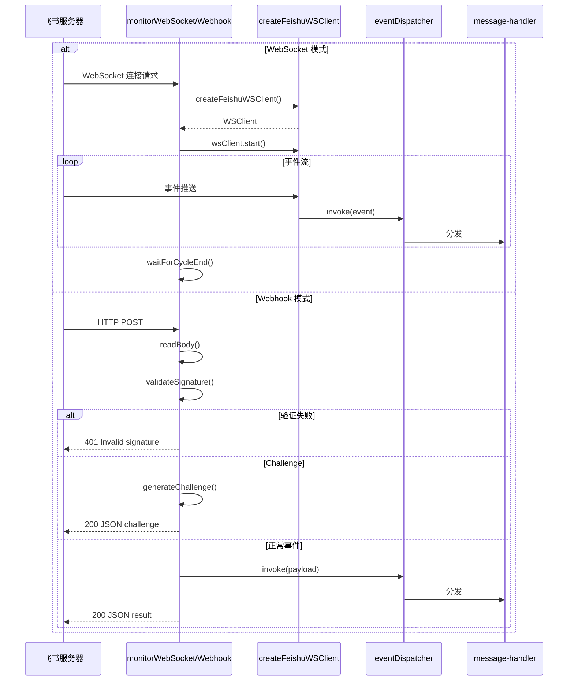

# 1. monitorWebSocket / monitorWebhook

#### 1. 函数定位（在整体链路中的作用）

**飞书消息接入层**：负责建立与飞书服务器的连接通道，接收消息事件并分发到处理器。它是整个消息处理链路的**入口点**。

- 所属阶段：**接入层**
- 职责：建立 WebSocket 连接或 Webhook HTTP 服务，接收飞书推送的事件，验证签名，分发到 `eventDispatcher`

---

#### 2. 上下游关系

**上游（谁调用它）：**

- `feishu/src/channel.runtime.ts` 中的 `startFeishuChannelMonitor()`
  - 根据配置选择 `monitorWebSocket` 或 `monitorWebhook`

**下游（它调用谁）：**

- `createFeishuWSClient()` → `feishu/src/client.ts`
- `Lark.WSClient.start({ eventDispatcher })` → Lark SDK
- `eventDispatcher.invoke()` → Lark SDK（分发事件到 handler）
- `isFeishuWebhookSignatureValid()` → 本文件（签名验证）
- `parseFeishuWebhookPayload()` → 本文件（JSON 解析）
- `Lark.generateChallenge()` → Lark SDK（处理 challenge）

---

#### 3. 输入

```typescript
type MonitorTransportParams = {
  account: ResolvedFeishuAccount; // 飞书账号配置（appId, appSecret, encryptKey）
  accountId: string; // 账号 ID
  runtime?: RuntimeEnv; // 运行时环境（log/error 函数）
  abortSignal?: AbortSignal; // 中断信号
  eventDispatcher: Lark.EventDispatcher; // 事件分发器
};
```

**关键控制参数：**

- `account.config.webhookPort/webhookPath/webhookHost` → Webhook 服务配置
- `account.encryptKey` → 签名验证密钥（Webhook 必需）
- `abortSignal` → 控制 WebSocket/Webhook 生命周期

**数据载体：**

- WebSocket 模式：无直接 payload，通过 `eventDispatcher` 接收事件
- Webhook 模式：HTTP Request Body（飞书事件 JSON）

---

#### 4. 核心处理流程

### 4.1 monitorWebSocket（WebSocket 模式）

1. **初始化日志和重连参数**
   - 设置 `attempt = 0`（重连尝试计数）
   - 获取 `log/error` 函数

2. **创建 WebSocket 客户端**
   - 调用 `createFeishuWSClient(account, { onError })` → `client.ts`
   - 返回 `Lark.WSClient` 实例
   - async：是

3. **启动 WebSocket 连接**
   - 调用 `wsClient.start({ eventDispatcher })` → Lark SDK
   - 开始接收事件流
   - async：是

4. **等待连接周期结束**
   - 调用 `waitForFeishuWsCycleEnd({ abortSignal, terminalError })`
   - 监听中断信号或终端错误
   - async：是

5. **重连逻辑（失败时）**
   - 计算 `delayMs = getFeishuWsReconnectDelayMs(attempt)`
   - 调用 `waitForAbortableDelay(delayMs, abortSignal)`
   - 指数退避重连（最大 30s）
   - async：是

**数据变化**：无数据转换，纯事件分发

### 4.2 monitorWebhook（Webhook 模式）

1. **创建 HTTP 服务器**
   - 调用 `http.createServer()` → Node.js
   - 监听 `port/host/path`
   - async：是（通过 Promise 包装）

2. **处理每个请求**
   - 调用 `applyBasicWebhookRequestGuards()` → 请求基础验证
   - 调用 `installRequestBodyLimitGuard()` → 限制请求体大小
   - 调用 `readWebhookBodyOrReject()` → 读取请求体
   - async：是

3. **签名验证**
   - 调用 `isFeishuWebhookSignatureValid({ headers, rawBody, encryptKey })`
   - 计算 SHA256 签名：`timestamp + nonce + encryptKey + rawBody`
   - 返回：`boolean`
   - async：否

4. **解析 JSON Payload**
   - 调用 `parseFeishuWebhookPayload(rawBody)`
   - 数据变化：`string → Record<string, unknown>`
   - async：否

5. **处理 Challenge（飞书验证）**
   - 调用 `Lark.generateChallenge(payload, { encryptKey })`
   - 返回：`{ isChallenge: boolean, challenge: object }`
   - async：否

6. **分发事件**
   - 调用 `eventDispatcher.invoke(buildFeishuWebhookEnvelope(req, payload))`
   - 数据变化：`payload → 处理结果`
   - async：是

**数据变化**：

```
HTTP Request
 → rawBody (string)
 → payload (JSON object)
 → eventDispatcher.invoke
 → response (JSON)
```

---

#### 5. 数据流

### WebSocket 模式

```
飞书服务器 WebSocket 连接
    │
    ▼ wsClient.start({ eventDispatcher })
Lark SDK 内部处理
    │
    ▼ eventDispatcher.invoke(event)
分发到 monitor.message-handler.ts
```

### Webhook 模式

```
飞书服务器 HTTP POST
    │
    ▼ http.createServer()
HTTP Request (headers + body)
    │
    ▼ readWebhookBodyOrReject()
rawBody: string
    │
    ▼ isFeishuWebhookSignatureValid()
验证通过
    │
    ▼ parseFeishuWebhookPayload()
payload: Record<string, unknown>
    │
    ├─ challenge? → Lark.generateChallenge() → JSON response
    │
    └─ event? → eventDispatcher.invoke() → handler
```

---

#### 6. 副作用

| 副作用             | WebSocket            | Webhook                |
| ------------------ | -------------------- | ---------------------- |
| 调用飞书 API       | ✅ 连接 WebSocket    | ❌                     |
| 调用外部 API       | ✅ Lark SDK          | ❌                     |
| 发送消息           | ❌                   | ❌（只接收）           |
| 修改 session/store | ❌                   | ❌                     |
| 创建 HTTP Server   | ❌                   | ✅                     |
| 持久化连接状态     | ✅ `wsClients.set()` | ✅ `httpServers.set()` |

---

#### 7. 关键逻辑 / 复杂点

### 7.1 WebSocket 重连机制

- 指数退避重连：`delayMs = min(1s * 2^(attempt-1), 30s)`
- 终端错误识别：`isFeishuWsTerminalError(err)`
- 清理逻辑：`cleanupFeishuWsClient()` → 关闭连接、清理状态

### 7.2 Webhook 签名验证

- SHA256 计算：`timestamp + nonce + encryptKey + rawBody`
- 使用 `safeEqualSecret()` 防止时序攻击
- 验证失败返回 401

### 7.3 Webhook Challenge 处理

- 飞书配置验证：首次配置时发送 challenge
- 返回加密后的 challenge 响应

### 7.4 请求保护

- Rate Limiting：`feishuWebhookRateLimiter`
- Body Size Limit：`FEISHU_WEBHOOK_MAX_BODY_BYTES`（默认 1MB）
- Timeout：`FEISHU_WEBHOOK_BODY_TIMEOUT_MS`

---

#### 8. Mermaid 调用关系图



---

#### 9. 错误处理

| 错误类型           | 处理方式               |
| ------------------ | ---------------------- |
| WebSocket 连接失败 | 指数退避重连，最大 30s |
| WebSocket 终端错误 | 停止重连，清理状态     |
| Webhook 签名无效   | 返回 401               |
| Webhook JSON 无效  | 返回 400               |
| Webhook 请求体过大 | 拒绝请求               |
| AbortSignal 触发   | 清理连接，优雅退出     |

---

#### 10. 配置项

| 配置          | WebSocket   | Webhook                 |
| ------------- | ----------- | ----------------------- |
| `mode`        | "websocket" | "webhook"               |
| `encryptKey`  | 可选        | **必需**                |
| `webhookPort` | -           | 3000 (默认)             |
| `webhookPath` | -           | "/feishu/events" (默认) |
| `webhookHost` | -           | "127.0.0.1" (默认)      |

---

> **文件路径**: `extensions/feishu/src/monitor.transport.ts`
> **所属步骤**: 主调用链第 1 步
> **分析版本**: 2026-05-04
