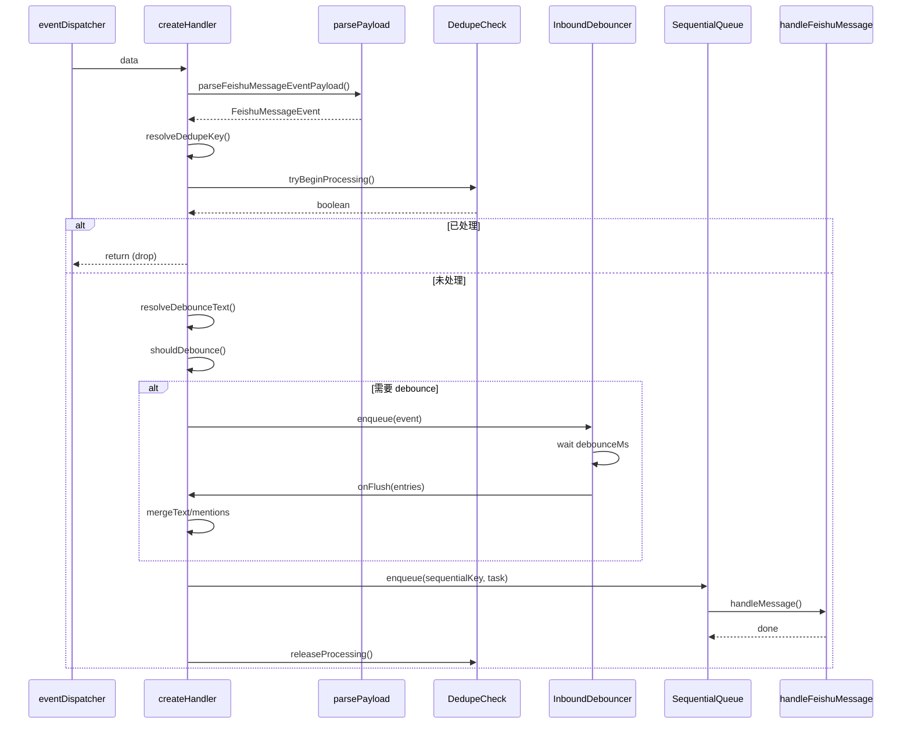

# 2. createFeishuMessageReceiveHandler

#### 1. 函数定位（在整体链路中的作用）

**飞书消息事件处理器工厂**：创建消息接收处理函数，负责解析事件 payload、去重检查、debounce 合并，并调度到消息处理主函数。它是消息处理链路的**事件解析层入口**。

- 所属阶段：**解析层**
- 职责：解析飞书事件、去重、debounce、调度到 `handleMessage`

---

#### 2. 上下游关系

**上游（谁调用它）：**

- `feishu/src/channel.runtime.ts` 中创建 `eventDispatcher`
- 通过 `eventDispatcher.register()` 注册 handler

**下游（它调用谁）：**

- `parseFeishuMessageEventPayload()` → 本文件（解析事件）
- `resolveFeishuMessageDedupeKey()` → `dedupe-key.ts`（去重 key）
- `tryBeginFeishuMessageProcessing()` → `processing-claims.ts`（去重检查）
- `createSequentialQueue()` → `sequential-queue.ts`（顺序队列）
- `core.channel.debounce.createInboundDebouncer()` → SDK（debounce）
- `handleMessage()` → `bot.ts` 的 `handleFeishuMessage`（主处理函数）
- `releaseFeishuMessageProcessing()` → `processing-claims.ts`（释放去重锁）

---

#### 3. 输入

```typescript
type FeishuMessageReceiveHandlerContext = {
  cfg: ClawdbotConfig; // OpenClaw 配置
  core: PluginRuntime; // 插件运行时（提供 debounce 等）
  accountId: string; // 账号 ID
  runtime?: RuntimeEnv; // 运行时环境（log/error）
  chatHistories: Map<string, HistoryEntry[]>; // 聊天历史
  fireAndForget?: boolean; // 是否异步执行（不等待）
  handleMessage: (params) => Promise<void>; // 消息处理主函数
  resolveDebounceText: (params) => string; // 解析 debounce 文本
  hasProcessedMessage: (id, namespace, log) => Promise<boolean>; // 去重检查
  recordProcessedMessage: (id, namespace, log) => Promise<boolean>; // 记录已处理
  getBotOpenId?: (accountId) => string; // 获取 Bot Open ID
  getBotName?: (accountId) => string; // 获取 Bot 名称
  resolveSequentialKey?: (params) => string; // 解析顺序队列 key
};
```

**关键控制参数：**

- `core.channel.debounce.resolveInboundDebounceMs()` → debounce 时间
- `fireAndForget` → 是否异步执行
- `handleMessage` → 主处理函数

**数据载体：**

- 输入：`data: unknown`（飞书事件原始 payload）
- 输出：调用 `handleMessage({ event, ... })`

---

#### 4. 核心处理流程

1. **解析事件 Payload**
   - 调用 `parseFeishuMessageEventPayload(data)`
   - 数据变化：`unknown → FeishuMessageEvent | null`
   - async：否

2. **去重 Key 解析**
   - 调用 `resolveFeishuMessageDedupeKey(event)`
   - 返回：`string`（去重标识）
   - async：否

3. **去重检查**
   - 调用 `tryBeginFeishuMessageProcessing(messageDedupeKey, accountId)`
   - 返回：`boolean`（是否获得处理锁）
   - async：否

4. **失败分支（已处理）**
   - 若去重失败：`log("dropping duplicate event")`，返回
   - async：否

5. **创建 Debouncer**
   - 调用 `core.channel.debounce.createInboundDebouncer()`
   - 参数：`debounceMs, buildKey, shouldDebounce, onFlush`
   - async：否（创建对象）

6. **入队 Debounce**
   - 调用 `inboundDebouncer.enqueue(event)`
   - 数据变化：`event → debounce queue`
   - async：是

7. **Debounce Flush（合并后）**
   - 调用 `onFlush(entries)`（debounce 触发）
   - 合并多条消息文本
   - 合并 mentions
   - async：是

8. **调度到顺序队列**
   - 调用 `dispatchFeishuMessage(event)`
   - 内部调用 `enqueue(sequentialKey, task)`
   - async：是

9. **调用主处理函数**
   - 调用 `handleMessage({ cfg, event, botOpenId, botName, runtime, chatHistories, accountId })`
   - async：是

10. **释放去重锁**
    - 调用 `releaseFeishuMessageProcessing(messageDedupeKey, accountId)`
    - async：是

**数据变化**：

```
data: unknown
 → FeishuMessageEvent
 → debounce queue
 → merged event
 → handleMessage()
```

---

#### 5. 数据流

```
飞书事件 payload (unknown)
    │
    ▼ parseFeishuMessageEventPayload()
FeishuMessageEvent {
    sender: { sender_id: { open_id, user_id } },
    message: {
        message_id, chat_id, chat_type,
        message_type, content, root_id, thread_id,
        mentions
    }
}
    │
    ▼ resolveFeishuMessageDedupeKey()
messageDedupeKey: "feishu:message_id"
    │
    ▼ tryBeginFeishuMessageProcessing()
获得处理锁
    │
    ▼ inboundDebouncer.enqueue()
debounce queue
    │
    ▼ onFlush() (debounce 触发)
合并后的 event {
    ...lastEntry,
    message: {
        ...,
        content: 合并文本,
        mentions: 合并 mentions
    }
}
    │
    ▼ dispatchFeishuMessage()
顺序队列
    │
    ▼ handleMessage()
handleFeishuMessage()
```

---

#### 6. 副作用

| 副作用             | 是否发生                                                                |
| ------------------ | ----------------------------------------------------------------------- |
| 调用 LLM           | ❌                                                                      |
| 调用外部 API       | ❌（仅内部去重检查）                                                    |
| 发送消息           | ❌                                                                      |
| 修改 session/store | ❌                                                                      |
| 去重锁操作         | ✅ `tryBeginFeishuMessageProcessing` / `releaseFeishuMessageProcessing` |
| 记录已处理         | ✅ `recordProcessedMessage`                                             |

---

#### 7. 关键逻辑 / 复杂点

### 7.1 Debounce 合并机制

- **触发条件**：`shouldDebounce()` 返回 true
  - `message_type === "text"`
  - 文本非空
  - 无控制命令（如 `/reset`）

- **合并逻辑**：
  - 合并多条消息文本（`\n` 分隔）
  - 合并 mentions（去重）
  - 记录被抑制的消息 ID（`recordSuppressedMessageIds`）

### 7.2 顺序队列

- 确保同一 chat 的消息按顺序处理
- Key：`feishu:${accountId}:${chatId}:${threadKey}:${senderId}`
- 通过 `createSequentialQueue()` 实现

### 7.3 去重检查

- `tryBeginFeishuMessageProcessing()` → 获取处理锁
- `releaseFeishuMessageProcessing()` → 释放锁
- 防止飞书多次推送同一消息

### 7.4 @转发请求处理

- `isMentionForwardRequest()` 检测
- 特殊处理 mentions 合合

---

#### 8. Mermaid 调用关系图



---

#### 9. Debounce 配置

| 参数             | 来源                                               | 默认值   |
| ---------------- | -------------------------------------------------- | -------- |
| `debounceMs`     | `core.channel.debounce.resolveInboundDebounceMs()` | 配置决定 |
| `buildKey`       | `${accountId}:${chatId}:${threadKey}:${senderId}`  | -        |
| `shouldDebounce` | `message_type === "text"` 且无命令                 | -        |

---

#### 10. 错误处理

| 错误类型            | 处理方式                 |
| ------------------- | ------------------------ |
| Payload 解析失败    | log error，return        |
| Debounce flush 失败 | release locks，log error |
| handleMessage 失败  | release lock，log error  |

---

> **文件路径**: `extensions/feishu/src/monitor.message-handler.ts:162`
> **所属步骤**: 主调用链第 2 步
> **分析版本**: 2026-05-04
