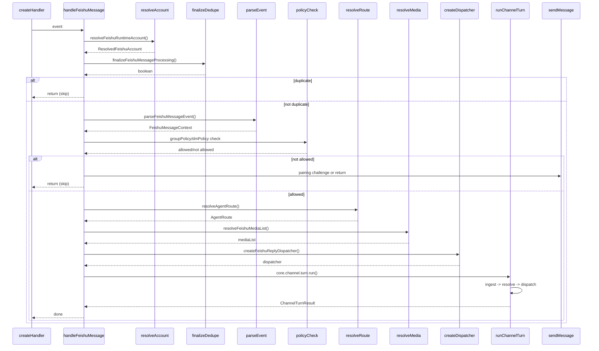

# 3. handleFeishuMessage

#### 1. 函数定位（在整体链路中的作用）

**飞书消息处理主函数**：负责接收解析后的飞书消息事件，执行权限检查、路由解析、会话绑定，并调用 Channel Turn 执行消息回复。它是消息处理链路的**业务逻辑层入口**。

- 所属阶段：**业务层**
- 职责：权限验证、路由解析、会话绑定、调用 `runChannelTurn`

---

#### 2. 上下游关系

**上游（谁调用它）：**

- `createFeishuMessageReceiveHandler()` → `monitor.message-handler.ts`
- 通过 debounce flush 后的 `handleMessage` 参数传入

**下游（它调用谁）：**

- `resolveFeishuRuntimeAccount()` → `accounts.ts`（账号解析）
- `finalizeFeishuMessageProcessing()` → `dedup.ts`（去重确认）
- `parseFeishuMessageEvent()` → 本文件（事件解析）
- `resolveFeishuSenderName()` → `bot-sender-name.ts`（发送者名称）
- `resolveFeishuGroupConfig()` → `policy.ts`（群配置）
- `resolveFeishuGroupSession()` → `bot-content.ts`（群会话）
- `resolveFeishuReplyPolicy()` → `policy.ts`（回复策略）
- `createChannelPairingController()` → SDK（配对控制器）
- `resolveAgentRoute()` → SDK（路由解析）
- `maybeCreateDynamicAgent()` → `dynamic-agent.ts`（动态 Agent）
- `resolveConfiguredBindingRoute()` → SDK（绑定路由）
- `resolveFeishuMediaList()` → `bot-content.ts`（媒体解析）
- `resolveFeishuAudioPreflightTranscript()` → 本文件（音频转录）
- `getMessageFeishu()` → `send.ts`（获取引用消息）
- `listFeishuThreadMessages()` → `send.ts`（获取线程消息）
- `resolveGroupName()` → 本文件（群名称）
- `buildFeishuAgentBody()` → 本文件（构建 Agent 输入）
- `createFeishuReplyDispatcher()` → `reply-dispatcher.ts`（回复分发器）
- `core.channel.turn.run()` → SDK（Channel Turn 执行）
- `sendMessageFeishu()` → `send.ts`（发送飞书消息）

---

#### 3. 输入

```typescript
type HandleFeishuMessageParams = {
  cfg: ClawdbotConfig; // OpenClaw 配置
  event: FeishuMessageEvent; // 飞书消息事件
  botOpenId?: string; // Bot Open ID
  botName?: string; // Bot 名称
  runtime?: RuntimeEnv; // 运行时环境（log/error）
  chatHistories?: Map<string, HistoryEntry[]>; // 聊天历史
  accountId?: string; // 账号 ID
  processingClaimHeld?: boolean; // 是否已持有去重锁
};
```

**关键控制参数：**

- `event.message.chat_type` → 群聊/私聊判断
- `event.message.message_type` → 消息类型（text/audio/merge_forward 等）
- `feishuCfg.dmPolicy` → 私聊策略（pairing/allowlist/open）
- `feishuCfg.groupPolicy` → 聊策略（allowlist/disabled）
- `groupConfig.enabled` → 群是否启用
- `requireMention` → 是否需要 @ Bot

**数据载体：**

- 输入：`FeishuMessageEvent`（飞书事件）
- 输出：调用 `core.channel.turn.run()` 执行回复

---

#### 4. 核心处理流程

1. **解析账号配置**
   - 调用 `resolveFeishuRuntimeAccount({ cfg, accountId })`
   - 返回：`ResolvedFeishuAccount`（合并后的账号配置）
   - async：否

2. **去重确认**
   - 调用 `finalizeFeishuMessageProcessing({ messageId, namespace, log, claimHeld })`
   - 返回：`boolean`（是否通过去重）
   - async：是
   - 若失败：`return`（跳过重复消息）

3. **解析消息事件**
   - 调用 `parseFeishuMessageEvent(event, botOpenId, botName)`
   - 返回：`FeishuMessageContext`
   - async：否

4. **处理合并转发消息**
   - 若 `message_type === "merge_forward"`：调用飞书 API 获取完整内容
   - 调用 `parseMergeForwardContent()` 扩展子消息
   - async：是

5. **解析发送者名称**
   - 调用 `resolveFeishuSenderName({ account, senderId, log })`
   - 返回：`{ name, permissionError }`
   - async：是

6. **群聊权限检查**
   - 若 `isGroup`：
     - 检查 `groupConfig.enabled`（群是否启用）
     - 检查 `groupPolicy`（群是否在允许列表）
     - 检查 `groupSenderAllowFrom`（发送者是否在允许列表）
     - 检查 `requireMention`（是否需要 @ Bot）
   - async：否
   - 若失败：`return`（跳过消息）

7. **私聊权限检查**
   - 若 `isDirect`：
     - 根据 `dmPolicy`（pairing/allowlist/open）检查权限
     - 若 `pairing` 且未授权：调用 `pairing.issueChallenge()`（发送配对请求）
   - async：是
   - 若失败：`return`（跳过消息）

8. **解析 Agent 路由**
   - 调用 `resolveAgentRoute({ cfg, channel, accountId, peer })`
   - 返回：`AgentRoute`（agentId、sessionKey、accountId）
   - async：否

9. **动态 Agent 创建（可选）**
   - 若 DM 且 `dynamicAgentCreation.enabled`：
     - 调用 `maybeCreateDynamicAgent()` 创建专属 Agent
     - 更新配置，重新解析路由
   - async：是

10. **会话绑定解析**
    - 调用 `resolveConfiguredBindingRoute()` 解析 ACP 绑定
    - 调用 `resolveRuntimeConversationBindingRoute()` 解析运行时绑定
    - async：否

11. **解析媒体附件**
    - 调用 `resolveFeishuMediaList()` 解析图片/音频等媒体
    - async：是

12. **音频预转录（可选）**
    - 若消息为纯音频：调用 `resolveFeishuAudioPreflightTranscript()`
    - 返回转录文本
    - async：是

13. **获取引用消息内容**
    - 若 `ctx.parentId` 存在：调用 `getMessageFeishu()` 获取被引用消息
    - async：是

14. **获取线程历史（可选）**
    - 若 `groupSessionScope === "group_topic"`：调用 `listFeishuThreadMessages()`
    - 构建线程历史上下文
    - async：是

15. **构建 Agent 输入**
    - 调用 `buildFeishuAgentBody()` 构建消息体
    - 格式：`[message_id: xxx]\nSpeaker: Content`
    - async：否

16. **构建回复分发器**
    - 调用 `createFeishuReplyDispatcher()` 创建分发器
    - 返回：`{ dispatcher, replyOptions, markDispatchIdle }`
    - async：否

17. **广播分发（可选）**
    - 若 `broadcastAgents` 存在：
      - 对每个 Agent 调用 `core.channel.turn.run()`
      - active Agent：使用真实 dispatcher
      - observer Agent：使用 noop dispatcher
    - async：是

18. **单 Agent 分发**
    - 若无广播：调用 `core.channel.turn.run()` 单次执行
    - async：是

**数据变化**：

```
FeishuMessageEvent
 → FeishuMessageContext
 → AgentRoute
 → ctxPayload (FinalizedMsgContext)
 → runChannelTurn()
 → ReplyPayload
 → sendMessageFeishu()
```

---

#### 5. 数据流

```
FeishuMessageEvent {
    sender: { sender_id: { open_id, user_id } },
    message: {
        message_id, chat_id, chat_type,
        message_type, content, root_id, thread_id,
        create_time, mentions
    }
}
    │
    ▼ parseFeishuMessageEvent()
FeishuMessageContext {
    chatId, messageId, senderId, senderOpenId,
    chatType, content, mentionedBot, hasAnyMention,
    rootId, parentId, threadId
}
    │
    ▼ resolveAgentRoute()
AgentRoute {
    agentId, sessionKey, accountId,
    matchedBy: "default" | "explicit" | "binding"
}
    │
    ▼ buildCtxPayloadForAgent()
FinalizedMsgContext {
    Body, BodyForAgent, InboundHistory,
    SessionKey, ChatType, SenderName, ...
}
    │
    ▼ createFeishuReplyDispatcher()
ReplyDispatcher {
    sendBlockReply, sendFinalReply, sendToolResult
}
    │
    ▼ core.channel.turn.run()
ChannelTurnResult {
    dispatched: boolean,
    dispatchResult: { queuedFinal, counts }
}
    │
    ▼ dispatcher.sendFinalReply()
飞书消息发送
```

---

#### 6. 副作用

| 副作用             | 是否发生                             |
| ------------------ | ------------------------------------ |
| 调用飞书 API       | ✅ 获取群信息/消息内容/媒体文件      |
| 调用 LLM           | ❌（由下游 `runChannelTurn` 触发）   |
| 发送消息           | ✅ 配对请求/权限错误提示             |
| 修改 session/store | ✅ 记录 inbound session              |
| 媒体下载           | ✅ 下载图片/音频文件                 |
| 动态 Agent 创建    | ✅ 可能创建新 Agent                  |
| 去重记录           | ✅ `finalizeFeishuMessageProcessing` |

---

#### 7. 关键逻辑 / 复杂点

### 7.1 权限检查分层

**三层权限检查**：

1. **群级别**：`groupPolicy` + `groupAllowFrom`（群是否在白名单）
2. **发送者级别**：`groupSenderAllowFrom`（发送者是否在白名单）
3. **命令级别**：`commandAllowFrom`（谁能执行命令）

**私聊策略**：

- `pairing`：首次私聊发送配对请求，需用户确认
- `allowlist`：仅白名单用户可私聊
- `open`：所有人可私聊（白名单用户有特殊权限）

### 7.2 群会话作用域

四种群会话模式：

- `group_chat`：群级别会话（所有消息共享 session）
- `group_topic`：话题级别会话（每个线程共享 session）
- `group_sender`：发送者级别会话（每个用户独立 session）
- `group_topic_sender`：话题+发送者级别会话

### 7.3 @ Bot 必须性

- `requireMention = true`：群消息必须 @ Bot 才会触发回复
- 未 @ 的消息：记录到 pending history，但不触发回复
- 用于减少群内噪音

### 7.4 动态 Agent 创建

- DM 用户首次私聊时，可自动创建专属 Agent
- 配置：`dynamicAgentCreation.enabled`
- 每个 DM 用户获得独立 workspace 和 session

### 7.5 广播分发

- 群消息可同时分发到多个 Agent
- `broadcastAgents` 配置：`cfg.broadcast[peerId] = [agentId1, agentId2]`
- 分发策略：`parallel`（并行）或 `sequential`（顺序）
- active Agent 回复消息，observer Agent 仅记录

### 7.6 媒体处理

- 图片：下载并转为 `media://` 格式
- 音频：可选预转录（将语音转为文本）
- `mediaMaxMb`：媒体大小限制（默认 30MB）

### 7.7 合并转发消息

- `message_type === "merge_forward"`：WebSocket 事件不含子消息
- 需调用飞书 API 获取完整内容
- 扩展为多条消息的合并文本

---

#### 8. Mermaid 调用关系图



---

#### 9. 群会话作用域决策表

| groupSessionScope    | peerId                        | sessionKey 示例                         |
| -------------------- | ----------------------------- | --------------------------------------- |
| `group_chat`         | `ctx.chatId`                  | `agent:main:feishu:group:oc_xxx`        |
| `group_topic`        | `ctx.rootId`                  | `agent:main:feishu:group:om_xxx`        |
| `group_sender`       | `ctx.senderOpenId`            | `agent:main:feishu:group:ou_xxx`        |
| `group_topic_sender` | `ctx.rootId:ctx.senderOpenId` | `agent:main:feishu:group:om_xxx:ou_xxx` |

---

#### 10. 错误处理

| 错误类型                   | 处理方式                               |
| -------------------------- | -------------------------------------- |
| 账号未配置                 | `resolveFeishuRuntimeAccount` 抛出错误 |
| 去重失败                   | log + return                           |
| 群未启用                   | log + return                           |
| 群不在白名单               | log + return                           |
| 发送者不在白名单           | log + return                           |
| 未 @ Bot（requireMention） | 记录 pending history + return          |
| DM 未授权                  | 发送配对请求 + return                  |
| ACP 绑定初始化失败         | 发送错误提示 + return                  |
| 媒体下载失败               | log + 继续处理（无媒体）               |
| 获取引用消息失败           | log + 继续处理（无引用）               |
| 获取线程历史失败           | log + 继续处理（无线程）               |
| 动态 Agent 创建失败        | log + 使用默认 Agent                   |
| runChannelTurn 失败        | error log + return                     |

---

#### 11. 配置项

| 配置                   | 来源                             | 默认值         |
| ---------------------- | -------------------------------- | -------------- |
| `dmPolicy`             | `feishuCfg.dmPolicy`             | `"pairing"`    |
| `groupPolicy`          | `feishuCfg.groupPolicy`          | `"allowlist"`  |
| `groupAllowFrom`       | `feishuCfg.groupAllowFrom`       | `[]`           |
| `groupSenderAllowFrom` | `feishuCfg.groupSenderAllowFrom` | `[]`           |
| `replyInThread`        | `feishuCfg.replyInThread`        | `"disabled"`   |
| `requireMention`       | `feishuCfg.requireMention`       | `true`（群聊） |
| `historyLimit`         | `feishuCfg.historyLimit`         | `10`           |
| `mediaMaxMb`           | `feishuCfg.mediaMaxMb`           | `30`           |
| `resolveSenderNames`   | `feishuCfg.resolveSenderNames`   | `true`         |

---

> **文件路径**: `extensions/feishu/src/bot.ts:384`
> **所属步骤**: 主调用链第 3 步
> **分析版本**: 2026-05-04
