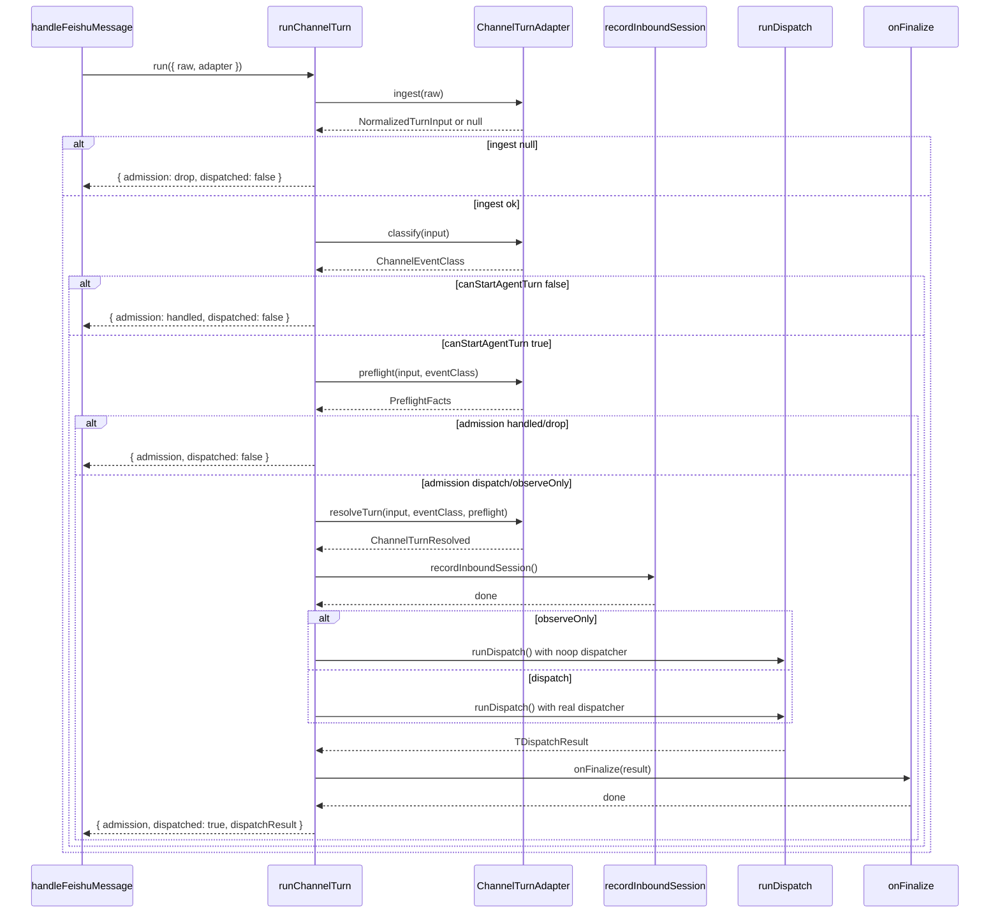

# 4. runChannelTurn

#### 1. 函数定位（在整体链路中的作用）

**Channel Turn 执行器**：负责执行一条消息的完整处理周期，包括 ingest（接收）、classify（分类）、preflight（预检）、resolve（解析）、record（记录）、dispatch（分发）、finalize（结束）。它是消息处理链路的**核心编排层**。

- 所属阶段：**编排层**
- 职责：协调消息处理的生命周期，确保每个阶段正确执行

---

#### 2. 上下游关系

**上游（谁调用它）：**

- `handleFeishuMessage()` → `extensions/feishu/src/bot.ts`
- `core.channel.turn.run()` 通过 SDK 调用

**下游（它调用谁）：**

- `adapter.ingest()` → Adapter 层（接收原始输入）
- `adapter.classify()` → Adapter 层（事件分类）
- `adapter.preflight()` → Adapter 层（预检）
- `adapter.resolveTurn()` → Adapter 层（解析 Turn）
- `recordInboundSession()` → `session.ts`（记录会话）
- `dispatchResolvedChannelTurn()` → 本文件（分发 Turn）
- `runPreparedChannelTurnCore()` → 本文件（执行 Turn）
- `params.runDispatch()` → 回调函数（执行分发）
- `adapter.onFinalize()` → Adapter 层（结束处理）
- `clearHistoryEntriesIfEnabled()` → `history.ts`（清理历史）

---

#### 3. 输入

```typescript
type RunChannelTurnParams<TRaw, TDispatchResult> = {
  channel: string; // 渠道标识（feishu/discord/slack）
  accountId?: string; // 账号 ID
  raw: TRaw; // 原始消息对象
  adapter: ChannelTurnAdapter<TRaw, TDispatchResult>; // Adapter 定义
  log?: (event: ChannelTurnLogEvent) => void; // 日志回调
};

type ChannelTurnAdapter<TRaw, TDispatchResult> = {
  ingest: (raw: TRaw) => NormalizedTurnInput | null; // 接收输入
  classify?: (input) => ChannelEventClass; // 分类事件
  preflight?: (input, eventClass) => PreflightFacts; // 预检
  resolveTurn: (input, eventClass, preflight) => ChannelTurnResolved; // 解析 Turn
  onFinalize?: (result) => void; // 结束回调
};
```

**关键控制参数：**

- `adapter.ingest()` → 是否接收消息（返回 null 则 drop）
- `eventClass.canStartAgentTurn` → 是否触发 Agent 回复
- `preflight.admission.kind` → 是否分发（dispatch/observeOnly/handled/drop）

**数据载体：**

- 输入：`TRaw`（原始消息，如 `FeishuMessageContext`）
- 输出：`ChannelTurnResult`（包含 dispatch 结果）

---

#### 4. 核心处理流程

**七阶段生命周期**：

1. **Ingest（接收）**
   - 调用 `adapter.ingest(params.raw)`
   - 数据变化：`TRaw → NormalizedTurnInput | null`
   - async：可选
   - 若返回 null：`admission = { kind: "drop", reason: "ingest-null" }`，return

2. **Classify（分类）**
   - 调用 `adapter.classify(input)`
   - 返回：`ChannelEventClass { kind, canStartAgentTurn }`
   - async：可选
   - 若 `!canStartAgentTurn`：`admission = { kind: "handled" }`，return

3. **Preflight（预检）**
   - 调用 `adapter.preflight(input, eventClass)`
   - 返回：`PreflightFacts { admission, message, media, supplemental }`
   - async：可选
   - 若 `admission.kind === "handled" | "drop"`：return

4. **Resolve（解析）**
   - 调用 `adapter.resolveTurn(input, eventClass, preflight)`
   - 返回：`ChannelTurnResolved`（包含 ctxPayload、routeSessionKey、runDispatch 等）
   - async：可选

5. **Record（记录）**
   - 调用 `recordInboundSession({ storePath, sessionKey, ctx })`
   - 记录 inbound session 到 store
   - async：是
   - 若失败：调用 `onPreDispatchFailure()`，throw

6. **Dispatch（分发）**
   - 调用 `runDispatch()`
   - 内部执行 `dispatchReplyFromConfig()`
   - async：是
   - 若失败：throw

7. **Finalize（结束）**
   - 调用 `adapter.onFinalize(result)`
   - 清理 pending history
   - async：可选

**数据变化**：

```
TRaw (原始消息)
 → NormalizedTurnInput
 → ChannelEventClass
 → PreflightFacts
 → ChannelTurnResolved
 → recordInboundSession
 → runDispatch()
 → ChannelTurnResult
```

---

#### 5. 数据流

```
FeishuMessageContext (TRaw)
    │
    ▼ adapter.ingest()
NormalizedTurnInput {
    id: messageId,
    timestamp: createTime,
    rawText: content,
    textForAgent: agentBody,
    textForCommands: commandBody
}
    │
    ▼ adapter.classify()
ChannelEventClass {
    kind: "message",
    canStartAgentTurn: true
}
    │
    ▼ adapter.preflight()
PreflightFacts {
    admission: { kind: "dispatch" },
    message: { body, rawBody },
    media: [{ path, contentType }],
    supplemental: { quote, thread }
}
    │
    ▼ adapter.resolveTurn()
ChannelTurnResolved {
    routeSessionKey: "agent:main:feishu:direct:ou_xxx",
    storePath: "/path/to/store",
    ctxPayload: FinalizedMsgContext,
    runDispatch: () => dispatchReplyFromConfig()
}
    │
    ▼ recordInboundSession()
Session 文件更新
    │
    ▼ runDispatch()
dispatchReplyFromConfig()
    │
    ▼ onFinalize()
清理 pending history
    │
    ▼
ChannelTurnResult {
    admission: { kind: "dispatch" },
    dispatched: true,
    dispatchResult: { queuedFinal, counts }
}
```

---

#### 6. 副作用

| 副作用             | 是否发生                          |
| ------------------ | --------------------------------- |
| 调用 LLM           | ❌（由 `runDispatch` 触发）       |
| 调用外部 API       | ❌（由 Adapter 触发）             |
| 发送消息           | ❌（由 dispatcher 触发）          |
| 修改 session/store | ✅ `recordInboundSession`         |
| 清理历史           | ✅ `clearPendingHistoryAfterTurn` |
| 日志输出           | ✅ `emit()`                       |

---

#### 7. 关键逻辑 / 复杂点

### 7.1 Admission 决策

四种 Admission 类型：

- `dispatch`：正常分发，执行 Agent 回复
- `observeOnly`：仅记录 session，不执行回复（如 observer Agent）
- `handled`：已处理，不需要 Agent 回复（如命令执行）
- `drop`：丢弃，不处理（如 ingest 返回 null）

决策链：

```
ingest → null? → drop
classify → canStartAgentTurn=false? → handled
preflight → admission=handled/drop? → handled/drop
resolve → admission=observeOnly? → observeOnly
default → dispatch
```

### 7.2 阶段日志

每个阶段发出日志事件：

- `{ stage, event, messageId, sessionKey, admission, reason, error }`
- `event`：`start | done | drop | handled | error`

用于调试和监控。

### 7.3 错误传播

- `record` 失败：调用 `onPreDispatchFailure`，保留原始错误
- `dispatch` 失败：直接 throw
- `finalize` 失败：调用 `onFinalize` 后 throw

### 7.4 ObserveOnly 处理

- `admission.kind === "observeOnly"`：使用 noop dispatcher
- 不发送消息，仅记录 session
- 用于 broadcast observer Agent

### 7.5 History 清理

- 群聊模式：处理完成后清理 pending history
- 避免 history buffer 无限增长

---

#### 8. Mermaid 调用关系图



---

#### 9. Admission 类型决策表

| 阶段      | 条件                                | Admission              | 结果         |
| --------- | ----------------------------------- | ---------------------- | ------------ |
| ingest    | `return null`                       | `drop: "ingest-null"`  | 不处理       |
| classify  | `!canStartAgentTurn`                | `handled: "event:xxx"` | 不触发 Agent |
| preflight | `admission.kind in [handled, drop]` | 继承                   | 不处理       |
| resolve   | `admission.kind === "observeOnly"`  | `observeOnly`          | 仅记录       |
| default   | -                                   | `dispatch`             | 正常执行     |

---

#### 10. 错误处理

| 错误类型                    | 处理方式                                    |
| --------------------------- | ------------------------------------------- |
| ingest 返回 null            | `{ admission: drop, dispatched: false }`    |
| classify 返回 handled       | `{ admission: handled, dispatched: false }` |
| preflight 返回 handled/drop | `{ admission, dispatched: false }`          |
| record 失败                 | `onPreDispatchFailure(err)` + throw         |
| dispatch 失败               | throw（保留错误）                           |
| finalize 失败               | throw（保留错误）                           |

---

#### 11. 阶段日志事件

| 阶段      | event              | 说明             |
| --------- | ------------------ | ---------------- |
| ingest    | `start`            | 开始接收         |
| ingest    | `done`             | 接收完成         |
| ingest    | `drop`             | ingest 返回 null |
| classify  | `handled`          | 不触发 Agent     |
| preflight | `drop/handled`     | 预检拒绝         |
| assemble  | `done`             | resolve 完成     |
| record    | `start/done/error` | session 记录     |
| dispatch  | `start/done/error` | 分发执行         |
| finalize  | `done/error`       | 结束处理         |

---

#### 12. Adapter 实现示例（飞书）

```typescript
// extensions/feishu/src/bot.ts (handleFeishuMessage)
adapter: {
  ingest: () => ({
    id: ctx.messageId,
    timestamp: messageCreateTimeMs,
    rawText: ctx.content,
    textForAgent: agentCtx.BodyForAgent,
    textForCommands: agentCtx.CommandBody,
    raw: ctx,
  }),
  resolveTurn: () => ({
    channel: "feishu",
    accountId: route.accountId,
    routeSessionKey: route.sessionKey,
    storePath,
    ctxPayload: ctxPayload,
    recordInboundSession: core.channel.session.recordInboundSession,
    runDispatch: () => dispatchReplyFromConfig({ ctx, cfg, dispatcher }),
  }),
}
```

---

> **文件路径**: `src/channels/turn/kernel.ts:300`
> **所属步骤**: 主调用链第 4 步
> **分析版本**: 2026-05-04
