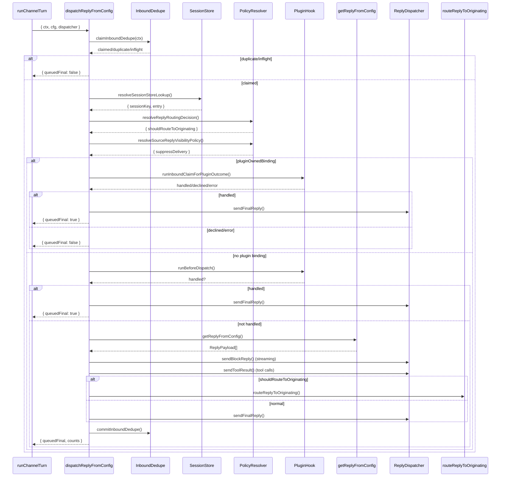

# 5. dispatchReplyFromConfig

#### 1. 函数定位（在整体链路中的作用）

**回复分发协调器**：负责协调消息回复的完整生命周期，包括去重检查、快速路径处理、路由决策、Hook 执行、工具策略解析、回复分发，并调用下游回复准备器。它是消息处理链路的**第 1 层分发协调**。

- 所属阶段：**分发层**
- 职责：路由决策、快速路径、Hook 执行、调用 `getReplyFromConfig`
- 文件：`src/auto-reply/reply/dispatch-from-config.ts`
- 行数：~1215

---

#### 2. 上下游关系

**上游（谁调用它）：**

- `runChannelTurn()` → `src/channels/turn/kernel.ts`
- 通过 `adapter.resolveTurn()` 传入 `runDispatch()`

**下游（它调用谁）：**

- `resolveSessionStoreLookup()` → 本文件（Session Store 解析）
- `resolveSessionAgentId()` → `agent-scope.ts`（Agent ID 解析）
- `resolveAgentConfig()` → `agent-scope.ts`（Agent 配置）
- `resolveEffectiveReplyRoute()` → `effective-reply-route.ts`（回复路由）
- `resolveReplyRoutingDecision()` → `routing-policy.ts`（路由决策）
- `resolveSendPolicy()` → `sessions/send-policy.ts`（发送策略）
- `resolveEffectiveToolPolicy()` → `pi-tools.policy.ts`（工具策略）
- `resolveSourceReplyVisibilityPolicy()` → `source-reply-delivery-mode.ts`（源回复策略）
- `claimInboundDedupe()` → `inbound-dedupe.ts`（去重声明）
- `loadAbortRuntime()` → `abort.runtime.ts`（快速中止）
- `hookRunner.runInboundClaimForPluginOutcome()` → Plugin Hook（Plugin 绑定处理）
- `hookRunner.runMessageReceived()` → Plugin Hook（消息接收 Hook）
- `hookRunner.runBeforeDispatch()` → Plugin Hook（分发前 Hook）
- `hookRunner.runReplyDispatch()` → Plugin Hook（回复分发 Hook）
- `getReplyFromConfig()` → `get-reply.ts`（回复准备器）
- `dispatcher.sendBlockReply()` → ReplyDispatcher（Block 回复）
- `dispatcher.sendToolResult()` → ReplyDispatcher（工具结果）
- `dispatcher.sendFinalReply()` → ReplyDispatcher（最终回复）
- `routeReplyToOriginating()` → `route-reply.runtime.ts`（跨渠道路由）

---

#### 3. 输入

```typescript
type DispatchFromConfigParams = {
  ctx: FinalizedMsgContext; // 消息上下文（已解析）
  cfg: OpenClawConfig; // OpenClaw 配置
  dispatcher: ReplyDispatcher; // 回复分发器
  replyOptions?: GetReplyOptions; // 回复选项
  replyResolver?: GetReplyFromConfig; // 自定义回复解析器
  configOverride?: unknown; // 配置覆盖
  fastAbortResolver?: FastAbortResolver; // 快速中止解析器
  formatAbortReplyTextResolver?: FormatAbortReplyTextResolver; // 中止文本格式化
};
```

**关键控制参数：**

- `ctx.SessionKey` → Session 标识
- `ctx.CommandSource` → 命令来源（native/plugin）
- `ctx.ChatType` → 聊天类型（direct/group/channel）
- `ctx.Surface/Provider` → 渠道标识
- `replyOptions.sourceReplyDeliveryMode` → 源回复模式
- `replyOptions.typingPolicy` → 打字指示器策略

**数据载体：**

- 输入：`FinalizedMsgContext`（完整消息上下文）
- 输出：`DispatchFromConfigResult { queuedFinal, counts }`

---

#### 4. 核心处理流程

1. **初始化诊断日志**
   - 解析 `channel, chatId, messageId, sessionKey`
   - 创建 `recordProcessed, markProcessing, markIdle` 函数
   - async：否

2. **Inbound Dedupe 声明**
   - 调用 `claimInboundDedupe(ctx)`
   - 返回：`{ status: "claimed" | "duplicate" | "inflight" }`
   - async：否
   - 若 `duplicate/inflight`：`return { queuedFinal: false }`

3. **解析 Session Store Entry**
   - 调用 `resolveSessionStoreLookup(ctx, cfg)`
   - 返回：`{ sessionKey, storePath, entry }`
   - async：否

4. **解析 ACP 绑定 Session Key**
   - 调用 `resolveBoundAcpDispatchSessionKey({ ctx, cfg })`
   - 返回：`acpDispatchSessionKey`
   - async：否

5. **解析 Agent 配置**
   - 调用 `resolveSessionAgentId({ sessionKey, config })`
   - 调用 `resolveAgentConfig(cfg, sessionAgentId)`
   - async：否

6. **解析回复路由**
   - 调用 `resolveEffectiveReplyRoute({ ctx, entry })`
   - 返回：`{ channel, to, accountId }`
   - async：否

7. **路由决策**
   - 调用 `resolveReplyRoutingDecision()`
   - 返回：`{ shouldRouteToOriginating, originatingChannel, originatingTo }`
   - async：否

8. **解析发送策略**
   - 调用 `resolveSendPolicy({ cfg, entry, sessionKey, channel, chatType })`
   - async：否

9. **解析工具策略**
   - 调用 `resolveEffectiveToolPolicy({ config, sessionKey, agentId })`
   - 返回：`{ globalPolicy, agentPolicy, profile, ... }`
   - async：否

10. **解析源回复可见性策略**
    - 调用 `resolveSourceReplyVisibilityPolicy()`
    - 返回：`{ sourceReplyDeliveryMode, suppressDelivery, ... }`
    - async：否

11. **Plugin 绑定处理**
    - 若 `pluginOwnedBinding` 存在：
      - 调用 `hookRunner.runInboundClaimForPluginOutcome()`
      - 若 `handled`：发送回复，`return`
      - 若 `declined/error`：发送提示，`return`
      - 若 `missing_plugin/no_handler`：发送 fallback 提示，继续
    - async：是

12. **触发 Plugin Hooks**
    - `hookRunner.runMessageReceived()` → fire-and-forget
    - `triggerInternalHook("message", "received")` → fire-and-forget
    - async：是

13. **快速中止检查**
    - 调用 `fastAbortResolver({ ctx, cfg })`
    - 返回：`{ handled, stoppedSubagents }`
    - async：是
    - 若 `handled`：发送中止回复，`return`

14. **Before Dispatch Hook**
    - 调用 `hookRunner.runBeforeDispatch()`
    - async：是
    - 若 `handled`：发送回复，`return`

15. **Reply Dispatch Hook**
    - 调用 `hookRunner.runReplyDispatch()`
    - async：是
    - 若 `handled`：`return`

16. **调用回复准备器**
    - 调用 `getReplyFromConfig(ctx, replyOptions)`
    - 返回：`ReplyPayload | ReplyPayload[] | undefined`
    - async：是

17. **发送最终回复**
    - 对每个 `reply` 调用 `sendFinalPayload(reply)`
    - 通过 `dispatcher.sendFinalReply()` 或 `routeReplyToOriginating()`
    - async：是

18. **TTS 处理（可选）**
    - 若 block streaming 完成后无 final reply，且启用 TTS：
      - 生成 TTS-only payload（仅音频）
      - 发送 TTS payload
    - async：是

19. **提交去重锁**
    - 调用 `commitInboundDedupe(key)`
    - async：否

20. **清理并返回**
    - `recordProcessed("completed")`
    - `markIdle("message_completed")`
    - 返回 `{ queuedFinal, counts }`

**数据变化**：

```
FinalizedMsgContext
 → SessionStoreEntry
 → AgentRoute
 → ReplyRoutingDecision
 → SendPolicy + ToolPolicy
 → SourceReplyVisibilityPolicy
 → PluginBinding处理
 → getReplyFromConfig()
 → ReplyPayload[]
 → sendFinalPayload()
 → DispatchFromConfigResult
```

---

#### 5. 数据流

```
FinalizedMsgContext {
    SessionKey, ChatType, Provider, Surface,
    Body, CommandBody, MessageSid, ...
}
    │
    ▼ resolveSessionStoreLookup()
SessionStoreEntry {
    sessionKey, storePath, entry: SessionEntry
}
    │
    ▼ resolveAgentConfig()
AgentConfig {
    id, model, provider, verboseDefault, ...
}
    │
    ▼ resolveReplyRoutingDecision()
ReplyRoutingDecision {
    shouldRouteToOriginating,
    originatingChannel, originatingTo
}
    │
    ▼ resolveSourceReplyVisibilityPolicy()
SourceReplyVisibilityPolicy {
    sourceReplyDeliveryMode,
    suppressDelivery, suppressTyping
}
    │
    ▼ hookRunner.runBeforeDispatch()
BeforeDispatchResult { handled?, text }
    │
    ▼ getReplyFromConfig()
ReplyPayload | ReplyPayload[] | undefined {
    text, mediaUrl, model, provider, usage
}
    │
    ▼ dispatcher.sendFinalReply()
或 routeReplyToOriginating()
DispatchFromConfigResult {
    queuedFinal: boolean,
    counts: { final, block, tool }
}
```

---

#### 6. 副作用

| 副作用           | 是否发生                                                                            |
| ---------------- | ----------------------------------------------------------------------------------- |
| 调用 LLM         | ❌（由 `getReplyFromConfig` 触发）                                                  |
| 调用 Plugin Hook | ✅ `runInboundClaim`, `runMessageReceived`, `runBeforeDispatch`, `runReplyDispatch` |
| 发送消息         | ✅ `dispatcher.sendBlockReply/sendToolResult/sendFinalReply`                        |
| 路由回复         | ✅ `routeReplyToOriginating()`（跨渠道）                                            |
| 去重操作         | ✅ `claimInboundDedupe`, `commitInboundDedupe`, `releaseInboundDedupe`              |
| Session 状态日志 | ✅ `logMessageQueued`, `logSessionStateChange`                                      |
| TTS 生成         | ✅ `maybeApplyTtsToReplyPayload`                                                    |

---

#### 7. 关键逻辑 / 复杂点

### 7.1 Inbound Dedupe

- **声明阶段**：`claimInboundDedupe(ctx)` → 检查是否重复/inflight
- **提交阶段**：`commitInboundDedupe(key)` → 确认已处理
- **释放阶段**：`releaseInboundDedupe(key)` → 出错时释放

防止同一条消息被重复处理。

### 7.2 路由决策

- **shouldRouteToOriginating**：回复是否路由回原始渠道
- 条件：`replyRoute.channel !== currentSurface`
- 用于跨渠道回复（如 Telegram → Slack）

### 7.3 Plugin 绑定处理

- **pluginOwnedBinding**：会话被 Plugin 绑定
- 调用 Plugin 的 `inbound_claim` Hook
- 结果：`handled/declined/error/missing_plugin/no_handler`
- Plugin 可完全接管消息处理

### 7.4 源回复可见性

- **suppressDelivery**：禁止自动发送回复
- Agent 仍处理消息，但不发送 visible reply
- 用于 message_tool 模式或静默处理

### 7.5 Block Streaming

- **onBlockReply**：流式回复回调
- 累积 block text 用于 TTS 生成
- 实时更新飞书卡片

### 7.6 TTS 处理

- **三种模式**：`block`, `final`, `reply`
- `final` 模式：block 完成后生成 TTS-only payload
- `block` 模式：每个 block 都生成 TTS

### 7.7 工具策略

- **多层策略**：global, agent, profile, group, subagent
- **profileAlsoAllow**：额外允许的工具
- **messageToolAvailable**：message 工具是否可用

---

#### 8. Mermaid 调用关系图



---

#### 9. 快速路径决策表

| 条件                                  | 动作                      | 返回                     |
| ------------------------------------- | ------------------------- | ------------------------ |
| `inboundDedupe duplicate/inflight`    | return                    | `{ queuedFinal: false }` |
| `pluginOwnedBinding + handled`        | send reply + return       | `{ queuedFinal: true }`  |
| `pluginOwnedBinding + declined/error` | send notice + return      | `{ queuedFinal: false }` |
| `fastAbort handled`                   | send abort reply + return | `{ queuedFinal: true }`  |
| `beforeDispatch handled`              | send reply + return       | `{ queuedFinal: true }`  |
| `replyDispatch handled`               | return                    | hook result              |
| `suppressDelivery`                    | skip visible delivery     | 继续处理                 |

---

#### 10. 回复类型

| 类型                | 触发时机             | 分发方法                                  |
| ------------------- | -------------------- | ----------------------------------------- |
| **Block Reply**     | 流式生成时           | `dispatcher.sendBlockReply()`             |
| **Tool Result**     | 工具执行完成         | `dispatcher.sendToolResult()`             |
| **Final Reply**     | 完成生成             | `dispatcher.sendFinalReply()`             |
| **Reasoning Reply** | 思考过程             | `dispatcher.sendBlockReply()`（特殊标记） |
| **TTS-only Reply**  | Block 完成后无 Final | `dispatcher.sendFinalReply()`             |

---

#### 11. 错误处理

| 错误类型                  | 处理方式                         |
| ------------------------- | -------------------------------- |
| Dedupe duplicate/inflight | `return { queuedFinal: false }`  |
| Plugin claim error        | 发送 error notice + `return`     |
| Fast abort handled        | 发送 abort reply + `return`      |
| Before dispatch handled   | 发送 reply + `return`            |
| getReplyFromConfig 异常   | `releaseInboundDedupe()` + throw |
| routeReply 失败           | log + 继续处理                   |
| TTS 处理失败              | log + 继续处理                   |

---

#### 12. 配置项

| 配置                      | 来源                                   | 默认值        |
| ------------------------- | -------------------------------------- | ------------- |
| `visibleReplies`          | `cfg.messages.visibleReplies`          | `undefined`   |
| `typingPolicy`            | `replyOptions.typingPolicy`            | `"auto"`      |
| `sourceReplyDeliveryMode` | `replyOptions.sourceReplyDeliveryMode` | `"automatic"` |
| `suppressTyping`          | `sourceReplyPolicy.suppressTyping`     | `false`       |
| `ttsAuto`                 | `sessionEntry.ttsAuto`                 | `"off"`       |

---

> **文件路径**: `src/auto-reply/reply/dispatch-from-config.ts:334`
> **所属步骤**: 主调用链第 5 步
> **分析版本**: 2026-05-04
