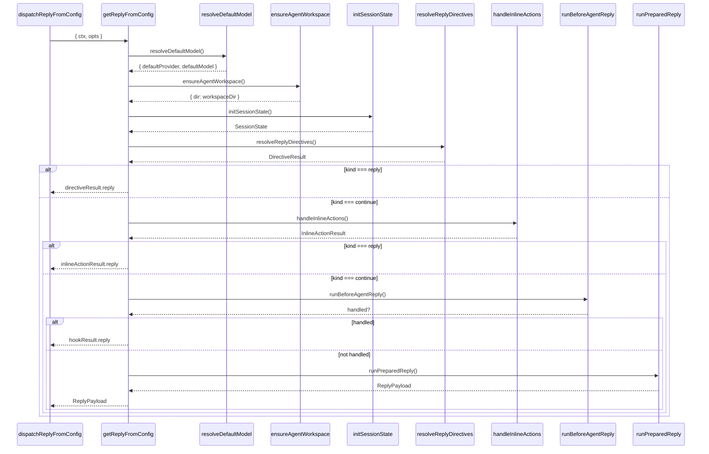

# 6. getReplyFromConfig

#### 1. 函数定位（在整体链路中的作用）

**回复准备器**：负责准备 Agent 回复所需的所有前置条件，包括模型选择、会话初始化、工作目录解析、指令解析、内联动作处理，并调用下游执行准备器。它是消息处理链路的**第 2 层回复准备**。

- 所属阶段：**准备层**
- 职责：模型选择、会话初始化、指令解析、调用 `runPreparedReply`
- 文件：`src/auto-reply/reply/get-reply.ts`
- 行数：~680

---

#### 2. 上下游关系

**上游（谁调用它）：**

- `dispatchReplyFromConfig()` → `dispatch-from-config.ts`
- 通过 `replyResolver()` 参数传入

**下游（它调用谁）：**

- `resolveSessionAgentId()` → `agent-scope.ts`（Agent ID 解析）
- `resolveDefaultModel()` → `directive-handling.defaults.ts`（默认模型）
- `resolveAgentWorkspaceDir()` → `agent-scope.ts`（工作目录）
- `ensureAgentWorkspace()` → `workspace.ts`（创建工作空间）
- `finalizeInboundContext()` → `inbound-context.ts`（上下文定型）
- `applyMediaUnderstandingIfNeeded()` → 本文件（媒体理解）
- `applyLinkUnderstandingIfNeeded()` → 本文件（链接理解）
- `emitPreAgentMessageHooks()` → `message-preprocess-hooks.ts`（预处理 Hook）
- `initSessionState()` → `session.ts`（会话初始化）
- `resolveChannelModelOverride()` → `model-overrides.ts`（渠道模型覆盖）
- `resolveStoredModelOverride()` → `stored-model-override.ts`（存储模型覆盖）
- `resolveReplyDirectives()` → `get-reply-directives.ts`（指令解析）
- `handleInlineActions()` → `get-reply-inline-actions.ts`（内联动作）
- `hookRunner.runBeforeAgentReply()` → Plugin Hook（Agent 回复前 Hook）
- `stageSandboxMedia()` → `stage-sandbox-media.runtime.ts`（媒体暂存）
- `runPreparedReply()` → `get-reply-run.ts`（执行准备器）
- `createTypingController()` → `typing.ts`（打字控制器）

---

#### 3. 输入

```typescript
type GetReplyFromConfigParams = {
  ctx: MsgContext; // 消息上下文
  opts?: GetReplyOptions; // 回复选项
  configOverride?: OpenClawConfig; // 配置覆盖
};
```

**关键控制参数：**

- `ctx.SessionKey` → Session 标识
- `ctx.CommandSource` → 命令来源（native/plugin）
- `opts.isHeartbeat` → 是否心跳触发
- `opts.skillFilter` → 技能过滤器
- `opts.timeoutOverrideSeconds` → 超时覆盖

**数据载体：**

- 输入：`MsgContext`（消息上下文）
- 输出：`ReplyPayload | ReplyPayload[] | undefined`

---

#### 4. 核心处理流程

1. **解析配置和 Agent ID**
   - 调用 `resolveGetReplyConfig()` 获取配置
   - 调用 `resolveSessionAgentId({ sessionKey, config })` 解析 Agent ID
   - async：否

2. **解析默认模型**
   - 调用 `resolveDefaultModel({ cfg, agentId })`
   - 返回：`{ defaultProvider, defaultModel, aliasIndex }`
   - async：否

3. **解析工作目录**
   - 调用 `resolveAgentWorkspaceDir(cfg, agentId)`
   - 调用 `ensureAgentWorkspace({ dir, ensureBootstrapFiles })`
   - async：是

4. **创建打字控制器**
   - 调用 `createTypingController({ onReplyStart, typingIntervalSeconds })`
   - 返回：`TypingController`
   - async：否

5. **定型消息上下文**
   - 调用 `finalizeInboundContext(ctx)`
   - 返回：`FinalizedMsgContext`
   - async：否

6. **媒体理解（可选）**
   - 若 `hasInboundMedia(ctx)`：调用 `applyMediaUnderstandingIfNeeded()`
   - async：是

7. **链接理解（可选）**
   - 若 `hasLinkCandidate(ctx)`：调用 `applyLinkUnderstandingIfNeeded()`
   - async：是

8. **触发预处理 Hooks**
   - 调用 `emitPreAgentMessageHooks({ ctx, cfg, isFastTestEnv })`
   - async：是

9. **初始化会话状态**
   - 调用 `initSessionState({ ctx, cfg, commandAuthorized })`
   - 返回：`SessionState`（包含 sessionKey、sessionEntry、sessionStore 等）
   - async：是

10. **Reset 模型覆盖（可选）**
    - 若 `resetTriggered`：调用 `applyResetModelOverride()`
    - async：是

11. **渠道模型覆盖（可选）**
    - 调用 `resolveChannelModelOverride({ cfg, channel, groupId })`
    - async：否

12. **存储模型覆盖（可选）**
    - 调用 `resolveStoredModelOverride({ sessionEntry, sessionStore })`
    - async：否
    - 若存在覆盖：更新 `provider, model`

13. **快速指令执行（可选）**
    - 若 `shouldUseReplyFastDirectiveExecution()`：直接调用 `runPreparedReply()`
    - async：是

14. **解析回复指令**
    - 调用 `resolveReplyDirectives()`
    - 返回：`DirectiveResult`（包含 command、directives、modelState 等）
    - async：是
    - 若 `kind === "reply"`：`return directiveResult.reply`

15. **处理内联动作**
    - 调用 `handleInlineActions()`
    - async：是
    - 若 `kind === "reply"`：`return inlineActionResult.reply`

16. **Before Agent Reply Hook**
    - 调用 `hookRunner.runBeforeAgentReply()`
    - async：是
    - 若 `handled`：`return hookResult.reply`

17. **媒体暂存（可选）**
    - 若 `hasInboundMedia(ctx)` 且非 fastTest：调用 `stageSandboxMedia()`
    - async：是

18. **调用执行准备器**
    - 调用 `runPreparedReply()` 并传入所有准备好的参数
    - async：是

**数据变化**：

```
MsgContext
 → agentId
 → defaultProvider/defaultModel
 → workspaceDir
 → FinalizedMsgContext
 → SessionState
 → DirectiveResult
 → InlineActionResult
 → runPreparedReply()
 → ReplyPayload
```

---

#### 5. 数据流

```
MsgContext {
    SessionKey, Body, CommandBody,
    Provider, ChatType, ...
}
    │
    ▼ resolveSessionAgentId()
agentId: "main"
    │
    ▼ resolveDefaultModel()
defaultProvider: "bailian"
defaultModel: "glm-5"
aliasIndex: { ... }
    │
    ▼ ensureAgentWorkspace()
workspaceDir: "/path/to/workspace"
    │
    ▼ finalizeInboundContext()
FinalizedMsgContext {
    BodyForCommands, BodyForAgent,
    CommandAuthorized, ...
}
    │
    ▼ initSessionState()
SessionState {
    sessionKey: "agent:main:feishu:direct:ou_xxx",
    sessionEntry: SessionEntry,
    sessionStore: SessionStore,
    isNewSession: boolean,
    resetTriggered: boolean,
    ...
}
    │
    ▼ resolveReplyDirectives()
DirectiveResult {
    kind: "continue",
    result: {
        command, directives, modelState,
        blockStreamingEnabled, ...
    }
}
    │
    ▼ handleInlineActions()
InlineActionResult {
    kind: "continue",
    directives, abortedLastRun
}
    │
    ▼ runPreparedReply()
ReplyPayload {
    text: "回复内容",
    model: "glm-5",
    provider: "bailian",
    usage: { ... }
}
```

---

#### 6. 副作用

| 副作用         | 是否发生                               |
| -------------- | -------------------------------------- |
| 调用 LLM       | ❌（由 `runPreparedReply` 触发）       |
| 创建工作空间   | ✅ `ensureAgentWorkspace()`            |
| 媒体理解       | ✅ `applyMediaUnderstandingIfNeeded()` |
| 链接理解       | ✅ `applyLinkUnderstandingIfNeeded()`  |
| Session 初始化 | ✅ `initSessionState()`                |
| 媒体暂存       | ✅ `stageSandboxMedia()`               |
| Plugin Hook    | ✅ `runBeforeAgentReply()`             |
| Reset 模型覆盖 | ✅ `applyResetModelOverride()`         |

---

#### 7. 关键逻辑 / 复杂点

### 7.1 模型选择链

模型选择遵循优先级：

1. **心跳模型覆盖**：`opts.heartbeatModelOverride`（最高优先）
2. **存储模型覆盖**：`sessionEntry.modelOverride/providerOverride`
3. **渠道模型覆盖**：`cfg.channels.modelByChannel`
4. **默认模型**：`resolveDefaultModel()`

### 7.2 会话初始化

- `initSessionState()`：
  - 解析 sessionKey、sessionId
  - 加载 sessionStore
  - 检测 `resetTriggered`（新会话/reset）
  - 检测 `isNewSession`
  - 解析 `groupResolution`

### 7.3 指令解析

- `resolveReplyDirectives()`：
  - 解析 `/think`, `/verbose`, `/model`, `/block` 等指令
  - 处理技能调用 `/skill:xxx`
  - 处理 elevated 模式
  - 返回 `DirectiveResult`

### 7.4 内联动作

- `handleInlineActions()`：
  - 处理 `/reset`, `/help`, `/status` 等内联命令
  - 处理技能内联调用
  - 可能直接返回回复（不调用 LLM）

### 7.5 快速路径

- `shouldUseReplyFastDirectiveExecution()`：
  - Fast test 环境
  - 非群聊、非心跳
  - 有 trigger body

直接调用 `runPreparedReply()`，跳过指令解析。

### 7.6 媒体处理

- **媒体理解**：分析图片内容，生成描述
- **链接理解**：抓取链接内容，生成摘要
- **媒体暂存**：将媒体文件复制到沙盒目录

---

#### 8. Mermaid 调用关系图



---

#### 9. 快速路径决策表

| 条件                                   | 动作                                 |
| -------------------------------------- | ------------------------------------ |
| `useFastTestBootstrap`                 | 跳过媒体理解、链接理解、预处理 Hooks |
| `shouldUseReplyFastDirectiveExecution` | 直接调用 `runPreparedReply()`        |
| `directiveResult.kind === "reply"`     | 返回 directive 回复                  |
| `inlineActionResult.kind === "reply"`  | 返回 inline action 回复              |
| `hookResult.handled`                   | 返回 hook 回复                       |

---

#### 10. 指令类型

| 指令         | 作用            | 示例                          |
| ------------ | --------------- | ----------------------------- |
| `/think`     | 思考级别        | `/think auto`, `/think off`   |
| `/verbose`   | 详细级别        | `/verbose on`, `/verbose off` |
| `/model`     | 模型切换        | `/model gpt-5`                |
| `/block`     | Block streaming | `/block on`                   |
| `/reset`     | 重置会话        | `/reset`                      |
| `/help`      | 帮助信息        | `/help`                       |
| `/status`    | 状态查询        | `/status`                     |
| `/skill:xxx` | 技能调用        | `/skill:search`               |

---

#### 11. 错误处理

| 错误类型              | 处理方式       |
| --------------------- | -------------- |
| 媒体理解失败          | log + 继续处理 |
| 链接理解失败          | log + 继续处理 |
| 工作空间创建失败      | throw          |
| Session 初始化失败    | throw          |
| 指令解析失败          | throw          |
| 内联动作失败          | throw          |
| runPreparedReply 异常 | throw          |

---

#### 12. 配置项

| 配置                    | 来源                             | 默认值   |
| ----------------------- | -------------------------------- | -------- |
| `typingIntervalSeconds` | `agentCfg.typingIntervalSeconds` | `6`      |
| `skipBootstrap`         | `agentCfg.skipBootstrap`         | `false`  |
| `heartbeat.model`       | `agentCfg.heartbeat.model`       | 无       |
| `timeoutMs`             | `resolveAgentTimeoutMs()`        | 配置决定 |

---

> **文件路径**: `src/auto-reply/reply/get-reply.ts:173`
> **所属步骤**: 主调用链第 6 步
> **分析版本**: 2026-05-04
