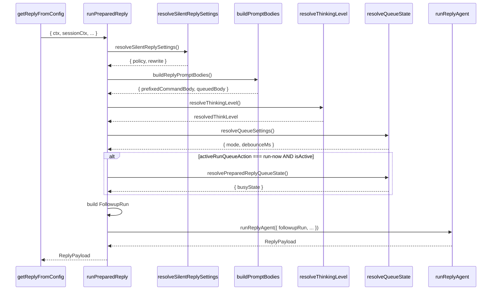

# 7. runPreparedReply

#### 1. 函数定位（在整体链路中的作用）

**执行准备器**：负责准备 Agent 执行所需的所有运行参数，包括 Prompt 构建、Silent 处理、队列状态解析、Thinking 级别验证，并调用下游 Agent 编排器。它是消息处理链路的**第 3 层执行准备**。

- 所属阶段：**准备层**
- 职责：Prompt 构建、Silent 处理、队列决策、调用 `runReplyAgent`
- 文件：`src/auto-reply/reply/get-reply-run.ts`
- 行数：~1059

---

#### 2. 上下游关系

**上游（谁调用它）：**

- `getReplyFromConfig()` → `get-reply.ts`
- 直接调用并传入所有准备好的参数

**下游（它调用谁）：**

- `resolvePromptSessionContextForSystemEvent()` → 本文件（系统事件上下文）
- `resolveSilentReplySettings()` → `config/silent-reply.ts`（Silent 配置）
- `resolveRunTypingPolicy()` → `typing-policy.ts`（打字策略）
- `resolveTypingMode()` → `typing-mode.ts`（打字模式）
- `buildDirectChatContext()` → `groups.ts`（私聊上下文）
- `buildGroupChatContext()` → `groups.ts`（群聊上下文）
- `buildGroupIntro()` → `groups.ts`（群介绍）
- `buildInboundMetaSystemPrompt()` → `inbound-meta.ts`（元系统提示）
- `resolveBareSessionResetPromptState()` → `session-reset-prompt.ts`（Reset 提示）
- `buildSessionStartupContextPrelude()` → `startup-context.ts`（启动上下文）
- `applySessionHints()` → `body.ts`（Session 提示）
- `drainFormattedSystemEvents()` → `session-system-events.ts`（系统事件）
- `ensureSkillSnapshot()` → `session-updates.runtime.ts`（技能快照）
- `resolveQueueSettings()` → `queue/settings-runtime.ts`（队列设置）
- `resolveActiveRunQueueAction()` → `queue-policy.ts`（队列动作）
- `resolvePreparedReplyQueueState()` → `get-reply-run-queue.ts`（队列状态）
- `resolveSessionAuthProfileOverride()` → `auth-profiles/session-override.ts`（认证覆盖）
- `runReplyAgent()` → `agent-runner.ts`（Agent 编排器）

---

#### 3. 输入

```typescript
type RunPreparedReplyParams = {
  ctx: MsgContext; // 消息上下文
  sessionCtx: TemplateContext; // 模板上下文
  cfg: OpenClawConfig; // OpenClaw 配置
  agentId: string; // Agent ID
  agentDir: string; // Agent 目录
  agentCfg: AgentDefaults; // Agent 默认配置
  sessionCfg: OpenClawConfig["session"]; // Session 配置
  commandAuthorized: boolean; // 命令授权
  command: CommandContext; // 命令上下文
  directives: InlineDirectives; // 内联指令
  modelState: ModelSelectionState; // 模型选择状态
  provider: string; // Provider
  model: string; // Model
  typing: TypingController; // 打字控制器
  opts?: GetReplyOptions; // 回复选项
  sessionEntry?: SessionEntry; // Session Entry
  sessionStore?: Record<string, SessionEntry>; // Session Store
  sessionKey: string; // Session Key
  workspaceDir: string; // 工作目录
  // ... 更多参数
};
```

**关键控制参数：**

- `isNewSession` → 是否新会话
- `resetTriggered` → 是否触发重置
- `blockStreamingEnabled` → Block streaming 是否启用
- `resolvedQueue.mode` → 队列模式
- `elevatedEnabled/Allowed` → Elevated 权限

**数据载体：**

- 输入：完整的准备参数（~40 个）
- 输出：`ReplyPayload | ReplyPayload[] | undefined`

---

#### 4. 核心处理流程

1. **解析 Prompt Session Context**
   - 调用 `resolvePromptSessionContextForSystemEvent()`
   - 处理系统事件的 Provider/Surface 恢复
   - async：否

2. **解析 Silent Reply 配置**
   - 调用 `resolveSilentReplySettings()`
   - 返回：`{ policy, rewrite }`
   - async：否

3. **解析打字策略**
   - 调用 `resolveRunTypingPolicy()`
   - 调用 `resolveTypingMode()`
   - async：否

4. **构建聊天上下文**
   - 若私聊：调用 `buildDirectChatContext()`
   - 若群聊：调用 `buildGroupChatContext()`
   - async：否

5. **构建群介绍（可选）**
   - 若 `isFirstTurnInSession` 或 `groupActivationNeedsSystemIntro`：
     - 调用 `buildGroupIntro()`
   - async：否

6. **构建元系统提示**
   - 调用 `buildInboundMetaSystemPrompt()`
   - async：否

7. **构建 Exec Override 提示**
   - 调用 `buildExecOverridePromptHint()`
   - async：否

8. **处理 Bare Session Reset**
   - 若 `isBareSessionReset`：
     - 调用 `resolveBareSessionResetPromptState()`
     - 调用 `buildSessionStartupContextPrelude()`
   - async：是

9. **构建 Prompt Bodies**
   - 调用 `buildInboundUserContextPrefix()`
   - 调用 `applySessionHints()`
   - 调用 `buildReplyPromptBodies()`
   - async：是

10. **解析 Thinking 级别**
    - 若 `!resolvedThinkLevel`：从消息首词解析
    - 验证级别支持：`isThinkingLevelSupported()`
    - 若不支持：fallback 或返回错误
    - async：是

11. **确保技能快照**
    - 调用 `ensureSkillSnapshot()`
    - async：是

12. **解析队列设置**
    - 调用 `resolveQueueSettings()`
    - 返回：`{ mode, debounceMs, cap, dropPolicy }`
    - async：否

13. **解析队列状态**
    - 调用 `resolveActiveRunQueueAction()`
    - 若 `activeRunQueueAction === "run-now"` 且 `isActive`：
      - 调用 `resolvePreparedReplyQueueState()`
    - async：是

14. **解析认证覆盖**
    - 调用 `resolveSessionAuthProfileOverride()`
    - async：是

15. **构建 FollowupRun**
    - 组装 `followupRun` 对象
    - 包含 `prompt, transcriptPrompt, run, ...`
    - async：否

16. **调用 Agent 编排器**
    - 调用 `runReplyAgent()`
    - async：是

**数据变化**：

```
RunPreparedReplyParams
 → PromptSessionContext
 → SilentReplySettings
 → TypingPolicy
 → ChatContext + GroupIntro
 → PromptBodies
 → ThinkingLevel
 → QueueSettings
 → QueueState
 → FollowupRun
 → runReplyAgent()
 → ReplyPayload
```

---

#### 5. 数据流

```
RunPreparedReplyParams {
    ctx, sessionCtx, cfg, agentId,
    provider, model, typing, ...
}
    │
    ▼ resolvePromptSessionContextForSystemEvent()
TemplateContext (for prompt)
    │
    ▼ resolveSilentReplySettings()
SilentReplySettings { policy, rewrite }
    │
    ▼ buildDirectChatContext() / buildGroupChatContext()
ChatContext: "Direct chat context..."
    │
    ▼ buildReplyPromptBodies()
PromptBodies {
    prefixedCommandBody,
    queuedBody,
    transcriptCommandBody
}
    │
    ▼ resolveQueueSettings()
QueueSettings {
    mode: "run",
    debounceMs: 0,
    cap: 1
}
    │
    ▼ FollowupRun
FollowupRun {
    prompt: queuedBody,
    transcriptPrompt: transcriptCommandBody,
    run: {
        agentId, sessionId, provider, model,
        thinkLevel, verboseLevel, ...
    }
}
    │
    ▼ runReplyAgent()
ReplyPayload {
    text: "Agent reply",
    model: "glm-5",
    usage: { ... }
}
```

---

#### 6. 副作用

| 副作用        | 是否发生                                    |
| ------------- | ------------------------------------------- |
| 调用 LLM      | ❌（由 `runReplyAgent` 触发）               |
| Session 更新  | ✅ `ensureSkillSnapshot()`                  |
| 队列操作      | ✅ `clearCommandLane`, `abortEmbeddedPiRun` |
| 认证解析      | ✅ `resolveSessionAuthProfileOverride()`    |
| Thinking 验证 | ✅ `isThinkingLevelSupported()`             |

---

#### 7. 关键逻辑 / 复杂点

### 7.1 Prompt 构建分层

Prompt 分为多层：

1. **Inbound Meta**：消息元数据（Message ID、时间戳等）
2. **Chat Context**：私聊/群聊上下文
3. **Group Intro**：群介绍（首次进入）
4. **Exec Override**：当前 Exec 状态
5. **User Context**：用户消息前缀
6. **Base Body**：消息正文
7. **System Events**：系统事件块

### 7.2 Bare Session Reset

- `/reset` 或 `/new` 命令
- 新会话且有消息
- 需加载启动上下文：`buildSessionStartupContextPrelude()`

### 7.3 Thinking 级别解析

- 首词解析：`/think low` → `resolvedThinkLevel = "low"`
- 验证支持：某些模型不支持特定 Thinking 级别
- Fallback：自动降级到支持的级别

### 7.4 队列决策

- `shouldSteer`：是否 Steer 模式（活运行中追加）
- `shouldFollowup`：是否 Followup 模式（完成后继续）
- `activeRunQueueAction`：`run-now` / `wait` / `skip`
- 若 `run-now` 且 `isActive`：需要处理队列状态

### 7.5 Silent Reply

- `silentReplyPolicy`：`allow` / `deny` / `rewrite`
- `allowEmptyAssistantReplyAsSilent`：允许空回复作为 Silent
- 群聊：根据 `defaultActivation` 决定

### 7.6 FollowupRun

包含完整的运行参数：

- `prompt`：用于队列处理的 Prompt
- `transcriptPrompt`：用于 Transcript 记录
- `run`：Agent 运行配置（provider, model, thinkLevel 等）

---

#### 8. Mermaid 调用关系图



---

#### 9. 队列模式决策表

| 模式        | shouldSteer | shouldFollowup | 动作            |
| ----------- | ----------- | -------------- | --------------- |
| `run`       | false       | false          | 立即运行        |
| `steer`     | true        | false          | Steer 到活运行  |
| `followup`  | false       | true           | Followup 到队列 |
| `collect`   | false       | true           | 收集并 debounce |
| `interrupt` | -           | -              | 中断当前运行    |

---

#### 10. Thinking 级别支持

| 级别     | 说明        | 适用模型       |
| -------- | ----------- | -------------- |
| `off`    | 无 Thinking | 所有           |
| `low`    | 低 Thinking | Claude, Gemini |
| `medium` | 中 Thinking | Claude, Gemini |
| `high`   | 高 Thinking | Claude, Gemini |
| `auto`   | 自动决定    | Claude         |

---

#### 11. 错误处理

| 错误类型            | 处理方式                |
| ------------------- | ----------------------- |
| Thinking 级别不支持 | fallback 或返回错误提示 |
| 消息体为空          | 返回提示消息            |
| 队列状态异常        | cleanup + return        |

---

#### 12. 配置项

| 配置                    | 来源                      | 默认值      |
| ----------------------- | ------------------------- | ----------- |
| `typingMode`            | `sessionCfg.typingMode`   | `"channel"` |
| `silentReplyPolicy`     | `cfg.silentReply.policy`  | `"deny"`    |
| `thinkLevel`            | `directives.thinkLevel`   | `"auto"`    |
| `verboseLevel`          | `directives.verboseLevel` | `"off"`     |
| `blockStreamingEnabled` | `directives.block`        | `false`     |

---

> **文件路径**: `src/auto-reply/reply/get-reply-run.ts:343`
> **所属步骤**: 主调用链第 7 步
> **分析版本**: 2026-05-04
