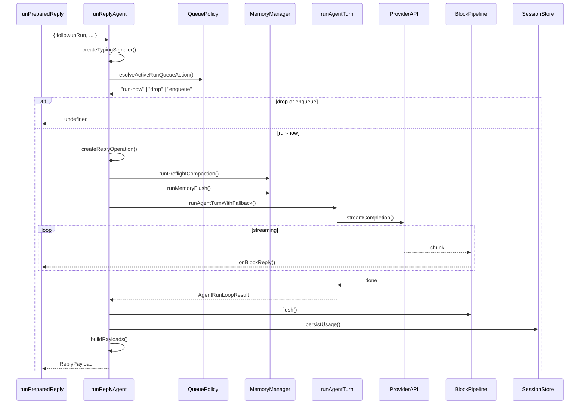

# 8. runReplyAgent

#### 1. 函数定位（在整体链路中的作用）

**Agent 回复编排器**：负责协调从消息输入到最终回复输出的完整生命周期，包括队列管理、会话压缩、LLM 调用、流式处理、结果构造和会话更新。它是消息处理链路的**第 4 层 Agent 编排**。

- 所属阶段：**编排层**
- 职责：队列决策、预压缩、Agent 执行、结果构造、调用 `runAgentTurnWithFallback`
- 文件：`src/auto-reply/reply/agent-runner.ts`
- 行数：~1869

---

#### 2. 上下游关系

**上游（谁调用它）：**

- `runPreparedReply()` → `get-reply-run.ts`
- 直接调用并传入 `FollowupRun` 等参数

**下游（它调用谁）：**

- `createTypingSignaler()` → `typing-mode.ts`（打字指示器）
- `resolveActiveRunQueueAction()` → `queue-policy.ts`（队列策略）
- `createReplyOperation()` → `reply-run-registry.ts`（运行操作）
- `runPreflightCompactionIfNeeded()` → `agent-runner-memory.ts`（预压缩）
- `runMemoryFlushIfNeeded()` → `agent-runner-memory.ts`（内存刷新）
- `runAgentTurnWithFallback()` → `agent-runner-execution.ts`（Agent 执行）
- `buildReplyPayloads()` → `agent-runner-payloads.ts`（Payload 构建）
- `persistRunSessionUsage()` → `session-run-accounting.ts`（Usage 持久化）
- `finalizeWithFollowup()` → `agent-runner-helpers.ts`（最终返回）
- `updateSessionStoreEntry()` → `config/sessions.ts`（Session 更新）

---

#### 3. 输入

```typescript
type RunReplyAgentParams = {
  commandBody: string; // 用户消息正文
  transcriptCommandBody?: string; // Transcript 命令体
  followupRun: FollowupRun; // 后续运行上下文
  queueKey: string; // 队列键
  resolvedQueue: QueueSettings; // 队列设置
  shouldSteer: boolean; // 是否 Steering 模式
  shouldFollowup: boolean; // 是否 Followup 模式
  isActive: boolean; // 当前是否有活运行
  isRunActive?: () => boolean; // 运行状态检测函数
  isStreaming: boolean; // 是否流式响应
  opts?: GetReplyOptions; // 回复选项（回调函数）
  typing: TypingController; // 打字控制器
  sessionEntry?: SessionEntry; // Session Entry
  sessionStore?: Record<string, SessionEntry>; // Session Store
  sessionKey?: string; // Session Key
  storePath?: string; // 存储路径
  defaultModel: string; // 默认模型
  blockStreamingEnabled: boolean; // Block streaming 是否启用
  sessionCtx: TemplateContext; // 模板上下文
  typingMode: TypingMode; // 打字模式
  resetTriggered?: boolean; // 是否触发重置
  // ... 更多参数
};
```

**关键控制参数：**

- `shouldSteer` → 是否将消息注入到现有运行
- `shouldFollowup` → 是否排队后续运行
- `isActive` + `isStreaming` → Steering 条件
- `resolvedQueue.mode` → 队列模式（run/steer/followup/collect）
- `blockStreamingEnabled` → 是否启用流式响应

**数据载体：**

- 输入：`FollowupRun`（包含 agentId、sessionKey、provider、model 等）
- 输出：`ReplyPayload | ReplyPayload[] | undefined`

---

#### 4. 核心处理流程

1. **初始化阶段**
   - 创建 `TypingSignaler`
   - 创建 `shouldEmitToolResult` / `shouldEmitToolOutput`
   - async：否

2. **Steering 检查**
   - 若 `shouldSteer && isStreaming`：
     - 调用 `queueEmbeddedPiMessage()` 注入消息
     - 若 `!shouldFollowup`：`return undefined`
   - async：是

3. **队列策略决策**
   - 调用 `resolveActiveRunQueueAction()`
   - 返回：`"drop" | "enqueue-followup" | "run-now" | "wait"`
   - async：否
   - 若 `"drop"`：`return undefined`
   - 若 `"enqueue-followup"`：排队并 `return undefined`

4. **上下文构建**
   - 解析运行配置：`resolveQueuedReplyExecutionConfig()`
   - 解析回复线程模式：`resolveReplyToMode()`
   - 创建媒体上下文：`createReplyMediaContext()`
   - 创建 Block Pipeline：`createBlockReplyPipeline()`
   - async：是

5. **创建 ReplyOperation**
   - 调用 `createReplyOperation()`
   - 管理生命周期：`queued → running → completed/failed/aborted`
   - async：否

6. **Preflight Compaction**
   - 调用 `runPreflightCompactionIfNeeded()`
   - 若接近 context window 上限：预压缩历史
   - async：是

7. **Memory Flush**
   - 调用 `runMemoryFlushIfNeeded()`
   - 将长期记忆写入文件
   - async：是

8. **核心 Agent 执行**
   - 调用 `runAgentTurnWithFallback()`
   - 内部调用 `runEmbeddedPiAgent()` → LLM API
   - async：是

9. **结果判断**
   - 若 `runOutcome.kind === "final"`：直接返回
   - 否则：继续处理
   - async：否

10. **流式管道清理**
    - 调用 `blockReplyPipeline.flush()`
    - 排空 pending tool tasks
    - async：是

11. **Usage 持久化**
    - 调用 `persistRunSessionUsage()`
    - async：是

12. **构建 ReplyPayload**
    - 调用 `buildReplyPayloads()`
    - async：是

13. **添加辅助信息**
    - Reminder Guard、Commitment Extraction
    - Usage Line、Verbose Notices、Trace Payload
    - async：是

14. **最终返回**
    - 调用 `finalizeWithFollowup()`
    - 调度 followup drain
    - async：否

**数据变化**：

```
commandBody
 → TypingSignaler
 → QueueAction
 → ReplyOperation
 → PreflightCompaction
 → MemoryFlush
 → runAgentTurnWithFallback()
 → EmbeddedPiRunResult
 → ReplyPayload[]
 → finalizeWithFollowup()
 → ReplyPayload
```

---

#### 5. 数据流

```
FollowupRun {
    prompt: queuedBody,
    transcriptPrompt: transcriptCommandBody,
    run: { agentId, sessionId, provider, model, ... }
}
    │
    ▼ resolveActiveRunQueueAction()
QueueAction: "run-now"
    │
    ▼ createReplyOperation()
ReplyOperation { phase: "queued" }
    │
    ▼ runPreflightCompactionIfNeeded()
SessionEntry (compacted)
    │
    ▼ runAgentTurnWithFallback()
AgentRunLoopResult {
    kind: "turn",
    payloads: ReplyPayload[],
    meta: { usage, promptTokens, model, provider }
}
    │
    ▼ buildReplyPayloads()
ReplyPayload[] {
    text: "回复内容",
    model: "glm-5",
    usage: { inputTokens, outputTokens }
}
    │
    ▼ finalizeWithFollowup()
ReplyPayload | ReplyPayload[]
```

---

#### 6. 副作用

| 副作用            | 是否发生                                    |
| ----------------- | ------------------------------------------- |
| 调用 LLM          | ✅ 通过 `runAgentTurnWithFallback`          |
| 调用 Tools        | ✅ Harness 执行 tool calls                  |
| 发送消息          | ✅ `opts.onBlockReply`, `opts.onToolResult` |
| Session 更新      | ✅ `updatedAt`, `compactionCount`           |
| Store 更新        | ✅ `updateSessionStoreEntry`                |
| Diagnostic Events | ✅ `emitTrustedDiagnosticEvent`             |
| Agent Events      | ✅ `emitAgentEvent`                         |
| Memory Flush      | ✅ 写入长期记忆文件                         |

---

#### 7. 关键逻辑 / 复杂点

### 7.1 Steering 模式

- **条件**：`shouldSteer && isStreaming`
- **作用**：将消息注入到现有运行，不启动新运行
- **场景**：用户在 Agent 执行中追加消息

### 7.2 队列策略

四种队列动作：

- `"drop"`：丢弃消息
- `"enqueue-followup"`：排队后续运行
- `"run-now"`：立即执行
- `"wait"`：等待当前运行完成

### 7.3 Preflight Compaction

- **触发条件**：接近 context window 上限
- **作用**：压缩历史消息，释放空间
- **算法**：保留重要消息，压缩旧消息

### 7.4 Memory Flush

- **作用**：将长期记忆写入文件
- **触发**：配置启用 + 接近限制
- **异步**：不阻塞主流程

### 7.5 Fallback 逻辑

- 主模型失败时尝试备用模型
- 限制 fallback attempts 数量
- 记录 fallback 事件

### 7.6 Block Streaming

- 流式发送回复块
- 通过 `opts.onBlockReply` 回调
- 支持 chunking 配置

---

#### 8. Mermaid 调用关系图



---

#### 9. 队列动作决策表

| 条件                          | Action               | 结果         |
| ----------------------------- | -------------------- | ------------ |
| `resetTriggered`              | `"interrupt"`        | 中断当前运行 |
| `shouldSteer && isStreaming`  | Steering             | 注入消息     |
| `shouldFollowup && isActive`  | `"enqueue-followup"` | 排队         |
| `isActive && !shouldFollowup` | `"drop"`             | 丢弃         |
| `!isActive`                   | `"run-now"`          | 立即执行     |

---

#### 10. 返回值逻辑

| 条件          | 返回值                         |
| ------------- | ------------------------------ | --------------- |
| Steering 成功 | `undefined`                    |
| Queue drop    | `undefined`                    |
| Queue enqueue | `undefined`                    |
| 快速路径      | `ReplyPayload`                 |
| 正常执行      | `ReplyPayload                  | ReplyPayload[]` |
| aborted       | `{ text: SILENT_REPLY_TOKEN }` |
| 异常          | `throw error`                  |

---

#### 11. 错误处理

| 错误类型                     | 处理方式                        |
| ---------------------------- | ------------------------------- |
| `ReplyRunAlreadyActiveError` | 返回冲突提示                    |
| `aborted_for_restart`        | Gateway 重启提示                |
| `aborted`                    | SILENT_REPLY_TOKEN              |
| `GatewayDrainingError`       | Gateway 重启提示                |
| `CommandLaneClearedError`    | Gateway 重启提示                |
| 其他                         | `replyOperation.fail()` + throw |

---

#### 12. 配置项

| 配置                  | 来源                          | 默认值       |
| --------------------- | ----------------------------- | ------------ |
| `queueMode`           | `resolvedQueue.mode`          | `"run"`      |
| `blockStreamingBreak` | `resolvedBlockStreamingBreak` | `"text_end"` |
| `typingMode`          | `typingMode`                  | `"channel"`  |
| `verboseLevel`        | `resolvedVerboseLevel`        | `"off"`      |

---

> **文件路径**: `src/auto-reply/reply/agent-runner.ts:888`
> **所属步骤**: 主调用链第 8 步
> **分析版本**: 2026-05-04
