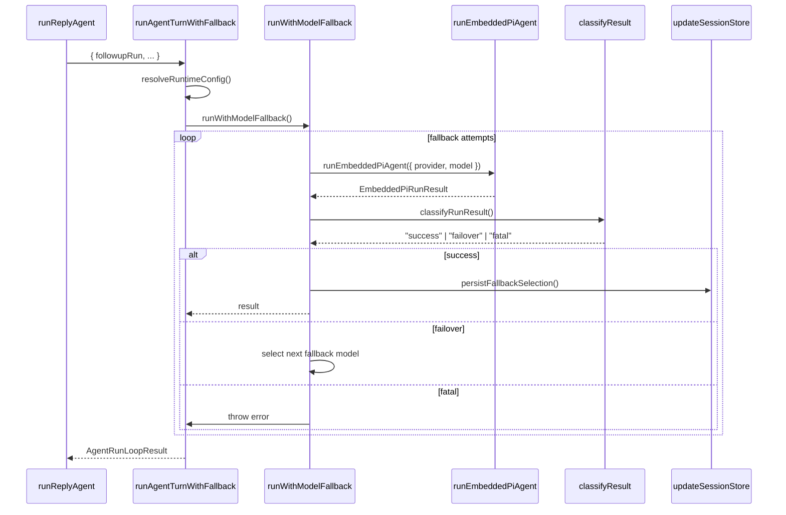

# 9. runAgentTurnWithFallback

#### 1. 函数定位（在整体链路中的作用）

**Agent Turn 执行器**：负责执行单个 Agent Turn，包含模型 fallback 逻辑、Compaction 处理、工具执行、流式处理，并调用嵌入式 Pi Agent。它是消息处理链路的**执行层入口**。

- 所属阶段：**执行层**
- 职责：Fallback 逻辑、Compaction 处理、调用 `runEmbeddedPiAgent`
- 文件：`src/auto-reply/reply/agent-runner-execution.ts`
- 行数：~2078

---

#### 2. 上下游关系

**上游（谁调用它）：**

- `runReplyAgent()` → `agent-runner.ts`
- 通过 `[run path]` 分支调用

**下游（它调用谁）：**

- `resolveQueuedReplyRuntimeConfig()` → 本文件（运行配置）
- `createReplyMediaContext()` → `reply-media-paths.ts`（媒体上下文）
- `runWithModelFallback()` → 本文件（Fallback 循环）
- `runEmbeddedPiAgent()` → `pi-embedded-runner/run.ts`（Pi Agent）
- `createBlockReplyDeliveryHandler()` → 本文件（Block 回复处理）
- `updateSessionStore()` → `config/sessions/store.ts`（Session 更新）
- `emitAgentEvent()` → `infra/agent-events.ts`（Agent 事件）

---

#### 3. 输入

```typescript
type RunAgentTurnParams = {
  commandBody: string; // 用户消息正文
  transcriptCommandBody?: string; // Transcript 命令体
  followupRun: FollowupRun; // 后续运行上下文
  sessionCtx: TemplateContext; // 模板上下文
  replyOperation?: ReplyOperation; // 运行操作
  opts?: GetReplyOptions; // 回复选项（回调函数）
  typingSignals: TypingSignaler; // 打字信号器
  blockReplyPipeline: BlockReplyPipeline | null; // Block 管道
  blockStreamingEnabled: boolean; // Block streaming 是否启用
  shouldEmitToolResult: () => boolean; // 是否显示工具结果
  pendingToolTasks: Set<Promise<void>>; // 待处理工具任务
  isHeartbeat: boolean; // 是否心跳
  sessionKey?: string; // Session Key
  storePath?: string; // 存储路径
  resolvedVerboseLevel: VerboseLevel; // 详细级别
  replyMediaContext?: ReplyMediaContext; // 媒体上下文
  // ... 更多参数
};
```

**关键控制参数：**

- `followupRun.run.provider/model` → 主模型
- `blockStreamingEnabled` → 流式响应
- `shouldEmitToolResult` → 工具结果可见性
- `resolvedVerboseLevel` → verbose 模式

**数据载体：**

- 输入：`FollowupRun`（运行上下文）
- 输出：`AgentRunLoopResult { kind, payloads, meta }`

---

#### 4. 核心处理流程

1. **解析运行配置**
   - 调用 `resolveQueuedReplyRuntimeConfig()`
   - 返回：`runtimeConfig`
   - async：否

2. **创建媒体上下文**
   - 调用 `createReplyMediaContext()`
   - async：否

3. **注册 Agent 运行上下文**
   - 调用 `registerAgentRunContext()`
   - async：否

4. **初始化 Fallback 状态**
   - 设置 `fallbackProvider, fallbackModel`
   - 初始化 `fallbackAttempts`
   - async：否

5. **Fallback 循环**
   - 调用 `runWithModelFallback()`
   - 循环直到成功或 exhausting fallbacks
   - async：是

6. **运行 Embedded Pi Agent**
   - 调用 `runEmbeddedPiAgent()`
   - async：是

7. **分类运行结果**
   - 调用 `outcomePlan.classifyRunResult()`
   - 返回：`"success" | "failover" | "fatal"`
   - async：否

8. **处理成功结果**
   - 构建 payloads
   - 持久化 fallback 选择（如果有）
   - async：是

9. **处理 Failover**
   - 选择下一个 fallback 模型
   - 更新 `fallbackProvider, fallbackModel`
   - 继续循环
   - async：是

10. **处理 Fatal 错误**
    - 抛出错误
    - async：否

**数据变化**：

```
FollowupRun
 → RuntimeConfig
 → runEmbeddedPiAgent()
 → EmbeddedAgentRunResult
 → classifyRunResult()
 → AgentRunLoopResult
```

---

#### 5. 数据流

```
FollowupRun {
    run: { provider, model, sessionId, ... }
}
    │
    ▼ resolveQueuedReplyRuntimeConfig()
RuntimeConfig { agents.defaults, ... }
    │
    ▼ runWithModelFallback()
fallbackProvider: "bailian"
fallbackModel: "glm-5"
    │
    ▼ runEmbeddedPiAgent()
EmbeddedPiRunResult {
    payloads: ReplyPayload[],
    meta: { durationMs, agentMeta, usage }
}
    │
    ▼ classifyRunResult()
classification: "success" | "failover" | "fatal"
    │
    ▼ [success]
AgentRunLoopResult {
    kind: "turn",
    payloads: ReplyPayload[],
    meta: EmbeddedPiRunResult.meta
}
```

---

#### 6. 副作用

| 副作用           | 是否发生                                    |
| ---------------- | ------------------------------------------- |
| 调用 LLM         | ✅ 通过 `runEmbeddedPiAgent`                |
| 工具执行         | ✅ 通过 Harness                             |
| 发送 Block Reply | ✅ `opts.onBlockReply`                      |
| 发送 Tool Result | ✅ `opts.onToolResult`                      |
| Session 更新     | ✅ `updateSessionStore`                     |
| Agent Events     | ✅ `emitAgentEvent`                         |
| Fallback 持久化  | ✅ `applyFallbackCandidateSelectionToEntry` |

---

#### 7. 关键逻辑 / 复杂点

### 7.1 Fallback 循环

- **触发条件**：主模型失败
- **循环逻辑**：
  1. 尝试主模型
  2. 若失败：分类错误类型
  3. 若 `failover`：选择下一个 fallback 模型
  4. 若 `fatal`：抛出错误
- **限制**：最多 N 次 fallback attempts

### 7.2 Fallback 持久化

- 成功使用 fallback 模型后，可选持久化到 session
- `modelOverrideSource: "auto"` 标记为自动选择
- 用户手动选择的模型不会被覆盖

### 7.3 Compaction 处理

- 运行中可能触发 Compaction
- `sendCompactionNotice()` 发送压缩提示
- `shouldNotifyUserAboutCompaction` 配置控制

### 7.4 Block Reply Delivery

- `createBlockReplyDeliveryHandler()` 创建处理器
- 处理 `replyToMode` 线程逻辑
- 处理媒体路径标准化

### 7.5 Silent Reply 处理

- `normalizeStreamingText()` 处理 silent token
- 跳过 `SILENT_REPLY_TOKEN` 消息
- 跳过 `HEARTBEAT_TOKEN` 消息

---

#### 8. Mermaid 调用关系图



---

#### 9. Fallback 分类决策

| 错误类型     | classification | 动作             |
| ------------ | -------------- | ---------------- |
| 模型不可用   | `failover`     | 尝试下一个模型   |
| Rate Limit   | `failover`     | 尝试下一个模型   |
| Auth 错误    | `failover`     | 尝试下一个模型   |
| 网络错误     | `failover`     | 重试或下一个模型 |
| Context 太长 | `fatal`        | 需要 Compaction  |
| 用户 Abort   | `fatal`        | 抛出 AbortError  |

---

#### 10. 返回值结构

```typescript
type AgentRunLoopResult = {
  kind: "turn" | "final";
  payloads?: ReplyPayload[];
  meta?: {
    durationMs: number;
    agentMeta: {
      sessionId: string;
      provider: string;
      model: string;
      promptTokens?: number;
      outputTokens?: number;
    };
    fallbackAttempts?: RuntimeFallbackAttempt[];
  };
};
```

---

#### 11. 错误处理

| 错误类型                | 处理方式           |
| ----------------------- | ------------------ |
| `FailoverError`         | 选择 fallback 模型 |
| `AbortError`            | 抛出，终止运行     |
| `CompactionNeededError` | 执行 Compaction    |
| 其他错误                | 抛出，标记为 fatal |

---

> **文件路径**: `src/auto-reply/reply/agent-runner-execution.ts:871`
> **所属步骤**: 主调用链第 9 步
> **分析版本**: 2026-05-04
