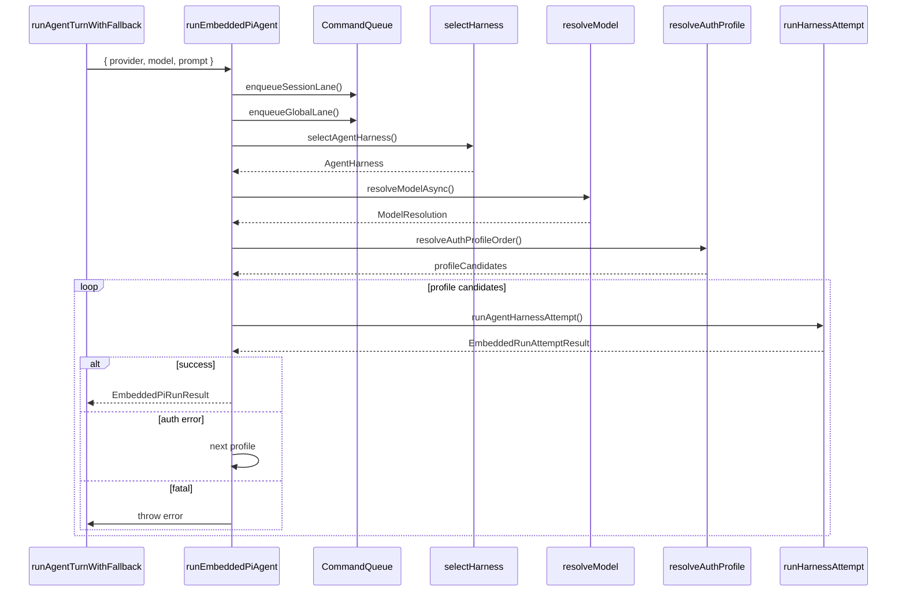

# 10. runEmbeddedPiAgent

#### 1. 函数定位（在整体链路中的作用）

**嵌入式 Pi Agent 运行器**：负责执行 Pi Agent 的完整生命周期，包括模型解析、认证选择、Harness 选择、运行计划构建，并调用 Harness 执行。它是消息处理链路的**Pi 层执行入口**。

- 所属阶段：**Pi 层**
- 职责：模型解析、认证选择、Harness 选择、调用 `runAgentHarnessAttempt`
- 文件：`src/agents/pi-embedded-runner/run.ts`
- 行数：~2649

---

#### 2. 上下游关系

**上游（谁调用它）：**

- `runAgentTurnWithFallback()` → `agent-runner-execution.ts`
- 通过 Fallback 循环调用

**下游（它调用谁）：**

- `resolveSessionLane()` → `command-queue.ts`（Session Lane）
- `resolveGlobalLane()` → `command-queue.ts`（Global Lane）
- `enqueueCommandInLane()` → `command-queue.ts`（队列入队）
- `resolveRunWorkspaceDir()` → `workspace.ts`（工作目录）
- `ensureRuntimePluginsLoaded()` → `plugins/runtime.ts`（运行时插件）
- `selectAgentHarness()` → `harness/selection.ts`（Harness 选择）
- `resolveModelAsync()` → `model-selection.ts`（模型解析）
- `resolveHookModelSelection()` → `hooks/model-selection.ts`（Hook 模型选择）
- `resolveAuthProfileOrder()` → `auth-profiles.ts`（认证顺序）
- `runAgentHarnessAttempt()` → `harness/selection.ts`（Harness 执行）

---

#### 3. 输入

```typescript
type RunEmbeddedPiAgentParams = {
  runId: string; // 运行 ID
  sessionId: string; // Session ID
  sessionKey?: string; // Session Key
  prompt: string; // 用户 Prompt
  provider: string; // Provider
  model: string; // Model ID
  config?: OpenClawConfig; // OpenClaw 配置
  workspaceDir: string; // 工作目录
  agentId?: string; // Agent ID
  agentDir?: string; // Agent 目录
  timeoutMs?: number; // 超时时间
  abortSignal?: AbortSignal; // 中断信号
  images?: ImageAttachment[]; // 图片附件
  authProfileId?: string; // 认证 Profile ID
  thinkLevel?: ThinkLevel; // Thinking 级别
  verboseLevel?: VerboseLevel; // Verbose 级别
  agentHarnessId?: string; // Harness ID
  extraSystemPrompt?: string; // 额外系统提示
  // ... 更多参数
};
```

**关键控制参数：**

- `provider/model` → 模型选择
- `authProfileId` → 认证 Profile
- `agentHarnessId` → Harness 选择
- `thinkLevel/verboseLevel` → 运行级别
- `abortSignal` → 中断控制

**数据载体：**

- 输入：`RunEmbeddedPiAgentParams`（运行参数）
- 输出：`EmbeddedPiRunResult { payloads, meta }`

---

#### 4. 核心处理流程

1. **Session Key Backfill**
   - 调用 `backfillSessionKey()`
   - 确保 sessionKey 有效
   - async：否

2. **解析 Lane**
   - 调用 `resolveSessionLane(sessionKey/sessionId)`
   - 调用 `resolveGlobalLane(lane)`
   - async：否

3. **入队到 Lane**
   - 调用 `enqueueCommandInLane(sessionLane, task)`
   - 调用 `enqueueCommandInLane(globalLane, task)`
   - async：是

4. **解析工作目录**
   - 调用 `resolveRunWorkspaceDir()`
   - 返回：`{ workspaceDir, agentId }`
   - async：否

5. **加载运行时插件**
   - 调用 `ensureRuntimePluginsLoaded()`
   - async：是

6. **Hook 模型选择**
   - 调用 `resolveHookModelSelection()`
   - Plugin Hook 可能修改 provider/model
   - async：是

7. **选择 Harness**
   - 调用 `selectAgentHarness()`
   - 返回：`AgentHarness`（pi 或 plugin harness）
   - async：否

8. **解析模型**
   - 调用 `resolveModelAsync(provider, modelId, agentDir, config)`
   - 返回：`{ model, authStorage, modelRegistry }`
   - async：是
   - 若无模型：抛出 `FailoverError`

9. **解析认证 Profile**
   - 调用 `resolveAuthProfileOrder()`
   - 生成 `profileCandidates`
   - async：否

10. **认证 Profile 循环**
    - 尝试每个 Profile candidate
    - 失败时切换到下一个
    - async：是

11. **调用 Harness 执行**
    - 调用 `runAgentHarnessAttempt()`
    - async：是

12. **返回结果**
    - 构建 `EmbeddedPiRunResult`
    - 包含 payloads 和 meta
    - async：否

**数据变化**：

```
RunEmbeddedPiAgentParams
 → sessionLane + globalLane
 → workspaceDir
 → AgentHarness
 → ModelResolution
 → AuthProfileCandidates
 → runAgentHarnessAttempt()
 → EmbeddedPiRunResult
```

---

#### 5. 数据流

```
RunEmbeddedPiAgentParams {
    runId, sessionId, sessionKey,
    prompt, provider, model, ...
}
    │
    ▼ resolveSessionLane()
sessionLane: "session:agent:main:feishu:ou_xxx"
    │
    ▼ selectAgentHarness()
AgentHarness { id: "pi", label: "PI Agent" }
    │
    ▼ resolveModelAsync()
ModelResolution {
    model: { id, provider, capabilities },
    authStorage: AuthProfileStore
}
    │
    ▼ resolveAuthProfileOrder()
profileCandidates: ["bailian:default", undefined]
    │
    ▼ runAgentHarnessAttempt()
EmbeddedPiRunResult {
    payloads: [{ text: "回复内容" }],
    meta: { durationMs, agentMeta }
}
```

---

#### 6. 副作用

| 副作用            | 是否发生                            |
| ----------------- | ----------------------------------- |
| 调用 LLM          | ✅ 通过 Harness                     |
| 调用 Plugin Hook  | ✅ `hookRunner.runBeforeAgentReply` |
| 认证 Profile 选择 | ✅ `resolveAuthProfileOrder`        |
| 队列入队          | ✅ `enqueueCommandInLane`           |
| 模型发现          | ✅ `ensureOpenClawModelsJson`       |

---

#### 7. 关键逻辑 / 复杂点

### 7.1 双层队列

- **Session Lane**：会话级别队列，保证同会话消息顺序
- **Global Lane**：全局队列，控制并发
- 入队顺序：先 Session Lane，再 Global Lane

### 7.2 Harness 选择

- `selectAgentHarness()` 根据 provider/model 选择
- 默认选择 `pi` Harness
- Plugin Harness 可能优先（如果支持）

### 7.3 认证 Profile 循环

- 多个 Profile candidate
- 主 Profile 失败时尝试备用
- 错误类型决定是否继续

### 7.4 Hook 模型选择

- `before_model_resolve` Hook 可能修改模型
- `before_agent_reply` Hook 可能直接返回（handled）

### 7.5 工作目录解析

- 优先使用传入的 `workspaceDir`
- Fallback 到 Agent 默认 workspace
- `spawnedWorkspaceDir` 特殊处理

---

#### 8. Mermaid 调用关系图



---

#### 9. 认证 Profile 选择逻辑

| 条件                             | Profile                     |
| -------------------------------- | --------------------------- |
| `authProfileIdSource === "user"` | `lockedProfileId`（不切换） |
| Plugin Harness                   | `forwardedAuthProfileId`    |
| 无 Profile                       | `undefined`（使用环境变量） |
| 多 Profile                       | 按 `profileOrder` 尝试      |

---

#### 10. 返回值结构

```typescript
type EmbeddedPiRunResult = {
  payloads: ReplyPayload[];
  meta: {
    durationMs: number;
    agentMeta: {
      sessionId: string;
      provider: string;
      model: string;
      promptTokens?: number;
      outputTokens?: number;
    };
    finalAssistantVisibleText?: string;
    finalAssistantRawText?: string;
    messagingToolSentTexts?: string[];
    messagingToolSentMediaUrls?: string[];
  };
};
```

---

#### 11. 错误处理

| 错误类型        | 处理方式             |
| --------------- | -------------------- |
| `FailoverError` | 抛出，触发 fallback  |
| Auth 错误       | 切换下一个 Profile   |
| `AbortError`    | 抛出，终止运行       |
| 模型不存在      | 抛出 `FailoverError` |

---

> **文件路径**: `src/agents/pi-embedded-runner/run.ts:303`
> **所属步骤**: 主调用链第 10 步
> **分析版本**: 2026-05-04
