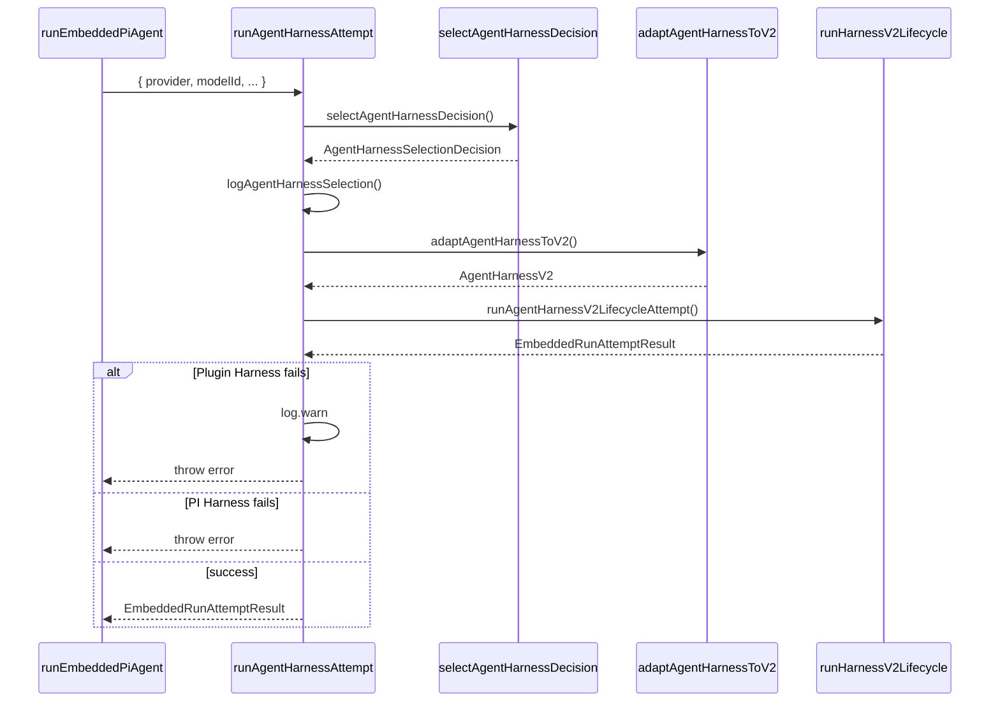

# 11. runAgentHarnessAttempt

#### 1. 函数定位（在整体链路中的作用）

**Harness 尝试执行器**：负责选择并执行 Agent Harness，处理 Harness 选择决策、日志记录，并调用 V2 Harness 生命周期。它是消息处理链路的**Harness 层入口**。

- 所属阶段：**Harness 层**
- 职责：Harness 选择、日志记录、调用 `runAgentHarnessV2LifecycleAttempt`
- 文件：`src/agents/harness/selection.ts`
- 行数：~50

---

#### 2. 上下游关系

**上游（谁调用它）：**

- `runEmbeddedPiAgent()` → `pi-embedded-runner/run.ts`
- 在模型解析和认证选择后调用

**下游（它调用谁）：**

- `selectAgentHarnessDecision()` → 本文件（Harness 选择决策）
- `adaptAgentHarnessToV2()` → `harness/v2-adapter.ts`（V2 适配）
- `runAgentHarnessV2LifecycleAttempt()` → `harness/v2.ts`（V2 生命周期）

---

#### 3. 输入

```typescript
type EmbeddedRunAttemptParams = {
  runId: string; // 运行 ID
  sessionId: string; // Session ID
  sessionKey?: string; // Session Key
  prompt: string; // 用户 Prompt
  provider: string; // Provider
  modelId: string; // Model ID
  config: OpenClawConfig; // OpenClaw 配置
  agentId?: string; // Agent ID
  agentHarnessId?: string; // Harness ID（显式选择）
  authProfileId?: string; // 认证 Profile ID
  thinkLevel?: ThinkLevel; // Thinking 级别
  verboseLevel?: VerboseLevel; // Verbose 级别
  timeoutMs?: number; // 超时时间
  abortSignal?: AbortSignal; // 中断信号
  images?: ImageAttachment[]; // 图片附件
  extraSystemPrompt?: string; // 额外系统提示
  // ... 更多参数
};
```

**关键控制参数：**

- `agentHarnessId` → 显式 Harness 选择（如 `pi`, plugin ID）
- `provider/modelId` → 自动 Harness 选择依据
- `config` → Harness 配置

**数据载体：**

- 输入：`EmbeddedRunAttemptParams`
- 输出：`EmbeddedRunAttemptResult`

---

#### 4. 核心处理流程

1. **选择 Harness 决策**
   - 调用 `selectAgentHarnessDecision()`
   - 参数：`{ provider, modelId, config, agentId, sessionKey, agentHarnessId }`
   - 返回：`AgentHarnessSelectionDecision`
   - async：否

2. **日志记录**
   - 调用 `logAgentHarnessSelection()`
   - 记录：`selectedHarnessId, selectedReason, candidates`
   - async：否

3. **V2 适配**
   - 调用 `adaptAgentHarnessToV2(harness)`
   - 返回：`AgentHarnessV2`
   - async：否

4. **执行 V2 生命周期**
   - 调用 `runAgentHarnessV2LifecycleAttempt(v2Harness, params)`
   - async：是

5. **错误处理**
   - 若 Plugin Harness 失败：
     - log.warn + throw（不 fallback 到 PI）
   - 若 PI Harness 失败：
     - throw（触发模型 fallback）
   - async：否

**数据变化**：

```
EmbeddedRunAttemptParams
 → selectAgentHarnessDecision()
 → AgentHarnessSelectionDecision
 → adaptAgentHarnessToV2()
 → AgentHarnessV2
 → runAgentHarnessV2LifecycleAttempt()
 → EmbeddedRunAttemptResult
```

---

#### 5. 数据流

```
EmbeddedRunAttemptParams {
    provider: "bailian",
    modelId: "glm-5",
    agentHarnessId: "auto"
}
    │
    ▼ selectAgentHarnessDecision()
AgentHarnessSelectionDecision {
    harness: AgentHarness { id: "pi" },
    policy: { runtime: "auto" },
    selectedReason: "auto_pi",
    candidates: [{ id: "pi", supported: true }]
}
    │
    ▼ adaptAgentHarnessToV2()
AgentHarnessV2 {
    id: "pi",
    prepare, start, send, resolveOutcome, ...
}
    │
    ▼ runAgentHarnessV2LifecycleAttempt()
EmbeddedRunAttemptResult {
    payloads: [{ text: "回复" }],
    meta: { durationMs, usage }
}
```

---

#### 6. 副作用

| 副作用       | 是否发生                        |
| ------------ | ------------------------------- |
| 调用 LLM     | ✅ 通过 V2 Harness              |
| 日志输出     | ✅ `logAgentHarnessSelection`   |
| Harness 选择 | ✅ `selectAgentHarnessDecision` |

---

#### 7. 关键逻辑 / 复杂点

### 7.1 Harness 选择决策

**选择优先级**：

1. `pinned`：显式配置 `agentHarnessId`（非 "auto")
2. `forced_pi`：`OPENCLAW_AGENT_RUNTIME=pi`
3. `forced_plugin`：`OPENCLAW_AGENT_RUNTIME=<plugin-id>`
4. `auto_plugin`：Plugin Harness 支持该 provider/model
5. `auto_pi`：默认 PI Harness

**决策依据**：

- `agentHarnessId` → 用户显式选择
- `provider/modelId` → Harness `supports()` 方法判断
- `config` → Harness 配置

### 7.2 Plugin Harness vs PI Harness

- **Plugin Harness**：第三方实现，可能有自己的 transport
- **PI Harness**：默认实现，使用 OpenClaw Provider API
- Plugin Harness 失败不 fallback 到 PI（保持一致性）

### 7.3 V2 适配

- 旧版 Harness 可能是 V1 接口
- `adaptAgentHarnessToV2()` 转换为 V2 接口
- V2 接口：`prepare, start, send, resolveOutcome`

---

#### 8. Mermaid 调用关系图



---

#### 9. Harness 选择决策表

| agentHarnessId | Provider/Model | 选择结果             |
| -------------- | -------------- | -------------------- |
| `"pi"`         | 任意           | `pinned: pi`         |
| `"plugin-xxx"` | 支持           | `pinned: plugin-xxx` |
| `"auto"`       | Plugin 支持    | `auto_plugin`        |
| `"auto"`       | Plugin 不支持  | `auto_pi`            |
| `undefined`    | Plugin 支持    | `auto_plugin`        |
| `undefined`    | Plugin 不支持  | `auto_pi`            |

---

#### 10. 返回值结构

```typescript
type EmbeddedRunAttemptResult = {
  payloads: ReplyPayload[];
  meta?: {
    durationMs?: number;
    usage?: {
      inputTokens?: number;
      outputTokens?: number;
    };
    agentMeta?: {
      sessionId: string;
      provider: string;
      model: string;
    };
  };
};
```

---

#### 11. 错误处理

| 错误类型       | Harness | 处理方式                                 |
| -------------- | ------- | ---------------------------------------- |
| LLM 错误       | PI      | throw（触发 fallback）                   |
| LLM 错误       | Plugin  | log.warn + throw（不 fallback）          |
| Harness 不存在 | -       | throw `Requested harness not registered` |
| Abort          | -       | throw AbortError                         |

---

> **文件路径**: `src/agents/harness/selection.ts:153`
> **所属步骤**: 主调用链第 11 步
> **分析版本**: 2026-05-04
