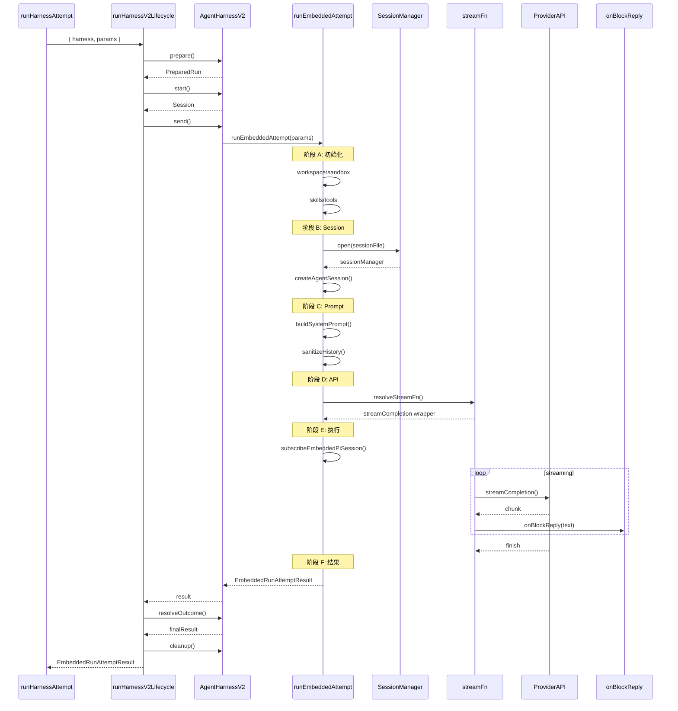

# 12. runAgentHarnessV2LifecycleAttempt

#### 1. 函数定位（在整体链路中的作用）

**Harness V2 生命周期执行器**：负责执行 Harness V2 的完整生命周期，包括 prepare（准备）、start（启动）、send（发送）、resolveOutcome（结果解析）。它是消息处理链路的**V2 层核心执行**。

- 所属阶段：**V2 层**
- 职责：执行 Harness V2 四阶段生命周期
- 文件：`src/agents/harness/v2.ts`
- 行数：~256

**关键说明**：PI Harness 的 `send()` 方法内部调用 `runEmbeddedAttempt`（`pi-embedded-runner/run/attempt.ts`，约 3000 行），这是整个消息处理链路中最复杂的函数，包含：

- Workspace/Sandbox 准备
- Skills 和 Tools 加载
- SessionManager 初始化（Session 文件管理）
- System Prompt 构建
- 对话历史处理（清洗、验证、截断）
- StreamFn 配置（API 调用函数）
- PI Session 订阅和执行
- 结果构造和清理

---

#### 2. 上下游关系

**上游（谁调用它）：**

- `runAgentHarnessAttempt()` → `harness/selection.ts`
- 通过 V2 适配后调用

**下游（它调用谁）：**

- `harness.prepare()` → Harness 实现（构建 Prompt/Tools）
- `harness.start()` → Harness 实现（初始化 Session）
- `harness.send()` → Harness 实现（调用 API）
- `harness.resolveOutcome()` → Harness 实现（解析结果）
- Provider API（在 `send` 内部调用）

---

#### 3. 输入

```typescript
type EmbeddedRunAttemptParams = {
  runId: string; // 运行 ID
  sessionId: string; // Session ID
  sessionKey?: string; // Session Key
  prompt: string; // 用户 Prompt
  provider: string; // Provider
  modelId: string; // Model ID
  config: OpenClawConfig; // OpenClaw 配置
  model?: Model; // 已解析的 Model
  authProfileId?: string; // 认证 Profile ID
  thinkLevel?: ThinkLevel; // Thinking 级别
  verboseLevel?: VerboseLevel; // Verbose 级别
  timeoutMs?: number; // 超时时间
  abortSignal?: AbortSignal; // 中断信号
  images?: ImageAttachment[]; // 图片附件
  extraSystemPrompt?: string; // 额外系统提示
  onBlockReply?: (payload) => Promise<void>; // Block 回复回调
  onToolResult?: (payload) => Promise<void>; // 工具结果回调
  onPartialReply?: (text) => Promise<void>; // 部分回复回调
  // ... 更多参数
};
```

**关键控制参数：**

- `provider/modelId` → 模型标识
- `model` → 已解析的 Model 对象
- `thinkLevel` → Thinking 级别
- `abortSignal` → 中断控制
- 回调函数 → 流式响应处理

**数据载体：**

- 输入：`EmbeddedRunAttemptParams` + `AgentHarnessV2`
- 输出：`EmbeddedRunAttemptResult`

---

#### 4. 核心处理流程

**四阶段生命周期**：

1. **Prepare（准备）**
   - 调用 `harness.prepare(params)`
   - 返回：`{ harnessId, label, params, lifecycleState: "prepared" }`
   - 对于 V1 Harness 适配：仅标记状态
   - async：是

2. **Start（启动）**
   - 调用 `harness.start(prepared)`
   - 返回：`{ harnessId, label, params, lifecycleState: "started" }`
   - 对于 V1 Harness 适配：仅标记状态
   - async：是

3. **Send（发送）** - **核心执行阶段**
   - 调用 `harness.send(session)`
   - **对于 PI Harness**：内部调用 `runEmbeddedAttempt(params)`
     - 这是整个链路最复杂的函数（~3000 行）
     - 内部步骤详见下方 "4.3 send() 内部详解"
   - 返回：`EmbeddedRunAttemptResult`
   - async：是

4. **ResolveOutcome（结果解析）**
   - 调用 `harness.resolveOutcome(session, result)`
   - 对于 PI Harness：应用 result classification
   - 返回：最终 `EmbeddedRunAttemptResult`
   - async：是

5. **Cleanup（清理）**
   - 调用 `harness.cleanup({ prepared, session, result })`
   - 清理资源、释放锁
   - async：是

**数据变化**：

```
EmbeddedRunAttemptParams
 → prepare()
 → AgentHarnessV2PreparedRun
 → start()
 → AgentHarnessV2Session
 → send() [核心]
 → EmbeddedRunAttemptResult
 → resolveOutcome()
 → EmbeddedRunAttemptResult (final)
 → cleanup()
```

---

#### 4.3 send() 内部详解（PI Harness）

**PI Harness 的 `send()` 调用 `runEmbeddedAttempt`**（`pi-embedded-runner/run/attempt.ts:704`）

这是整个消息处理链路最复杂的函数，包含以下核心步骤：

**阶段 A：初始化准备**

1. **Workspace/Sandbox 准备**
   - 解析 `workspaceDir`，创建目录
   - 解析 Sandbox 配置（如启用）
   - async：是

2. **Skills 加载**
   - `resolveEmbeddedRunSkillEntries()` → 加载 Skills
   - `applySkillEnvOverrides()` → 应用环境变量覆盖
   - `resolveSkillsPromptForRun()` → 构建 Skills prompt
   - async：是

3. **Tools 构建**
   - `createOpenClawCodingTools()` → 创建 OpenClaw 工具集
   - `resolveEffectiveToolPolicy()` → 解析工具策略
   - `toClientToolDefinitions()` → 转换为客户端工具定义
   - async：否

**阶段 B：Session 初始化**

4. **SessionManager 打开**
   - `prewarmSessionFile()` → 预热 Session 文件
   - `SessionManager.open(sessionFile)` → 打开 Session
   - `repairSessionFileIfNeeded()` → 修复损坏文件（如需要）
   - async：是

5. **创建 PI Session**
   - `createEmbeddedAgentSessionWithResourceLoader()` → 创建 Session
   - 设置 `agent.streamFn` → API 调用函数
   - async：是

**阶段 C：Prompt 构建**

6. **System Prompt 构建**
   - `buildEmbeddedSystemPrompt()` → 构建系统提示
   - 包含：Skills、工具说明、权限约束、文档路径
   - async：是

7. **对话历史处理**
   - `sanitizeSessionHistory()` → 清洗历史（tool_use/tool_result 配对）
   - `validateReplayTurns()` → 验证重放轮次
   - `filterHeartbeatPairs()` → 过滤心跳消息
   - `limitHistoryTurns()` → 截断超出限制的历史
   - async：是

8. **Context Engine 处理**（如启用）
   - `assembleAttemptContextEngine()` → 组装上下文引擎
   - 窗口化历史、注入内存摘要
   - async：是

**阶段 D：API 配置**

9. **StreamFn 配置**
   - `resolveEmbeddedAgentStreamFn()` → 解析 stream 函数
   - 内部调用 `getProviderRuntime().streamCompletion`
   - 包装多层：诊断、缓存、错误恢复、工具调用修复
   - async：否

10. **Transport 选择**
    - 判断是否使用 WebSocket transport（OpenAI）
    - 配置 HTTP runtime（timeout）
    - async：否

**阶段 E：执行**

11. **订阅 PI Session**
    - `subscribeEmbeddedPiSession()` → 订阅事件流
    - 处理 assistant message chunks
    - 处理 tool calls
    - 通过 `onBlockReply/onToolResult` 回调
    - async：是（持续直到完成）

12. **等待完成**
    - 等待 session 结束或 abort
    - 处理 timeout、compaction
    - 收集 usage 信息
    - async：是

**阶段 F：结果构造**

13. **构造返回结果**
    - 收集 `assistantTexts`、`toolMetas`
    - 计算 `attemptUsage`
    - 构建 `messagesSnapshot`
    - 返回 `EmbeddedRunAttemptResult`
    - async：否

14. **清理资源**
    - `cleanupEmbeddedAttemptResources()` → 清理
    - 释放 session lock
    - 关闭 MCP runtime
    - async：是

**数据流（send 内部）**：

```
params (EmbeddedRunAttemptParams)
    │
    ▼ [阶段 A] 初始化
workspace, sandbox, skills, tools
    │
    ▼ [阶段 B] Session
sessionManager, activeSession
    │
    ▼ [阶段 C] Prompt
systemPrompt, sanitizedHistory, assembledContext
    │
    ▼ [阶段 D] API
streamFn (包装多层)
    │
    ▼ [阶段 E] 执行
subscribeEmbeddedPiSession → PI Agent Core
    │   │
    │   ▼ 流式响应
    │   assistant chunks → onBlockReply
    │   tool calls → execute → onToolResult
    │   │
    │   ▼ 循环直到结束
    │   finishReason: stop
    │
    ▼ [阶段 F] 结果
EmbeddedRunAttemptResult {
    assistantTexts, toolMetas, usage,
    messagesSnapshot, aborted, timedOut
}
```

```
EmbeddedRunAttemptParams {
    prompt: "[message_id: xxx] GL: 国内模型差距",
    provider: "bailian",
    modelId: "glm-5",
    thinkLevel: "auto",
    onBlockReply, onToolResult, ...
}
    │
    ▼ harness.prepare()
PrepareResult {
    prompt: {
        messages: [{ role: "system", content: "..." }, { role: "user", content: "..." }],
        systemPrompt: "You are a helpful assistant...",
    },
    tools: [{ name: "bash", schema }],
    context: { sessionId, workspaceDir, ... }
}
    │
    ▼ harness.start()
SessionContext {
    initialized: true,
    state: { ... }
}
    │
    ▼ harness.send() → Provider.streamCompletion()
StreamResult {
    chunks: [{ text: "国内模型" }, { text: "和国外" }, ...],
    finishReason: "stop",
    usage: { inputTokens: 100, outputTokens: 50 }
}
    │
    ▼ resolveOutcome()
EmbeddedRunAttemptResult {
    payloads: [{ text: "国内模型和国外模型差距主要在..." }],
    meta: { durationMs: 500, usage }
}
```

---

#### 6. 副作用

| 副作用           | 是否发生                           |
| ---------------- | ---------------------------------- |
| 调用 LLM         | ✅ `harness.send()` → Provider API |
| 调用 Tools       | ✅ 在 `send` 中执行 tool calls     |
| 发送 Block Reply | ✅ `onBlockReply` 回调             |
| 发送 Tool Result | ✅ `onToolResult` 回调             |
| Session 初始化   | ✅ `harness.start()`               |

---

#### 7. 关键逻辑 / 复杂点

### 7.1 PI Harness 实现

**Prepare**：

- 构建系统提示：`buildSystemPrompt()`
- 构建用户消息：`buildUserMessage()`
- 构建 Tools：`buildToolDefinitions()`

**Send**：

- 调用 `Provider.streamCompletion({ model, messages, tools, stream: true })`
- 流式接收 chunks
- 通过 `onBlockReply` 发送每个 chunk

**Tool Execution**：

- 解析 tool_calls
- 执行 tool（bash, message, etc.）
- 返回 tool_result
- 可能循环（多轮 tool calls）

### 7.2 Thinking 级别处理

- `thinkLevel` 控制是否启用 extended thinking
- 模型能力检查：`model.capabilities.thinking`
- API 参数：`thinkingBudget` 等

### 7.3 Abort 处理

- `abortSignal.aborted` 检查
- 中断时清理状态
- 抛出 `AbortError`

### 7.4 Block Streaming

- 流式接收：每个 chunk 触发 `onBlockReply`
- 累积文本：`accumulatedText += chunk.text`
- 完成后发送 Final

---

#### 8. Mermaid 调用关系图



---

#### 9. 四阶段详解

| 阶段               | 输入            | 输出                       | 主要操作                             |
| ------------------ | --------------- | -------------------------- | ------------------------------------ |
| **prepare**        | params          | `PreparedRun`              | 标记生命周期状态                     |
| **start**          | prepared        | `Session`                  | 标记生命周期状态                     |
| **send**           | session         | `EmbeddedRunAttemptResult` | **核心执行**：初始化→Prompt→API→结果 |
| **resolveOutcome** | session, result | final result               | 应用 result classification           |
| **cleanup**        | params          | -                          | 清理资源、释放锁                     |

**send() 内部阶段详解**：

| 阶段           | 主要操作                             | 关键函数                                              |
| -------------- | ------------------------------------ | ----------------------------------------------------- |
| **A: 初始化**  | Workspace/Sandbox/Skills/Tools       | `resolveSandboxContext`, `createOpenClawCodingTools`  |
| **B: Session** | 打开 SessionManager、创建 PI Session | `SessionManager.open`, `createEmbeddedAgentSession`   |
| **C: Prompt**  | 构建 System Prompt、处理历史         | `buildEmbeddedSystemPrompt`, `sanitizeSessionHistory` |
| **D: API**     | 配置 StreamFn、Transport             | `resolveEmbeddedAgentStreamFn`                        |
| **E: 执行**    | 订阅 PI Session、流式处理            | `subscribeEmbeddedPiSession`                          |
| **F: 结果**    | 构造返回、清理资源                   | `cleanupEmbeddedAttemptResources`                     |

---

#### 10. Tool Execution 循环

```
send() 内部:
LLM 返回 tool_calls
  │
  ▼ 执行 Tools
ToolResults
  │
  ▼ 构建 tool_result messages
追加到 messages
  │
  ▼ 再次调用 LLM
LLM 返回 text 或更多 tool_calls
  │
  ▼ 循环直到无 tool_calls
Final Response
```

---

#### 11. 错误处理

| 错误类型       | 阶段    | 处理方式               |
| -------------- | ------- | ---------------------- |
| Prompt 构建    | prepare | throw                  |
| Session 初始化 | start   | throw                  |
| API 错误       | send    | throw（触发 fallback） |
| Tool 错误      | send    | 作为 tool_result 返回  |
| Abort          | 任意    | throw AbortError       |

---

> **文件路径**: `src/agents/harness/v2.ts:187`
> **核心实现**: `src/agents/pi-embedded-runner/run/attempt.ts:704` (runEmbeddedAttempt, ~3000 行)
> **所属步骤**: 主调用链第 12 步
> **分析版本**: 2026-05-04 (更新：补充 send() 内部详解)
