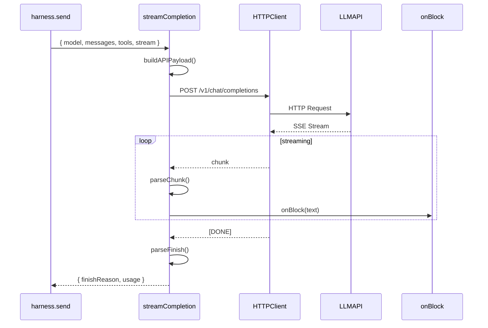

# 13. Provider.streamCompletion

#### 1. 函数定位（在整体链路中的作用）

**Provider API 调用层**：负责调用具体的 LLM Provider API，发送请求并接收流式响应。它是消息处理链路的**Provider 层执行入口**，直接与外部 LLM API 交互。

- 所属阶段：**Provider 层**
- 职责：调用 LLM API、流式响应处理、错误处理
- 文件：各 Provider 实现（如 `src/providers/bailian.ts`, `src/providers/openai.ts`）

---

#### 2. 上下游关系

**上游（谁调用它）：**

- `harness.send()` → PI Harness 实现
- 在 `runAgentHarnessV2LifecycleAttempt` 的 send 阶段调用

**下游（它调用谁）：**

- HTTP Client（如 `fetch`, SDK client）
- 外部 LLM API（如 Bailian API, OpenAI API, Anthropic API）

---

#### 3. 输入

```typescript
type StreamCompletionParams = {
  model: string; // Model ID
  messages: Message[]; // 对话历史
  tools?: ToolDefinition[]; // 工具定义
  stream?: boolean; // 是否流式（默认 true）
  temperature?: number; // 温度参数
  maxTokens?: number; // 最大输出 token
  thinkingBudget?: number; // Thinking budget（部分模型）
  abortSignal?: AbortSignal; // 中断信号
  onBlock?: (block: StreamBlock) => void; // 流式回调
  authProfileId?: string; // 认证 Profile ID
};
```

**关键控制参数：**

- `model` → 模型标识
- `messages` → 对话历史
- `tools` → 工具定义（可选）
- `stream` → 流式响应（默认 true）
- `abortSignal` → 中断控制

**数据载体：**

- 输入：`StreamCompletionParams`
- 输出：`StreamChunk[]` 或通过 `onBlock` 回调

---

#### 4. 核心处理流程

1. **构建 API Payload**
   - 格式化 messages（Provider 特定格式）
   - 格式化 tools（Provider 特定格式）
   - 添加 Provider 特定参数
   - async：否

2. **发送 HTTP 请求**
   - 调用 Provider API endpoint
   - 使用 POST 方法
   - 设置 streaming headers
   - async：是

3. **接收流式响应**
   - 解析 SSE（Server-Sent Events）流
   - 每个 chunk 触发 `onBlock` 回调
   - async：是

4. **解析响应块**
   - 提取 text content
   - 提取 tool_calls
   - 提取 usage 信息
   - async：否

5. **完成处理**
   - 返回 finishReason
   - 返回最终 usage
   - async：否

**数据变化**：

```
StreamCompletionParams
 → Provider API Payload
 → HTTP Request
 → SSE Stream
 → StreamChunks
 → onBlock callbacks
```

---

#### 5. 数据流

```
StreamCompletionParams {
    model: "glm-5",
    messages: [
        { role: "system", content: "You are..." },
        { role: "user", content: "国内模型差距" }
    ],
    tools: [{ name: "bash", ... }],
    stream: true,
    onBlock: callback
}
    │
    ▼ Provider API
HTTP POST https://api.bailian.xxx/v1/chat/completions
Body: {
    model: "glm-5",
    messages: [...],
    tools: [...],
    stream: true
}
    │
    ▼ SSE Stream
data: {"choices":[{"delta":{"content":"国内"}}]}
data: {"choices":[{"delta":{"content":"模型"}}]}
data: {"choices":[{"delta":{"content":"和国外"}}]}
data: {"choices":[{"finish_reason":"stop"}]}
data: [DONE]
    │
    ▼ onBlock callbacks
StreamBlock { text: "国内模型和国外", type: "text" }
StreamBlock { text: "模型差距...", type: "text" }
    │
    ▼ 最终结果
{ finishReason: "stop", usage: { input: 100, output: 50 } }
```

---

#### 6. 副作用

| 副作用       | 是否发生             |
| ------------ | -------------------- |
| 调用外部 API | ✅ HTTP Request      |
| 网络请求     | ✅ Provider endpoint |
| 流式回调     | ✅ `onBlock`         |
| 认证         | ✅ API Key / Profile |

---

#### 7. 关键逻辑 / 复杂点

### 7.1 Provider 格式差异

各 Provider 有不同的 API 格式：

- **OpenAI**：`/v1/chat/completions`，OpenAI 格式 messages
- **Anthropic**：`/v1/messages`，Anthropic 格式 messages
- **Bailian**：`/v1/chat/completions`，OpenAI-compatible
- **Gemini**：Google AI format

### 7.2 Streaming 实现

- **SSE**：Server-Sent Events，逐行解析
- **WebSocket**：部分 Provider 支持
- **chunked**：HTTP chunked transfer

### 7.3 Tool Calls 处理

- 解析 `tool_calls` 字段
- 格式：`[{ id, name, arguments }]`
- Provider 格式差异（OpenAI vs Anthropic）

### 7.4 Thinking Budget

- 部分 Provider 支持 extended thinking
- 参数：`thinkingBudget` tokens
- 流式返回 thinking blocks

### 7.5 认证处理

- API Key：从 authProfile 或环境变量
- 多 Profile：fallback 尝试
- 错误类型：auth_invalid, rate_limit

---

#### 8. Mermaid 调用关系图



---

#### 9. Provider API 格式差异

| Provider  | Endpoint               | Messages 格式                         |
| --------- | ---------------------- | ------------------------------------- |
| OpenAI    | `/v1/chat/completions` | `{ role, content }`                   |
| Anthropic | `/v1/messages`         | `{ role, content }` (system separate) |
| Bailian   | `/v1/chat/completions` | OpenAI-compatible                     |
| Gemini    | `generateContent`      | `{ parts: [{ text }] }`               |
| XAI       | `/v1/chat/completions` | OpenAI-compatible                     |

---

#### 10. StreamChunk 结构

```typescript
type StreamChunk = {
  type: "text" | "tool_call" | "thinking" | "usage";
  text?: string;
  toolCall?: {
    id: string;
    name: string;
    arguments: string;
  };
  thinking?: string;
  usage?: {
    inputTokens: number;
    outputTokens: number;
  };
};
```

---

#### 11. 错误处理

| 错误类型         | HTTP Code | 处理方式                       |
| ---------------- | --------- | ------------------------------ |
| Auth Invalid     | 401       | throw（触发 Profile fallback） |
| Rate Limit       | 429       | throw（触发模型 fallback）     |
| Model Not Found  | 404       | throw FailoverError            |
| Context Too Long | 400       | throw（需要 Compaction）       |
| Network Error    | -         | throw（重试或 fallback）       |
| Abort            | -         | throw AbortError               |

---

> **所属步骤**: 主调用链第 13 步
> **分析版本**: 2026-05-04
