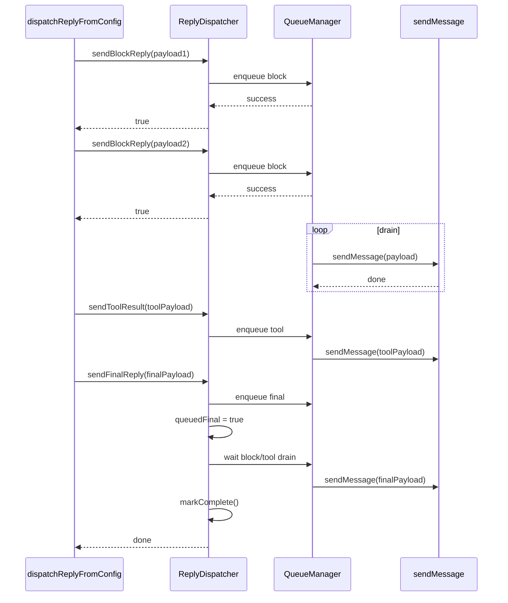

# 15. ReplyDispatcher

#### 1. 函数定位（在整体链路中的作用）

**回复分发器**：负责管理回复消息的发送队列，提供 `sendBlockReply`、`sendToolResult`、`sendFinalReply` 方法，协调 Block 回复、工具结果、最终回复的发送顺序。它是消息处理链路的**分发层核心**。

- 所属阶段：**分发层**
- 职责：回复队列管理、发送协调
- 文件：`src/auto-reply/reply/reply-dispatcher.ts`

---

#### 2. 上下游关系

**上游（谁调用它）：**

- `dispatchReplyFromConfig()` → 使用 dispatcher 方法
- `createFeishuReplyDispatcher()` → 飞书特定实现

**下游（它调用谁）：**

- Channel 发送方法（如飞书 `sendMessageFeishu`）
- `onBlockReply` 回调
- Queue 管理逻辑

---

#### 3. 接口定义

```typescript
interface ReplyDispatcher {
  sendBlockReply(payload: ReplyPayload): boolean;
  sendToolResult(payload: ReplyPayload): boolean;
  sendFinalReply(payload: ReplyPayload): boolean;
  waitForIdle(): Promise<void>;
  getQueuedCounts(): { block: number; tool: number; final: number };
  getFailedCounts(): { block: number; tool: number; final: number };
  markComplete(): void;
}
```

**关键方法**：

- `sendBlockReply` → 发送 Block 回复（流式）
- `sendToolResult` → 发送工具执行结果
- `sendFinalReply` → 发送最终回复
- `waitForIdle` → 等待队列处理完成

---

#### 4. 核心处理流程

### 4.1 sendBlockReply

1. **检查队列状态**
   - 若已 markComplete：返回 false
   - 若队列已满：返回 false

2. **入队 Block**
   - 添加到 blockQueue
   - 触发异步发送

3. **返回成功**
   - 返回 true（表示入队成功）

### 4.2 sendToolResult

1. **检查队列状态**
   - 若已 markComplete：返回 false

2. **入队 Tool Result**
   - 添加到 toolQueue
   - 触发异步发送

3. **返回成功**
   - 返回 true

### 4.3 sendFinalReply

1. **检查队列状态**
   - 若已 markComplete：返回 false

2. **入队 Final Reply**
   - 添加到 finalQueue
   - 设置 queuedFinal = true

3. **触发 drain**
   - 开始处理所有队列

4. **返回成功**
   - 返回 true

---

#### 5. 数据流

```
ReplyPayload (Block)
    │
    ▼ sendBlockReply()
blockQueue: [payload1, payload2, ...]
    │
    ▼ 异步 drain
sendMessage(channel, payload)
    │
    ▼ 队列清空
counts: { block: 0, tool: 0, final: 0 }
```

```
ReplyPayload (Tool Result)
    │
    ▼ sendToolResult()
toolQueue: [payload1, payload2, ...]
    │
    ▼ 异步 drain
sendMessage(channel, payload)
```

```
ReplyPayload (Final)
    │
    ▼ sendFinalReply()
finalQueue: [payload1]
queuedFinal = true
    │
    ▼ 等待 block/tool 队列清空
发送 Final Reply
    │
    ▼ markComplete()
队列关闭
```

---

#### 6. 副作用

| 副作用   | 是否发生            |
| -------- | ------------------- |
| 发送消息 | ✅ 通过 Channel API |
| 队列管理 | ✅ 入队/出队操作    |
| 状态管理 | ✅ complete 标记    |

---

#### 7. 关键逻辑 / 复杂点

### 7.1 队列优先级

发送顺序：

1. Block Replies（先发送，保持流式）
2. Tool Results（后发送）
3. Final Reply（最后发送）

### 7.2 队列容量限制

- Block Queue：有限容量
- Tool Queue：有限容量
- Final Queue：单条（只允许一个 Final）

### 7.3 markComplete

- 调用后所有 send 方法返回 false
- 队列继续处理现有项
- 不接受新项

### 7.4 waitForIdle

- 等待所有队列处理完成
- 用于确保消息发送完成

---

#### 8. Mermaid 调用关系图



---

#### 9. 方法返回值

| 方法              | 返回值                   | 说明              |
| ----------------- | ------------------------ | ----------------- |
| `sendBlockReply`  | `boolean`                | 入队成功返回 true |
| `sendToolResult`  | `boolean`                | 入队成功返回 true |
| `sendFinalReply`  | `boolean`                | 入队成功返回 true |
| `getQueuedCounts` | `{ block, tool, final }` | 当前队列数量      |
| `getFailedCounts` | `{ block, tool, final }` | 失败数量          |

---

#### 10. 队列状态

```
状态转换:
created → active → draining → complete

created: 初始化完成
active: 接收消息入队
draining: 处理队列中消息
complete: 队列关闭，不接受新消息
```

---

#### 11. 飞书 ReplyDispatcher 实现

```typescript
// extensions/feishu/src/reply-dispatcher.ts
createFeishuReplyDispatcher({
  cfg, agentId, runtime, chatId,
  replyToMessageId, replyInThread,
  accountId, mentionTargets
}) → {
  dispatcher: ReplyDispatcher,
  replyOptions: GetReplyOptions,
  markDispatchIdle: () => void
}
```

---

> **所属步骤**: 主调用链第 14 步
> **分析版本**: 2026-05-04
