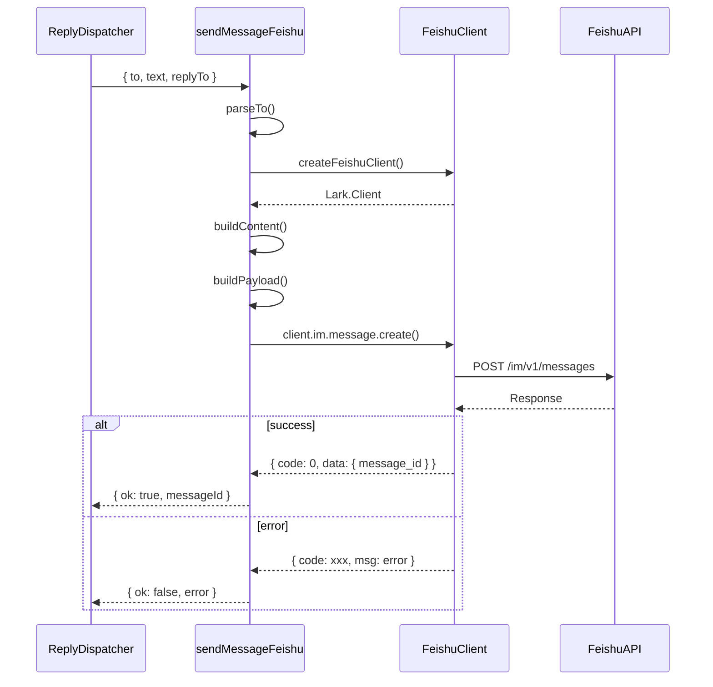

# 16. sendMessageFeishu

#### 1. 函数定位（在整体链路中的作用）

**飞书消息发送层**：负责调用飞书 API 发送消息，包括文本消息、媒体消息、回复消息，处理飞书特有的消息格式和线程逻辑。它是消息处理链路的**发送层出口**，直接与飞书 API 交互。

- 所属阶段：**发送层**
- 职责：调用飞书 API、消息格式化、发送处理
- 文件：`extensions/feishu/src/send.ts`

---

#### 2. 上下游关系

**上游（谁调用它）：**

- `ReplyDispatcher.sendBlockReply/sendFinalReply()` → 通过飞书 dispatcher
- `handleFeishuMessage()` → 发送配对请求、权限错误提示
- `routeReplyToOriginating()` → 跨渠道路由

**下游（它调用谁）：**

- `createFeishuClient()` → `client.ts`（飞书 Client）
- `client.im.message.create()` → 飞书 SDK（发送消息 API）
- 飞书 API endpoint

---

#### 3. 输入

```typescript
type SendMessageFeishuParams = {
  cfg: ClawdbotConfig; // OpenClaw 配置
  to: string; // 接收目标（chat:user:xxx）
  text?: string; // 文本内容
  content?: string; // 飞书格式内容（JSON）
  msgType?: "text" | "post" | "interactive"; // 消息类型
  replyToMessageId?: string; // 回复消息 ID
  replyInThread?: boolean; // 是否回复到线程
  rootId?: string; // 根消息 ID（线程）
  mentionTargets?: MentionTarget[]; // @ 目标
  accountId?: string; // 账号 ID
};
```

**关键控制参数：**

- `to` → 接收目标格式：`chat:xxx` / `user:xxx`
- `msgType` → 消息类型（text/post/interactive）
- `replyToMessageId` → 回复目标
- `replyInThread` → 线程回复模式
- `mentionTargets` → @ 列表

**数据载体：**

- 输入：`SendMessageFeishuParams`
- 输出：飞书 API Response（message_id）

---

#### 4. 核心处理流程

1. **解析接收目标**
   - 解析 `to` 格式：`chat:xxx` → `receive_id: xxx, receive_id_type: "chat"`
   - 解析 `user:xxx` → `receive_id: xxx, receive_id_type: "open_id"`
   - async：否

2. **创建飞书 Client**
   - 调用 `createFeishuClient(account)`
   - 返回：`Lark.Client`
   - async：否

3. **构建消息内容**
   - 若 `text`：构建飞书 text 格式 `{ text: content }`
   - 若 `content`：直接使用（已格式化）
   - 若 `mentionTargets`：添加 `<at>` 标签
   - async：否

4. **构建 API Payload**
   - 组装 `receive_id, receive_id_type, content, msg_type`
   - 若 `replyInThread`：添加 `root_id`
   - async：否

5. **调用飞书 API**
   - 调用 `client.im.message.create({ data: payload })`
   - async：是

6. **处理响应**
   - 若成功：返回 `{ ok: true, messageId }`
   - 若失败：返回 `{ ok: false, error }`
   - async：否

**数据变化**：

```
SendMessageFeishuParams
 → receive_id/receive_id_type
 → 飞书消息内容
 → API Payload
 → client.im.message.create()
 → API Response
```

---

#### 5. 数据流

```
SendMessageFeishuParams {
    to: "chat:oc_xxx",
    text: "回复内容",
    replyToMessageId: "om_xxx",
    replyInThread: true,
    accountId: "default"
}
    │
    ▼ 解析 to
receive_id: "oc_xxx"
receive_id_type: "chat_id"
    │
    ▼ 构建内容
content: JSON.stringify({ text: "回复内容" })
msg_type: "text"
    │
    ▼ 构建 Payload
{
    receive_id: "oc_xxx",
    receive_id_type: "chat_id",
    content: '{"text":"回复内容"}',
    msg_type: "text"
}
    │
    ▼ client.im.message.create()
飞书 API POST /im/v1/messages
    │
    ▼ Response
{
    code: 0,
    data: { message_id: "om_new_xxx" }
}
```

---

#### 6. 副作用

| 副作用       | 是否发生                      |
| ------------ | ----------------------------- |
| 调用飞书 API | ✅ `client.im.message.create` |
| 发送消息     | ✅ 用户可见消息               |
| 网络请求     | ✅ HTTP POST                  |

---

#### 7. 关键逻辑 / 复杂点

### 7.1 目标解析

格式：

- `chat:xxx` → 群聊 ID
- `user:xxx` → 用户 Open ID
- `user_id:xxx` → 用户 User ID

### 7.2 消息类型

- `text`：纯文本
- `post`：富文本（支持格式、链接、@）
- `interactive`：卡片消息

### 7.3 @ Mention

- `<at user_id="xxx">name</at>` 格式
- `mentionTargets` 转换为 `<at>` 标签
- 飞书自动解析并触发通知

### 7.4 线程回复

- `replyInThread: true` → 回复到线程
- 需要 `root_id` 或 `replyToMessageId`
- 线程内消息保持上下文

### 7.5 错误处理

- `code !== 0` → API 错误
- 错误类型：权限不足、目标不存在、内容违规

---

#### 8. Mermaid 调用关系图



---

#### 9. 目标格式转换

| 输入格式      | receive_id_type | 说明         |
| ------------- | --------------- | ------------ |
| `chat:oc_xxx` | `"chat_id"`     | 群聊         |
| `user:ou_xxx` | `"open_id"`     | 用户 Open ID |
| `user_id:xxx` | `"user_id"`     | 用户 ID      |
| `email:xxx`   | `"email"`       | 邮箱         |

---

#### 10. 消息内容格式

**Text**:

```json
{ "text": "消息内容" }
```

**Post (富文本)**:

```json
{
  "zh_cn": {
    "title": "标题",
    "content": [
      [
        { "tag": "text", "text": "内容" },
        { "tag": "at", "user_id": "xxx" }
      ]
    ]
  }
}
```

---

#### 11. 错误处理

| 错误 Code  | 说明       | 处理方式    |
| ---------- | ---------- | ----------- |
| 10001      | 权限不足   | log error   |
| 10002      | 目标不存在 | log error   |
| 10003      | 内容违规   | log error   |
| 网络 Error | 网络问题   | 重试或 fail |

---

> **文件路径**: `extensions/feishu/src/send.ts`
> **所属步骤**: 主调用链第 15 步
> **分析版本**: 2026-05-04
