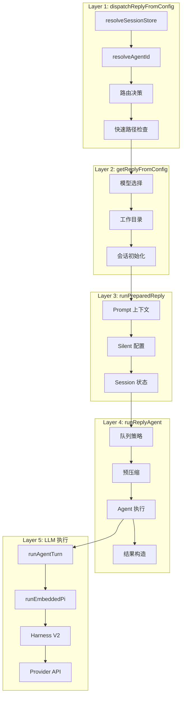
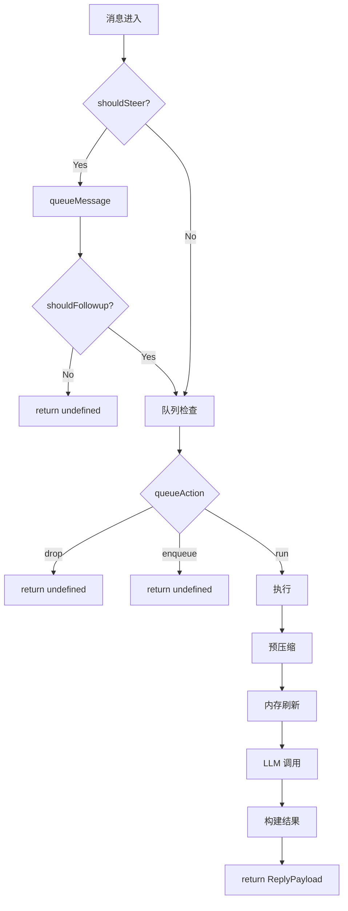

# 消息执行流程分析

> 本目录详细分析一条消息从接收到回复的完整执行流程。
>
> 分析日期：2026-05-04 | 版本：2026.5.3

---

## 整体概览

当用户在飞书发送消息给 OpenClaw Bot 时，消息经历以下旅程：

```
飞书服务器 → WebSocket/Webhook → OpenClaw Gateway → LLM → 飞书用户
     │              │                 │              │         │
   事件推送      接收解析          业务处理       AI生成    消息回复
```

**全程耗时**：通常 3-15 秒（取决于 LLM 响应速度）

---

## 目录结构

| 文件                                                                 | 函数                                | 作用                                   | 状态 |
| -------------------------------------------------------------------- | ----------------------------------- | -------------------------------------- | ---- |
| [README.md](README.md)                                               | -                                   | 详细目录和调用链                       | 完成 |
| [01-monitor-transport.md](01-monitor-transport.md)                   | `monitorWebSocket`/`monitorWebhook` | **接入层**：WebSocket/Webhook 消息接收 | 完成 |
| [02-monitor-message-handler.md](02-monitor-message-handler.md)       | `createFeishuMessageReceiveHandler` | **解析层**：事件解析、去重、debounce   | 完成 |
| [03-handle-feishu-message.md](03-handle-feishu-message.md)           | `handleFeishuMessage`               | **业务层**：权限检查、路由解析         | 完成 |
| [04-run-channel-turn.md](04-run-channel-turn.md)                     | `runChannelTurn`                    | **编排层**：Turn 生命周期管理          | 完成 |
| [05-dispatch-reply-from-config.md](05-dispatch-reply-from-config.md) | `dispatchReplyFromConfig`           | **第 1 层**：分发协调器                | 完成 |
| [06-get-reply-from-config.md](06-get-reply-from-config.md)           | `getReplyFromConfig`                | **第 2 层**：回复准备器                | 完成 |
| [07-run-prepared-reply.md](07-run-prepared-reply.md)                 | `runPreparedReply`                  | **第 3 层**：执行准备器                | 完成 |
| [08-run-reply-agent.md](08-run-reply-agent.md)                       | `runReplyAgent`                     | **第 4 层**：Agent 编排器              | 完成 |
| [09-run-agent-turn.md](09-run-agent-turn.md)                         | `runAgentTurnWithFallback`          | **执行层**：Agent Turn 执行            | 完成 |
| [10-run-embedded-pi-agent.md](10-run-embedded-pi-agent.md)           | `runEmbeddedPiAgent`                | **Pi 层**：嵌入式 Pi Agent 运行        | 完成 |
| [11-run-agent-harness-attempt.md](11-run-agent-harness-attempt.md)   | `runAgentHarnessAttempt`            | **Harness 层**：Harness 尝试           | 完成 |
| [12-run-harness-v2-lifecycle.md](12-run-harness-v2-lifecycle.md)     | `runHarnessV2LifecycleAttempt`      | **V2 层**：Harness V2 生命周期         | 完成 |
| [13-provider-stream-completion.md](13-provider-stream-completion.md) | `Provider.streamCompletion`         | **Provider 层**：LLM API 调用          | 完成 |
| [14-reply-dispatcher.md](14-reply-dispatcher.md)                     | `ReplyDispatcher`                   | **分发层**：回复分发器                 | 完成 |
| [15-send-message-feishu.md](15-send-message-feishu.md)               | `sendMessageFeishu`                 | **发送层**：飞书消息发送               | 完成 |

---

## 核心概念

### 接入：两种传输模式

| 模式          | 原理             | 适用场景           |
| ------------- | ---------------- | ------------------ |
| **WebSocket** | 长连接，实时推送 | 内网部署、低延迟   |
| **Webhook**   | HTTP POST 回调   | 公网部署、简单配置 |

### 处理：三道防线

1. **Debounce（防抖）**：合并短时间内的连续消息（3 秒窗口）
2. **Deduplication（去重）**：基于 `message_id` 防止重复处理
3. **Sequential Queue（顺序队列）**：保证同一会话消息按顺序处理

### 执行：四层架构

```
Layer 1: dispatchReplyFromConfig  → 路由决策、快速路径
Layer 2: getReplyFromConfig       → 模型选择、会话初始化
Layer 3: runPreparedReply         → Prompt 构建、执行准备
Layer 4: runReplyAgent            → LLM 调用、结果构造
```

### 发送：三种回复类型

| 类型            | 方法             | 说明               |
| --------------- | ---------------- | ------------------ |
| **Block Reply** | `sendBlockReply` | 流式更新，实时显示 |
| **Tool Result** | `sendToolResult` | 工具执行结果       |
| **Final Reply** | `sendFinalReply` | 最终完整回复       |

---

## 调用架构

消息执行流程分为**三个阶段**：渠道接入 → 回复生成 → 回复发送

### 前置层（渠道接入，步骤 1-4）

```
┌─────────────────────────────────────────────────────────────┐
│  (1) feishu/src/monitor.transport.ts                        │
│  作用: WebSocket/Webhook 消息接收                           │
└─────────────────────────────────────────────────────────────┘
                            │
                            ▼
┌─────────────────────────────────────────────────────────────┐
│  (2) feishu/src/monitor.message-handler.ts                  │
│  作用: 事件解析、去重、debounce                              │
└─────────────────────────────────────────────────────────────┘
                            │
                            ▼
┌─────────────────────────────────────────────────────────────┐
│  (3) feishu/src/bot.ts:384                                  │
│  作用: 权限检查、路由解析、构建 Agent 输入                   │
└─────────────────────────────────────────────────────────────┘
                            │
                            ▼
┌─────────────────────────────────────────────────────────────┐
│  (4) channels/turn/kernel.ts:300                            │
│  作用: Turn 生命周期编排 (ingest → dispatch → finalize)     │
└─────────────────────────────────────────────────────────────┘
```

### 核心四层（回复生成，步骤 5-8）

```
┌─────────────────────────────────────────────────────────────┐
│  Layer 1: dispatchReplyFromConfig                           │
│  文件: src/auto-reply/reply/dispatch-from-config.ts         │
│  作用: 分发协调 - 路由决策、快速路径、调用准备器             │
│  行数: ~1549                                                 │
└─────────────────────────────────────────────────────────────┘
                            │
                            ▼
┌─────────────────────────────────────────────────────────────┐
│  Layer 2: getReplyFromConfig                                 │
│  文件: src/auto-reply/reply/get-reply.ts                     │
│  作用: 回复准备 - 模型选择、会话初始化、调用执行器           │
│  行数: ~680                                                  │
└─────────────────────────────────────────────────────────────┘
                            │
                            ▼
┌─────────────────────────────────────────────────────────────┐
│  Layer 3: runPreparedReply                                    │
│  文件: src/auto-reply/reply/get-reply-run.ts                 │
│  作用: 执行准备 - prompt 构建、silent 处理、调用编排器       │
│  行数: ~1059                                                 │
└─────────────────────────────────────────────────────────────┘
                            │
                            ▼
┌─────────────────────────────────────────────────────────────┐
│  Layer 4: runReplyAgent                                       │
│  文件: src/auto-reply/reply/agent-runner.ts                  │
│  作用: Agent 编排 - 队列管理、压缩、LLM 调用、结果构造       │
│  行数: ~1869                                                 │
└─────────────────────────────────────────────────────────────┘
```

### 执行层（LLM 调用，步骤 9-13）

```
┌─────────────────────────────────────────────────────────────┐
│  (9)  runAgentTurnWithFallback                               │
│  文件: src/auto-reply/reply/agent-runner-execution.ts        │
│  作用: Model fallback 策略                                   │
│  行数: ~2078                                                 │
└─────────────────────────────────────────────────────────────┘
                            │
                            ▼
┌─────────────────────────────────────────────────────────────┐
│  (10) runEmbeddedPiAgent                                     │
│  文件: src/agents/pi-embedded-runner/run.ts                  │
│  作用: Harness 选择、模型解析                                │
│  行数: ~700                                                  │
└─────────────────────────────────────────────────────────────┘
                            │
                            ▼
┌─────────────────────────────────────────────────────────────┐
│  (11) runAgentHarnessAttempt                                 │
│  文件: src/agents/harness/selection.ts                       │
│  作用: Harness 选择和适配 (V1 → V2 wrapper)                  │
│  行数: ~400                                                  │
└─────────────────────────────────────────────────────────────┘
                            │
                            ▼
┌─────────────────────────────────────────────────────────────┐
│  (12) runAgentHarnessV2LifecycleAttempt                      │
│  文件: src/agents/harness/v2.ts                              │
│  作用: V2 生命周期 (prepare → start → send → resolve)        │
│  行数: ~260                                                  │
└─────────────────────────────────────────────────────────────┘
                            │
                            ▼
┌─────────────────────────────────────────────────────────────┐
│  (13) runEmbeddedAttempt                                     │
│  文件: src/agents/pi-embedded-runner/run/attempt.ts          │
│  作用: 核心执行 - Session/Prompt/API/工具执行                │
│  行数: ~3700                                                 │
│                                                              │
│  内部调用: Provider.streamCompletion → LLM API              │
└─────────────────────────────────────────────────────────────┘
```

### 后置层（回复发送，步骤 14-15）

```
┌─────────────────────────────────────────────────────────────┐
│  (14) feishu/src/reply-dispatcher.ts                        │
│  作用: 回复分发 (Block/Final Reply)                         │
└─────────────────────────────────────────────────────────────┘
                            │
                            ▼
┌─────────────────────────────────────────────────────────────┐
│  (15) feishu/src/send.ts                                    │
│  作用: 飞书 API 发送                                         │
└─────────────────────────────────────────────────────────────┘
```

---

## 15 步调用链（完整路径）

> **Harness 类型说明**：
>
> - **PI Harness** (`createPiAgentHarness`) 是 **V1 接口** (`AgentHarness`)，有 `runAttempt()` 方法
> - **V2 Lifecycle** (`runAgentHarnessV2LifecycleAttempt`) 是适配层，通过 `adaptAgentHarnessToV2()` 包装 V1
> - V2 的 `send()` 方法直接调用 V1 的 `runAttempt()` → `runEmbeddedAttempt`
> - 所有准备工作（Prompt、Tools、Session）都在 `runEmbeddedAttempt` 内部完成

```
飞书服务器推送消息（WebSocket 或 Webhook）
        │
        ├─────────────────────────────────────────┐
        │                                         │
        ▼ (WebSocket 模式)                  ▼ (Webhook 模式)
┌─────────────────────────────────────────────────────────────────────────────┐
│  (1) feishu/src/monitor.transport.ts                                           │
│     WebSocket 模式: monitorWebSocket()                                       │
│     ├── createFeishuWSClient()            → 连接飞书 WebSocket              │
│     └── wsClient.start({ eventDispatcher }) → 启动事件分发                  │
│                                                                              │
│     Webhook 模式: monitorWebhook()                                           │
│     ├── http.createServer()               → 创建 HTTP 服务器                │
│     ├── isFeishuWebhookSignatureValid()   → 验证签名                        │
│     └── eventDispatcher.invoke()          → 分发事件                        │
│                                                                              │
│     输出: eventDispatcher 分发到 message-handler                             │
└─────────────────────────────────────────────────────────────────────────────┘
        │
        ▼
┌─────────────────────────────────────────────────────────────────────────────┐
│  (2) feishu/src/monitor.message-handler.ts                                     │
│     createFeishuMessageReceiveHandler()                                      │
│     ├── parseFeishuMessageEventPayload()  → 解析消息 payload                │
│     ├── tryBeginFeishuMessageProcessing()  → 去重检查                       │
│     ├── inboundDebouncer.enqueue()         → debounce 处理                  │
│     └── dispatchFeishuMessage()            → 调用 handleMessage             │
│                                                                              │
│     输出: FeishuMessageEvent                                                 │
└─────────────────────────────────────────────────────────────────────────────┘
        │
        ▼
┌─────────────────────────────────────────────────────────────────────────────┐
│  (3) feishu/src/bot.ts:384                                                     │
│     handleFeishuMessage({ cfg, event, accountId })                          │
│     ├── parseFeishuMessageEvent()         → 解析消息内容                     │
│     ├── resolveFeishuSenderName()         → 获取发送者名称                   │
│     ├── isFeishuGroupAllowed()            → 权限检查                         │
│     ├── buildFeishuAgentBody():269        → 构建 Agent 输入文本              │
│     └── createFeishuReplyDispatcher()     → 创建回复分发器                   │
│                                                                              │
│     输出: { agentBody, dispatcher, sessionKey }                              │
└─────────────────────────────────────────────────────────────────────────────┘
        │
        ▼
┌─────────────────────────────────────────────────────────────────────────────┐
│  (4) channels/turn/kernel.ts:300                                               │
│     runChannelTurn({ channel, accountId, raw, adapter })                    │
│     ├── adapter.ingest()                   → 解析输入                        │
│     ├── adapter.preflight()                → 预检查                          │
│     ├── adapter.resolveTurn()              → 解析 Turn                       │
│     │   └── 返回: { routeSessionKey, storePath, ctxPayload, runDispatch }   │
│     └── adapter.resolveTurn().runDispatch()                                 │
│                                                                              │
│     Phase: ingest → preflight → resolve → dispatch → finalize               │
└─────────────────────────────────────────────────────────────────────────────┘
        │
        ▼
┌─────────────────────────────────────────────────────────────────────────────┐
│  (5) auto-reply/reply/dispatch-from-config.ts:334                              │
│     dispatchReplyFromConfig({ ctx, cfg, dispatcher })                       │
│     ├── resolveSessionStoreLookup()        → 解析 Session Store             │
│     ├── resolveSessionAgentId()            → 解析 Agent ID                  │
│     ├── resolveAgentConfig()               → 解析 Agent 配置                 │
│     ├── getReplyFromConfig()               → [跳转到 (6)]                     │
│     └── dispatcher.sendFinalReply()        → [跳转到 (14)]                    │
└─────────────────────────────────────────────────────────────────────────────┘
        │
        ▼
┌─────────────────────────────────────────────────────────────────────────────┐
│  (6) auto-reply/reply/get-reply.ts:173                                        │
│     getReplyFromConfig(ctx, opts)                                            │
│     ├── resolveDefaultModel()              → 模型选择                        │
│     │   └── 输出: { provider: "bailian", model: "glm-5" }                   │
│     ├── resolveAgentWorkspaceDir()         → 工作目录                        │
│     ├── ensureAgentWorkspace()             → 创建工作空间                    │
│     └── runPreparedReply()                 → [跳转到 (7)]                     │
└─────────────────────────────────────────────────────────────────────────────┘
        │
        ▼
┌─────────────────────────────────────────────────────────────────────────────┐
│  (7) auto-reply/reply/get-reply-run.ts:343                                    │
│     runPreparedReply(params)                                                 │
│     ├── resolvePromptSessionContext()      → 构建 Prompt 上下文              │
│     ├── resolveSilentReplySettings()       → 静默回复设置                    │
│     └── runReplyAgent()                     → [跳转到 (8)]                    │
└─────────────────────────────────────────────────────────────────────────────┘
        │
        ▼
┌─────────────────────────────────────────────────────────────────────────────┐
│  (8) auto-reply/reply/agent-runner.ts:888                                     │
│     runReplyAgent(params)                                                    │
│     ├── 创建 TypingSignaler                → 打字状态管理                    │
│     ├── runPreflightCompactionIfNeeded()   → 预压缩检查                      │
│     ├── runMemoryFlushIfNeeded()           → 内存刷新                        │
│     └── runAgentTurnWithFallback()         → [跳转到 (9)]                    │
└─────────────────────────────────────────────────────────────────────────────┘
        │
        ▼
┌─────────────────────────────────────────────────────────────────────────────┐
│  (9) auto-reply/reply/agent-runner-execution.ts:871                           │
│     runAgentTurnWithFallback(params)                                         │
│     ├── resolveQueuedReplyRuntimeConfig()   → 解析运行配置                   │
│     ├── 处理 model fallback 逻辑            → 模型降级策略                   │
│     └── runEmbeddedPiAgent()                → [跳转到 (10)]                   │
└─────────────────────────────────────────────────────────────────────────────┘
        │
        ▼
┌─────────────────────────────────────────────────────────────────────────────┐
│  (10) agents/pi-embedded-runner/run.ts:303                                    │
│     runEmbeddedPiAgent(params)                                               │
│     ├── resolveSessionLane()                → 解析会话 Lane                  │
│     ├── selectAgentHarness()                → 选择 Harness (V2)              │
│     ├── resolveModelAsync()                 → 动态模型解析                   │
│     └── runEmbeddedAttemptWithBackend()     → [跳转到 (11)]                   │
└─────────────────────────────────────────────────────────────────────────────┘
        │
        ▼
┌─────────────────────────────────────────────────────────────────────────────┐
│  (11) agents/harness/selection.ts:153                                         │
│     runAgentHarnessAttempt(params)                                            │
│                                                                              │
│     Harness 选择和适配:                                                       │
│     ├── selectAgentHarnessDecision()        → 选择 Harness                   │
│     │   ├── 检查 agentHarnessId 配置       → 显式指定?                       │
│     │   ├── 检查 Plugin Harness 支持度     → supports(provider/model)        │
│     │   └── 选择结果:                       │
│     │       ├── "pi" (默认)                 → createPiAgentHarness()         │
│     │       └── plugin harness              → 注册的插件 harness             │
│     │                                                                        │
│     ├── createPiAgentHarness()              → AgentHarness (V1 接口)         │
│     │   └── { id: "pi", runAttempt: runEmbeddedAttempt }                     │
│     │                                                                        │
│     └── adaptAgentHarnessToV2(harness)      → AgentHarnessV2 (V2 包装)       │
│         ├── prepare: async () → { lifecycleState: "prepared" }              │
│         ├── start: async () → { lifecycleState: "started" }                 │
│         ├── send: async () → harness.runAttempt()  ← V1.runAttempt          │
│         ├── resolveOutcome: async () → applyClassification()               │
│         └── cleanup: async () → {}                                           │
│                                                                              │
│     └── runAgentHarnessV2LifecycleAttempt() → [跳转到 (12)]                   │
└─────────────────────────────────────────────────────────────────────────────┘
        │
        ▼
┌─────────────────────────────────────────────────────────────────────────────┐
│  (12) agents/harness/v2.ts:187                                                │
│     runAgentHarnessV2LifecycleAttempt(harness, params)                       │
│                                                                              │
│     Lifecycle (V2 适配层，包装 V1 Harness):                                  │
│     ├── harness.prepare(params)            → 标记 prepared 状态              │
│     ├── harness.start(prepared)            → 标记 started 状态               │
│     ├── harness.send(session)              → [核心] 调用 V1.runAttempt       │
│     │   │                                                                    │
│     │   │  V2.send() 内部:                                                   │
│     │   │  harness.runAttempt(session.params)  ← 来自 V1 AgentHarness       │
│     │   │                                                                    │
│     │   └── PI Harness V1.runAttempt → runEmbeddedAttempt (~3700 行)        │
│     │       ├── [阶段 A] 初始化: workspace/sandbox/skills/tools            │
│     │       ├── [阶段 B] Session: SessionManager + PI Session               │
│     │       ├── [阶段 C] Prompt: systemPrompt + history 处理                │
│     │       ├── [阶段 D] API: streamFn 配置                                 │
│     │       ├── [阶段 E] 执行: subscribeEmbeddedPiSession                   │
│     │       │   └── streamFn → [跳转到 (13)]                                │
│     │       └── [阶段 F] 结果: 构造返回 + 清理                               │
│     ├── harness.resolveOutcome()           → 应用 result classification     │
│     └── harness.cleanup()                  → 清理资源                        │
│                                                                              │
│     输出: EmbeddedRunAttemptResult { assistantTexts, toolMetas, usage }      │
│                                                                              │
│     关键: V2 lifecycle 是适配层，实际执行都在 V1.runAttempt/runEmbeddedAttempt│
└─────────────────────────────────────────────────────────────────────────────┘
        │
        ▼
┌─────────────────────────────────────────────────────────────────────────────┐
│  (13) bailian/src/provider.ts                                                 │
│     streamCompletion({ model, messages, tools })                             │
│     ├── callBailianApi()                   → HTTP POST                       │
│     │   └── https://bailian.aliyuncs.com/v1/chat/completions                │
│     └── parseBailianStreamChunk()          → 解析流式响应                    │
│         └── AsyncIterable<StreamChunk>                                      │
│             ├── { text: "国内模型..." }                                      │
│             ├── { toolCall: { name, args } }                                │
│             └── { finishReason: "stop" }                                    │
└─────────────────────────────────────────────────────────────────────────────┘
        │  流式返回
        ▼
┌─────────────────────────────────────────────────────────────────────────────┐
│  (14) feishu/src/reply-dispatcher.ts:131                                      │
│     dispatcher.sendBlockReply() (流式)                                       │
│     ├── streamingSession.updateCard()      → 更新飞书卡片                   │
│     │   └── 实时显示生成内容                                                 │
│                                                                              │
│     dispatcher.sendFinalReply() (最终)                                       │
│     ├── shouldUseCard()                    → 判断是否卡片                   │
│     │   └── 条件: 代码块 | 表格                                              │
│     └── sendMessageFeishu() | sendCardFeishu() → [跳转到 (15)]               │
└─────────────────────────────────────────────────────────────────────────────┘
        │
        ▼
┌─────────────────────────────────────────────────────────────────────────────┐
│  (15) feishu/src/send.ts:549                                                  │
│     sendMessageFeishu({ to, text, replyToMessageId })                        │
│     ├── resolveFeishuSendTarget()          → 解析发送目标                   │
│     ├── buildFeishuPostMessagePayload()    → 构建消息体                     │
│     └── client.im.message.create()         → 飞书 API                       │
│         └── POST /im/v1/messages?receive_id_type=open_id                    │
│         └── 返回: { message_id: "om_xxx" }                                   │
└─────────────────────────────────────────────────────────────────────────────┘
        │
        ▼
    飞书服务器送达用户
```

---

### 工具调用分支

当 LLM 返回 `toolCall` 时，进入工具执行循环：

```
(12) harness.send() → Provider API
        │
        ▼  返回 toolCall
│
│  ┌─────────────────────────────────────────────────────────────────────┐
│  │ agents/harness/v2.ts                                                 │
│  │ executeToolCall(toolCall)                                            │
│  │ ├── resolveToolDefinition()        → 获取工具定义                     │
│  │ ├── validateToolInput()            → 验证输入                         │
│  │ └── tool.execute(input)            → 执行工具                         │
│  │     │                                                               │
│  │     │  示例: brave/src/tool.ts                                       │
│  │     │  braveSearch({ query })                                        │
│  │     │  └── https://api.search.brave.com/res/v2/web/search            │
│  │     │  └── 返回: { results: [...] }                                  │
│  │     │                                                               │
│  │ ├── dispatcher.sendToolResult()    → 发送工具结果                   │
│  │ │   （飞书不显示，返回 false）                                       │
│  │ ├── appendToolResultToHistory()    → 记录到 Session                │
│  │ │                                                                   │
│  │ └── 继续调用 Provider API           → 循环直到结束                   │
│  │     └── streamCompletion() → (13)                                      │
│  └─────────────────────────────────────────────────────────────────────┘
```

---

## 数据流演变

```
原始消息 (飞书事件)
    │
    ▼ parseFeishuMessageEvent
FeishuMessageContext
    { chatId, messageId, senderId, content, chatType }
    │
    ▼ buildFeishuAgentBody
Agent 输入文本
    "[message_id: xxx] GL: 国内模型和国外模型差距"
    │
    ▼ resolveSessionStoreLookup
Session Key
    "agent:main:feishu:direct:ou_xxx"
    │
    ▼ resolveModelSelection
模型选择
    { provider: "bailian", model: "glm-5" }
    │
    ▼ buildPromptSessionContext
API Payload
    { model, messages, tools, stream: true }
    │
    ▼ Provider.streamCompletion
StreamChunk (流式)
    { text: "国内模型...", finishReason: "stop" }
    │
    ▼ resolveOutcome
ReplyPayload
    { text, model, provider, usage }
    │
    ▼ dispatcher.sendFinalReply
飞书消息
    { receive_id, content, msg_type }
```

---

## 流程图

### 整体流程



### 队列决策分支



---

## 关键机制

### Fallback（降级）

当主模型失败时，自动尝试备用模型：

```
glm-5 失败 → gpt-5.5 → sonnet-4.6 → ...
```

触发条件：

- API 错误（401/429/500）
- 超时
- Rate Limit

### Compaction（压缩）

当会话历史超出 context window 时：

```
旧消息 → LLM Summary → 替换为摘要 → 空出空间
```

### Block Streaming（流式回复）

实时更新飞书卡片，用户看到"打字"效果：

```
LLM chunk → onBlockReply → 飞书卡片更新 → 用户可见
```

---

## 核心函数签名速查

### dispatchReplyFromConfig

```typescript
export async function dispatchReplyFromConfig(params: {
  ctx: FinalizedMsgContext;
  cfg: OpenClawConfig;
  dispatcher: ReplyDispatcher;
}): Promise<DispatchFromConfigResult>;
```

### getReplyFromConfig

```typescript
export async function getReplyFromConfig(
  ctx: MsgContext,
  sessionEntry: SessionEntry | undefined,
  opts?: GetReplyOptions,
): Promise<ReplyPayload | undefined>;
```

### runPreparedReply

```typescript
export async function runPreparedReply(params: {
  ctx: MsgContext;
  cfg: OpenClawConfig;
  agentId: string;
  sessionKey: string;
  storePath: string;
  modelState: ModelState;
  opts?: GetReplyOptions;
  // ... 更多参数
}): Promise<ReplyPayload | undefined>;
```

### runReplyAgent

```typescript
export async function runReplyAgent(params: {
  commandBody: string;
  followupRun: FollowupRun;
  queueKey: string;
  resolvedQueue: QueueSettings;
  sessionKey?: string;
  sessionEntry?: SessionEntry;
  defaultModel: string;
  sessionCtx: TemplateContext;
  typing: TypingController;
  blockStreamingEnabled: boolean;
  opts?: GetReplyOptions;
  // ... 更多参数
}): Promise<ReplyPayload | ReplyPayload[] | undefined>;
```

---

## 阅读指引

**快速入门**：先读本文总览，理解整体流程和核心概念。

**深入理解 - 核心四层**（推荐顺序）：

1. [01-monitor-transport.md](01-monitor-transport.md) - 接入层：消息如何进入系统
2. [05-dispatch-reply-from-config.md](05-dispatch-reply-from-config.md) - 第 1 层分发协调
3. [06-get-reply-from-config.md](06-get-reply-from-config.md) - 第 2 层回复准备
4. [07-run-prepared-reply.md](07-run-prepared-reply.md) - 第 3 层执行准备
5. [08-run-reply-agent.md](08-run-reply-agent.md) - 第 4 层 Agent 编排（最复杂）

> 注：02-04 是飞书渠道特定处理（消息解析、权限检查、Turn 编排），其他渠道类似。

**完整阅读**（按调用顺序）：

从 01 到 15 依次阅读，每步对应调用链中的一个环节。

**调试排查**：根据问题现象定位对应层级：

- 消息未收到 → 检查 01-02（接入层）
- 消息处理异常 → 检查 03-04（渠道层）
- LLM 调用失败 → 检查 09-13（执行层）
- 回复发送失败 → 检查 14-15（发送层）

---

## 关键概念

| 概念                | 说明                                                                 |
| ------------------- | -------------------------------------------------------------------- |
| **Session Key**     | 会话标识，格式：`agent:<agentId>:<channel>:<peerKind>:<peerId>`      |
| **FollowupRun**     | 后续运行上下文，包含 agentId、sessionKey、provider、model 等         |
| **ReplyDispatcher** | 回复分发器，提供 sendBlockReply、sendFinalReply、sendToolResult 方法 |
| **Block Streaming** | 流式响应，实时更新飞书卡片                                           |
| **Compaction**      | 会话压缩，当历史超出 context window 时压缩旧消息                     |
| **Fallback**        | 模型降级，当主模型失败时尝试备用模型                                 |
| **ReplyOperation**  | 运行操作，管理运行生命周期（queued → running → completed）           |
| **TypingSignaler**  | 打字指示器控制器                                                     |

---

## 延伸阅读

- [../architecture.md](../architecture.md) - 项目整体架构
- [../session-management.md](../session-management.md) - 会话管理机制
- [../channel-routing.md](../channel-routing.md) - 渠道路由

---

> **文档版本**: 2026-05-04
> **分析基于**: OpenClaw v2026.5.3
