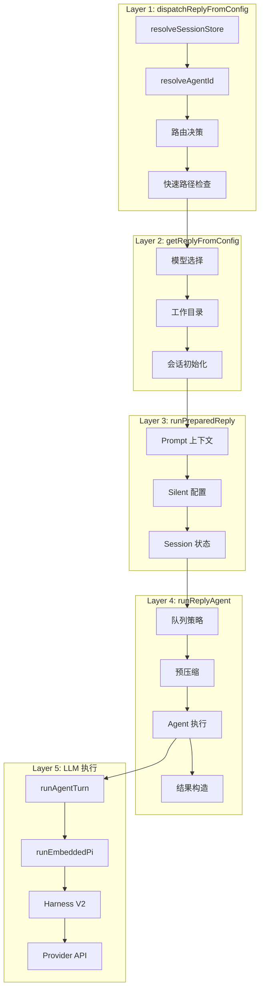
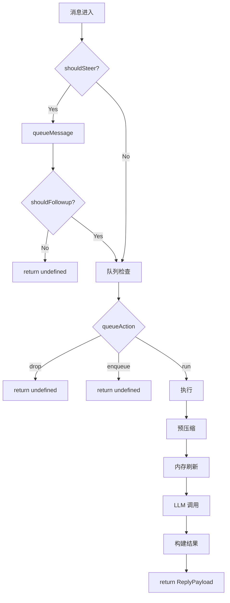

# 消息执行流程分析

> 本目录详细分析一条消息从接收到回复的完整执行流程。
>
> 分析日期：2026-05-04 | 版本：2026.5.3

---

## 整体概览

当用户在飞书发送消息给 OpenClaw Bot 时，消息经历以下旅程：

```
飞书服务器 → WebSocket/Webhook → OpenClaw Gateway → LLM → 飞书用户
     │              │                 │              │         │
   事件推送      接收解析          业务处理       AI生成    消息回复
```

**全程耗时**：通常 3-15 秒（取决于 LLM 响应速度）

---

## 目录结构

| 文件                                                                 | 函数                                | 作用                                    | 状态 |
| -------------------------------------------------------------------- | ----------------------------------- | --------------------------------------- | ---- |
| [README.md](README.md)                                               | -                                   | 详细目录和调用链                        | 完成 |
| [01-monitor-transport.md](01-monitor-transport.md)                   | `monitorWebSocket`/`monitorWebhook` | **接入层**：WebSocket/Webhook 消息接收  | 完成 |
| [02-monitor-message-handler.md](02-monitor-message-handler.md)       | `createFeishuMessageReceiveHandler` | **解析层**：事件解析、去重、debounce    | 完成 |
| [03-handle-feishu-message.md](03-handle-feishu-message.md)           | `handleFeishuMessage`               | **业务层**：权限检查、路由解析          | 完成 |
| [04-run-channel-turn.md](04-run-channel-turn.md)                     | `runChannelTurn`                    | **编排层**：Turn 生命周期管理           | 完成 |
| [05-dispatch-reply-from-config.md](05-dispatch-reply-from-config.md) | `dispatchReplyFromConfig`           | **第 1 层**：分发协调器                 | 完成 |
| [06-get-reply-from-config.md](06-get-reply-from-config.md)           | `getReplyFromConfig`                | **第 2 层**：回复准备器                 | 完成 |
| [07-run-prepared-reply.md](07-run-prepared-reply.md)                 | `runPreparedReply`                  | **第 3 层**：执行准备器                 | 完成 |
| [08-run-reply-agent.md](08-run-reply-agent.md)                       | `runReplyAgent`                     | **第 4 层**：Agent 编排器               | 完成 |
| [09-run-agent-turn.md](09-run-agent-turn.md)                         | `runAgentTurnWithFallback`          | **执行层**：Agent Turn 执行             | 完成 |
| [10-run-embedded-pi-agent.md](10-run-embedded-pi-agent.md)           | `runEmbeddedPiAgent`                | **Pi 层**：嵌入式 Pi Agent 运行         | 完成 |
| [11-run-agent-harness-attempt.md](11-run-agent-harness-attempt.md)   | `runAgentHarnessAttempt`            | **Harness 层**：Harness 尝试            | 完成 |
| [12-run-harness-v2-lifecycle.md](12-run-harness-v2-lifecycle.md)     | `runHarnessV2LifecycleAttempt`      | **V2 层**：Harness V2 生命周期          | 完成 |
| [13-run-embedded-attempt.md](13-run-embedded-attempt.md)             | `runEmbeddedAttempt`                | **核心层**：Session/Prompt/API/工具执行 | 完成 |
| [14-provider-stream-completion.md](14-provider-stream-completion.md) | `Provider.streamCompletion`         | **Provider 层**：LLM API 调用           | 完成 |
| [15-reply-dispatcher.md](15-reply-dispatcher.md)                     | `ReplyDispatcher`                   | **分发层**：回复分发器                  | 完成 |
| [16-send-message-feishu.md](16-send-message-feishu.md)               | `sendMessageFeishu`                 | **发送层**：飞书消息发送                | 完成 |

---

## 核心概念

### 接入：两种传输模式

| 模式          | 原理             | 适用场景           |
| ------------- | ---------------- | ------------------ |
| **WebSocket** | 长连接，实时推送 | 内网部署、低延迟   |
| **Webhook**   | HTTP POST 回调   | 公网部署、简单配置 |

### 处理：三道防线

1. **Debounce（防抖）**：合并短时间内的连续消息（3 秒窗口）
2. **Deduplication（去重）**：基于 `message_id` 防止重复处理
3. **Sequential Queue（顺序队列）**：保证同一会话消息按顺序处理

### 执行：四层架构

```
Layer 1: dispatchReplyFromConfig  → 路由决策、快速路径
Layer 2: getReplyFromConfig       → 模型选择、会话初始化
Layer 3: runPreparedReply         → Prompt 构建、执行准备
Layer 4: runReplyAgent            → LLM 调用、结果构造
```

### 发送：三种回复类型

| 类型            | 方法             | 说明               |
| --------------- | ---------------- | ------------------ |
| **Block Reply** | `sendBlockReply` | 流式更新，实时显示 |
| **Tool Result** | `sendToolResult` | 工具执行结果       |
| **Final Reply** | `sendFinalReply` | 最终完整回复       |

---

## 完整调用链

消息执行流程分为**四个阶段**：渠道接入 → 回复生成 → LLM 执行 → 回复发送

> **Harness 类型说明**：
>
> - **PI Harness** (`createPiAgentHarness`) 是 V1 接口，有 `runAttempt()` 方法
> - **V2 Lifecycle** 是适配层，通过 `adaptAgentHarnessToV2()` 包装 V1
> - V2 的 `send()` 方法直接调用 V1 的 `runAttempt()` → `runEmbeddedAttempt`

### 阶段 1：渠道接入（步骤 1-4）

```
飞书服务器推送消息
        │
        ▼
┌─────────────────────────────────────────────────────────────┐
│  (1) feishu/src/monitor.transport.ts                        │
│  作用: WebSocket/Webhook 消息接收                           │
│  核心函数:                                                   │
│  ├── WebSocket: monitorWebSocket()                          │
│  │   └── createFeishuWSClient() → wsClient.start()          │
│  └── Webhook: monitorWebhook()                              │
│      └── http.createServer() → 验证签名 → 分发              │
│  输出: eventDispatcher                                       │
└─────────────────────────────────────────────────────────────┘
        │
        ▼
┌─────────────────────────────────────────────────────────────┐
│  (2) feishu/src/monitor.message-handler.ts                  │
│  作用: 事件解析、去重、debounce                              │
│  核心函数: createFeishuMessageReceiveHandler()               │
│  ├── parseFeishuMessageEventPayload() → 解析 payload        │
│  ├── tryBeginFeishuMessageProcessing() → 去重               │
│  └── inboundDebouncer.enqueue() → debounce                  │
│  输出: FeishuMessageEvent                                    │
└─────────────────────────────────────────────────────────────┘
        │
        ▼
┌─────────────────────────────────────────────────────────────┐
│  (3) feishu/src/bot.ts:384                                  │
│  作用: 权限检查、路由解析、构建 Agent 输入                   │
│  核心函数: handleFeishuMessage()                             │
│  ├── isFeishuGroupAllowed() → 权限检查                       │
│  └── buildFeishuAgentBody() → 构建 Agent 输入文本           │
│  输出: { agentBody, dispatcher, sessionKey }                 │
└─────────────────────────────────────────────────────────────┘
        │
        ▼
┌─────────────────────────────────────────────────────────────┐
│  (4) channels/turn/kernel.ts:300                            │
│  作用: Turn 生命周期编排                                     │
│  核心函数: runChannelTurn()                                  │
│  Phase: ingest → preflight → resolve → dispatch → finalize  │
│  输出: runDispatch()                                         │
└─────────────────────────────────────────────────────────────┘
```

### 阶段 2：回复生成四层（步骤 5-8）

```
┌─────────────────────────────────────────────────────────────┐
│  (5) dispatchReplyFromConfig                                │
│  文件: auto-reply/reply/dispatch-from-config.ts (~1549行)   │
│  作用: 分发协调 - 路由决策、快速路径                         │
│  核心函数: dispatchReplyFromConfig()                         │
│  ├── resolveSessionStoreLookup() → Session Store            │
│  ├── resolveSessionAgentId() → Agent ID                     │
│  └── getReplyFromConfig() → [跳转到 (6)]                     │
└─────────────────────────────────────────────────────────────┘
        │
        ▼
┌─────────────────────────────────────────────────────────────┐
│  (6) getReplyFromConfig                                     │
│  文件: auto-reply/reply/get-reply.ts (~680行)               │
│  作用: 回复准备 - 模型选择、会话初始化                       │
│  核心函数: getReplyFromConfig()                              │
│  ├── resolveDefaultModel() → { provider, model }            │
│  └── runPreparedReply() → [跳转到 (7)]                       │
└─────────────────────────────────────────────────────────────┘
        │
        ▼
┌─────────────────────────────────────────────────────────────┐
│  (7) runPreparedReply                                       │
│  文件: auto-reply/reply/get-reply-run.ts (~1059行)          │
│  作用: 执行准备 - prompt 构建                                │
│  核心函数: runPreparedReply()                                │
│  ├── resolvePromptSessionContext() → Prompt 上下文          │
│  └── runReplyAgent() → [跳转到 (8)]                          │
└─────────────────────────────────────────────────────────────┘
        │
        ▼
┌─────────────────────────────────────────────────────────────┐
│  (8) runReplyAgent                                          │
│  文件: auto-reply/reply/agent-runner.ts (~1869行)           │
│  作用: Agent 编排 - 队列、压缩、LLM 调用                     │
│  核心函数: runReplyAgent()                                   │
│  ├── runPreflightCompactionIfNeeded() → 预压缩              │
│  ├── runMemoryFlushIfNeeded() → 内存刷新                     │
│  └── runAgentTurnWithFallback() → [跳转到 (9)]               │
└─────────────────────────────────────────────────────────────┘
```

### 阶段 3：LLM 执行（步骤 9-14）

```
┌─────────────────────────────────────────────────────────────┐
│  (9) runAgentTurnWithFallback                               │
│  文件: auto-reply/reply/agent-runner-execution.ts (~2078行) │
│  作用: Model fallback 策略                                  │
│  核心函数: runAgentTurnWithFallback()                        │
│  └── 处理 fallback: 主模型失败 → 尝试备用模型               │
│  └── runEmbeddedPiAgent() → [跳转到 (10)]                    │
└─────────────────────────────────────────────────────────────┘
        │
        ▼
┌─────────────────────────────────────────────────────────────┐
│  (10) runEmbeddedPiAgent                                    │
│  文件: agents/pi-embedded-runner/run.ts (~700行)            │
│  作用: Harness 选择、模型解析                                │
│  核心函数: runEmbeddedPiAgent()                              │
│  ├── selectAgentHarness() → 选择 Harness                    │
│  └── runAgentHarnessAttempt() → [跳转到 (11)]                │
└─────────────────────────────────────────────────────────────┘
        │
        ▼
┌─────────────────────────────────────────────────────────────┐
│  (11) runAgentHarnessAttempt                                │
│  文件: agents/harness/selection.ts (~400行)                 │
│  作用: Harness 选择和适配                                    │
│  核心流程:                                                   │
│  ├── selectAgentHarnessDecision() → 选择结果                │
│  │   ├── "pi" (默认) → createPiAgentHarness()               │
│  │   └── plugin harness → 注册的插件 harness                │
│  └── adaptAgentHarnessToV2() → V2 包装                      │
│      └── { prepare, start, send, resolveOutcome, cleanup }  │
│  └── runAgentHarnessV2LifecycleAttempt() → [跳转到 (12)]     │
└─────────────────────────────────────────────────────────────┘
        │
        ▼
┌─────────────────────────────────────────────────────────────┐
│  (12) runHarnessV2LifecycleAttempt                          │
│  文件: agents/harness/v2.ts (~260行)                        │
│  作用: V2 生命周期（适配层）                                 │
│  核心流程:                                                   │
│  ├── harness.prepare() → 标记 prepared                      │
│  ├── harness.start() → 标记 started                         │
│  ├── harness.send() → [核心] 调用 V1.runAttempt             │
│  │   └── PI Harness.runAttempt → runEmbeddedAttempt         │
│  ├── harness.resolveOutcome() → 分类                        │
│  └── harness.cleanup() → 清理                               │
│                                                              │
│  ★ 关键: V2 是适配层，实际执行在 V1.runAttempt              │
└─────────────────────────────────────────────────────────────┘
        │
        ▼
┌─────────────────────────────────────────────────────────────┐
│  (13) runEmbeddedAttempt ★ 核心执行                         │
│  文件: agents/pi-embedded-runner/run/attempt.ts (~3700行)   │
│  作用: Session/Prompt/工具准备、PI Agent 执行                │
│                                                              │
│  6 个阶段:                                                   │
│  [A] 初始化: workspace/sandbox/skills                       │
│  [B] Tools: createOpenClawCodingTools + MCP/LSP + 过滤       │
│  [C] ★ PI Agent Session 创建:                               │
│      ├── SessionManager.fromFile ← @mariozechner/pi-agent   │
│      └── createAgentSession ← @mariozechner/pi-agent        │
│          └── 返回 AgentSession                              │
│  [D] Prompt 构建: systemPrompt + bootstrap files             │
│  [E] ★ 执行流程:                                             │
│      ├── subscribeEmbeddedPiSession                         │
│      │   └── session.subscribe(handler) ← 注册处理器        │
│      └── activeSession.prompt() ← 启动对话                  │
│                                                              │
│  输出: EmbeddedRunAttemptResult                              │
│        { assistantTexts, toolMetas, usage }                  │
└─────────────────────────────────────────────────────────────┘
        │
        ▼ activeSession.prompt() 启动 PI Agent 内部循环
┌─────────────────────────────────────────────────────────────┐
│  ★ PI Agent Conversation Loop                               │
│  来源: @mariozechner/pi-coding-agent                        │
│                                                              │
│  while (!finished) {                                         │
│      // 调用 streamFn 获取 LLM 响应                          │
│      const response = await session.agent.streamFn();       │
│      │                                                       │
│      ├── text chunk → message_update 事件                   │
│      ├── toolCall → executeToolCall → 继续循环 ↺            │
│      └── finishReason → 结束 ✓                               │
│  }                                                           │
│                                                              │
│  ★ streamFn 就是 Provider.streamCompletion → [跳转到 (14)]  │
└─────────────────────────────────────────────────────────────┘
        │ streamFn() 调用
        ▼
┌─────────────────────────────────────────────────────────────┐
│  (14) Provider.streamCompletion                             │
│  文件: extensions/*/src/provider.ts                         │
│  作用: LLM API 调用                                          │
│                                                              │
│  返回: AsyncIterable<StreamChunk>                            │
│        { text, toolCall, finishReason }                      │
└─────────────────────────────────────────────────────────────┘
```

### 阶段 4：回复发送（步骤 15-16）

```
┌─────────────────────────────────────────────────────────────┐
│  (15) ReplyDispatcher                                       │
│  文件: feishu/src/reply-dispatcher.ts                       │
│  作用: 回复分发（Block/Final Reply）                        │
│                                                              │
│  sendBlockReply(chunk) → 流式更新飞书卡片                   │
│  sendFinalReply(payload) → 最终完整回复                     │
│      ├── shouldUseCard() → 判断卡片/文本                    │
│      └── sendCardFeishu() | sendMessageFeishu()             │
└─────────────────────────────────────────────────────────────┘
        │
        ▼
┌─────────────────────────────────────────────────────────────┐
│  (16) sendMessageFeishu                                     │
│  文件: feishu/src/send.ts                                   │
│  作用: 飞书 API 发送                                         │
│                                                              │
│  核心流程:                                                   │
│  ├── resolveFeishuSendTarget() → 解析目标                   │
│  ├── buildFeishuPostMessagePayload() → 构建消息体           │
│  └── client.im.message.create() → POST API                  │
│      └── 返回: { message_id }                                │
└─────────────────────────────────────────────────────────────┘
        │
        ▼
    飞书服务器送达用户
```

---

## PI Agent 输出处理

PI Agent Session 完成后，输出需要经过多层处理才能发送给用户。

### 流式处理机制

整个流程是**流式输出 + 工具执行循环**的混合模式：

```
┌─────────────────────────────────────────────────────────────────────────────┐
│  Provider.streamCompletion                                                   │
│  返回: AsyncIterable<StreamChunk> ← 流式响应                                │
│                                                                              │
│  流式 chunk 类型:                                                            │
│  ├── { text: "部分文本..." }          → 文本片段                            │
│  ├── { toolCall: { name, args } }     → 工具调用请求                        │
│  └── { finishReason: "stop" }         → 结束标志                            │
└─────────────────────────────────────────────────────────────────────────────┘
        │
        ▼ 流式处理（逐个 chunk）
┌─────────────────────────────────────────────────────────────────────────────┐
│  PI Agent Session Conversation Loop                                          │
│                                                                              │
│  for await (const chunk of response) {   ← 异步迭代流                        │
│      │                                                                       │
│      │  case "text":                                                         │
│      ├──→ onAssistantMessage(text)                                           │
│      │       └── dispatcher.sendBlockReply({ text })                        │
│      │           └── 飞书卡片实时更新 ← 流式发送给用户                       │
│      │           └── 用户看到逐步生成                                        │
│      │                                                                       │
│      │  case "toolCall":                                                     │
│      └──→ onToolCall(toolCall)                                               │
│              └── executeToolCall() ← 执行工具（非流式，需等待）              │
│              └── toolResult 加入 context                                     │
│              └── 再次调用 streamFn() ← 新的流式请求                          │
│              └── 循环继续...                                                 │
│      │                                                                       │
│      │  case "finishReason":                                                 │
│      └──→ finished = true                                                    │
│  }                                                                           │
│                                                                              │
│  流式结束后:                                                                  │
│  dispatcher.sendFinalReply(完整回复) ← 最终完整消息                         │
└─────────────────────────────────────────────────────────────────────────────┘
```

**流式 vs 阻塞环节对比**：

| 环节                            | 类型   | 说明                       | 用户感知     |
| ------------------------------- | ------ | -------------------------- | ------------ |
| **Provider.streamCompletion**   | 流式   | AsyncIterable<StreamChunk> | -            |
| **text chunk → sendBlockReply** | 流式   | 每个 chunk 立即处理        | 看到逐步生成 |
| **toolCall → executeToolCall**  | 阻塞   | 执行工具需等待结果         | 看到暂停     |
| **再次 streamFn**               | 流式   | 新的流式请求               | 看到继续生成 |
| **sendFinalReply**              | 一次性 | 完成后发送完整消息         | 完整卡片     |

**时间线示例**：

```
时间 →

[LLM 流式输出] "国内模型" → sendBlockReply → 用户看到 "国内"
[LLM 流式输出] "和国外"   → sendBlockReply → 用户看到 "国内和国外"
[LLM 流式输出] "模型差距" → sendBlockReply → 用户看到 "国内和国外模型差距"
[LLM 输出 toolCall: web_search]
    │
    └──→ executeToolCall(web_search) ← 执行工具 (等待 2-5 秒)
    │       └── 用户看到生成暂停
    │       └── dispatcher.sendToolResult() ← 飞书不显示
    │       └── toolResult 加入 context
    │
    └──→ 再次 streamFn() ← 新的 LLM 请求
[LLM 流式输出] "根据搜索结果..." → sendBlockReply → 用户看到继续生成
[LLM 流式输出] "国产模型如..."   → sendBlockReply → 用户看到更多内容
[LLM finishReason: stop]
    │
    └──→ sendFinalReply(完整回复) ← 发送完整交互式卡片
    │       └── 用户看到最终消息
```

### 输出到发送的完整链路

```
┌─────────────────────────────────────────────────────────────────────────────┐
│  PI Agent Session 输出                                                       │
│                                                                              │
│  subscribeEmbeddedPiSession 返回:                                            │
│  ├── assistantTexts: string[]        → 文本回复片段                         │
│  ├── toolMetas: ToolMeta[]           → 工具执行元数据                       │
│  ├── usage: TokenUsage               → Token 使用统计                       │
│  └── finishReason: string            → 结束原因                             │
└─────────────────────────────────────────────────────────────────────────────┘
        │
        ▼
┌─────────────────────────────────────────────────────────────────────────────┐
│  (13) runEmbeddedAttempt 结果处理                                            │
│                                                                              │
│  ├── classifyRunResult()              → 结果分类                             │
│  │   └── "ok" | "error" | "aborted" | "timeout"                              │
│  │                                                                           │
│  ├── emitDiagnosticRunCompleted()     → 诊断事件                             │
│  │                                                                           │
│  └── 返回 EmbeddedRunAttemptResult                                           │
│      { assistantTexts, toolMetas, usage, classification }                   │
└─────────────────────────────────────────────────────────────────────────────┘
        │
        ▼
┌─────────────────────────────────────────────────────────────────────────────┐
│  (12 → 11 → 10 → 9) 结果逐层返回                                             │
│                                                                              │
│  runHarnessV2LifecycleAttempt.resolveOutcome()                               │
│      └── applyClassification() → 标记最终状态                               │
│                                                                              │
│  runEmbeddedPiAgent()                                                        │
│      └── 返回 PiAgentRunResult                                               │
│                                                                              │
│  runAgentTurnWithFallback()                                                  │
│      └── 处理 fallback 结果                                                  │
│      └── 返回 AgentTurnResult                                                │
└─────────────────────────────────────────────────────────────────────────────┘
        │
        ▼
┌─────────────────────────────────────────────────────────────────────────────┐
│  (8) runReplyAgent 结果构造                                                   │
│                                                                              │
│  ├── constructReplyPayload()           → 构建 ReplyPayload                  │
│  │   ├── assistantTexts.join()        → 合并文本                            │
│  │   ├── resolveOutcome()             → 结果状态                            │
│  │   └── { text, model, provider, usage, toolMetas }                        │
│  │                                                                           │
│  └── 流式输出（并行处理）                                                     │
│      │                                                                       │
│      ├── onBlockReply(chunk)           → 流式更新                           │
│      │   └── dispatcher.sendBlockReply()                                    │
│      │       └── 实时更新飞书卡片                                            │
│      │                                                                       │
│      └── onToolResult(result)          → 工具结果                           │
│          └── dispatcher.sendToolResult()                                    │
│              └── 飞书：不显示（返回 false）                                   │
│              └── 其他渠道：可能显示                                          │
└─────────────────────────────────────────────────────────────────────────────┘
        │
        ▼
┌─────────────────────────────────────────────────────────────────────────────┐
│  (5 → 6 → 7) ReplyPayload 返回                                               │
│                                                                              │
│  runPreparedReply()                                                          │
│      └── 返回 ReplyPayload                                                   │
│                                                                              │
│  getReplyFromConfig()                                                        │
│      └── 返回 ReplyPayload                                                   │
│                                                                              │
│  dispatchReplyFromConfig()                                                   │
│      └── dispatcher.sendFinalReply(payload)                                 │
└─────────────────────────────────────────────────────────────────────────────┘
        │
        ▼
┌─────────────────────────────────────────────────────────────────────────────┐
│  (15) ReplyDispatcher 发送                                                   │
│  文件: feishu/src/reply-dispatcher.ts                                        │
│                                                                              │
│  sendFinalReply(payload)                                                     │
│      │                                                                       │
│      ├── shouldUseCard(text)            → 判断是否使用卡片                   │
│      │   └── 条件: 包含代码块 || 包含表格                                    │
│      │                                                                       │
│      ├── 卡片模式:                                                            │
│      │   └── sendCardFeishu()           → 发送交互式卡片                    │
│      │       └── buildFeishuCardPayload()                                   │
│      │       └── client.im.message.create()                                 │
│      │                                                                       │
│      └── 文本模式:                                                            │
│          └── sendMessageFeishu()        → 发送文本消息                      │
│              └── buildFeishuPostMessagePayload()                            │
│              └── client.im.message.create()                                 │
│                                                                              │
│  流式更新（并行进行）:                                                        │
│  sendBlockReply(chunk)                                                       │
│      │                                                                       │
│      ├── streamingSession.updateCard() → 更新飞书卡片                       │
│      │   └── 实时显示生成内容                                                 │
│      │   └── 用户看到"打字"效果                                               │
│      │                                                                       │
│      └── 最终完成时：卡片变为最终回复                                         │
└─────────────────────────────────────────────────────────────────────────────┘
        │
        ▼
┌─────────────────────────────────────────────────────────────────────────────┐
│  (16) sendMessageFeishu 飞书 API                                             │
│  文件: feishu/src/send.ts                                                    │
│                                                                              │
│  sendMessageFeishu({ to, text, replyToMessageId })                          │
│      │                                                                       │
│      ├── resolveFeishuSendTarget()      → 解析发送目标                      │
│      │   ├── open_id                    → 用户私聊                          │
│      │   ├── chat_id                    → 群聊                              │
│      │   └── user_id                    → 用户 ID                           │
│      │                                                                       │
│      ├── buildFeishuPostMessagePayload() → 构建消息体                       │
│      │   ├── msg_type: "post"           → 富文本消息                        │
│      │   ├── content: PostContent       → 内容结构                          │
│      │   │   └── [[{ tag: "text", text: "..." }]]                           │
│      │   └── reply_to_message_id        → 回复原消息                        │
│      │                                                                       │
│      └── client.im.message.create()      → 飞书 API 调用                    │
│          └── POST /im/v1/messages?receive_id_type=open_id                   │
│          └── Headers: Authorization:Bearer xxx                              │
│          └── Body: { receive_id, msg_type, content }                        │
│          └── 返回: { message_id: "om_xxx" }                                  │
└─────────────────────────────────────────────────────────────────────────────┘
        │
        ▼
    飞书服务器送达用户
```

### Block Reply vs Final Reply

两种回复类型的对比：

| 类型            | 时机       | 内容 | 显示效果                 | API                           |
| --------------- | ---------- | ---- | ------------------------ | ----------------------------- |
| **Block Reply** | 流式过程中 | 部分 | 实时更新，用户看到"打字" | `dispatcher.sendBlockReply()` |
| **Final Reply** | 完成后     | 完整 | 卡片或文本消息，可交互   | `dispatcher.sendFinalReply()` |

**Block Reply 机制**：

- 每个 LLM text chunk 立即通过 `sendBlockReply` 发送
- 飞书卡片实时更新，用户看到逐步生成
- 工具执行期间暂停，但卡片保持显示

**Final Reply 机制**：

- 所有文本片段合并后一次性发送
- 根据内容判断使用卡片或文本消息
- 卡片模式：包含代码块或表格时使用交互式卡片
- 文本模式：普通文本使用飞书富文本消息

### ReplyPayload 结构

```typescript
type ReplyPayload = {
  // 文本内容
  text: string;

  // 模型信息
  model: string;
  provider: string;

  // Token 使用
  usage: {
    inputTokens: number;
    outputTokens: number;
    cacheWriteTokens?: number;
    cacheReadTokens?: number;
  };

  // 工具元数据
  toolMetas?: ToolMeta[];

  // 结果状态
  outcome?: "ok" | "error" | "aborted" | "timeout";

  // 其他
  finishReason?: string;
  sessionId?: string;
  runId?: string;
};
```

---

### 工具调用分支

当 LLM 返回 `toolCall` 时，进入工具执行循环：

```
(13) runEmbeddedAttempt → subscribeEmbeddedPiSession
        │
        ▼  返回 toolCall
│
│  ┌─────────────────────────────────────────────────────────────────────┐
│  │ agents/pi-embedded-runner/run/attempt.ts                           │
│  │ executeToolCall(toolCall)                                           │
│  │ ├── resolveToolDefinition()        → 获取工具定义                     │
│  │ ├── validateToolInput()            → 验证输入                         │
│  │ └── tool.execute(input)            → 执行工具                         │
│  │     │                                                               │
│  │     │  示例: brave/src/tool.ts                                       │
│  │     │  braveSearch({ query })                                        │
│  │     │  └── https://api.search.brave.com/res/v2/web/search            │
│  │     │  └── 返回: { results: [...] }                                  │
│  │     │                                                               │
│  │ ├── dispatcher.sendToolResult()    → 发送工具结果                   │
│  │ │   （飞书不显示，返回 false）                                       │
│  │ ├── appendToolResultToHistory()    → 记录到 Session                │
│  │ │                                                                   │
│  │ └── 继续调用 Provider API           → 循环直到结束                   │
│  │     └── streamCompletion() → (14)                                   │
│  └─────────────────────────────────────────────────────────────────────┘
```

---

## 数据流演变

```
原始消息 (飞书事件)
    │
    ▼ parseFeishuMessageEvent
FeishuMessageContext
    { chatId, messageId, senderId, content, chatType }
    │
    ▼ buildFeishuAgentBody
Agent 输入文本
    "[message_id: xxx] GL: 国内模型和国外模型差距"
    │
    ▼ resolveSessionStoreLookup
Session Key
    "agent:main:feishu:direct:ou_xxx"
    │
    ▼ resolveModelSelection
模型选择
    { provider: "bailian", model: "glm-5" }
    │
    ▼ buildPromptSessionContext
API Payload
    { model, messages, tools, stream: true }
    │
    ▼ Provider.streamCompletion
StreamChunk (流式)
    { text: "国内模型...", finishReason: "stop" }
    │
    ▼ resolveOutcome
ReplyPayload
    { text, model, provider, usage }
    │
    ▼ dispatcher.sendFinalReply
飞书消息
    { receive_id, content, msg_type }
```

---

## 流程图

### 整体流程



### 队列决策分支



---

## 可选旁支处理

主流程之外，有多个可选的旁支处理，根据配置和状态决定是否执行。

### 预压缩检查（Preflight Compaction）

**位置**: `runReplyAgent` (步骤 8)

**触发条件**: 会话历史接近 context window 限制

**处理流程**:

```
runReplyAgent()
    │
    ├── runPreflightCompactionIfNeeded()
    │   │
    │   ├── 检查 history token count
    │   │   └── 计算: inputTokens + pendingTokens
    │   │   └── 对比: contextWindow * compactionThreshold
    │   │
    │   ├── 如果超出阈值:
    │   │   └── runSessionCompaction()
    │   │       ├── 旧消息 → LLM Summary
    │   │       ├── 替换为摘要
    │   │       └── 空出空间
    │   │
    │   └── 否则: 跳过
    │
    └── 继续执行...
```

**参数**:

- `compactionThreshold`: 默认 0.75 (75% 触发)
- `contextWindow`: 模型上下文窗口大小

### 内存刷新检查（Memory Flush）

**位置**: `runReplyAgent` (步骤 8)

**触发条件**: 内存数据需要更新

**处理流程**:

```
runReplyAgent()
    │
    ├── runMemoryFlushIfNeeded()
    │   │
    │   ├── 检查 memory flush 配置
    │   │   └── config.memory.flushInterval
    │   │   └── lastFlushTime + flushInterval < now
    │   │
    │   ├── 如果需要刷新:
    │   │   └── flushMemory()
    │   │       ├── 清理过期记忆
    │   │       ├── 重新加载记忆文件
    │   │       └── 更新 lastFlushTime
    │   │
    │   └── 否则: 跳过
    │
    └── 继续执行...
```

### Bootstrap 文件注入

**位置**: `runEmbeddedAttempt` (步骤 13，阶段 D)

**触发条件**: 新工作目录或需要 bootstrap

**处理流程**:

```
runEmbeddedAttempt()
    │
    ├── [阶段 D] Prompt 构建
    │   │
    │   ├── resolveAttemptBootstrapContext()
    │   │   │
    │   │   ├── 检查 bootstrapMode
    │   │   │   ├── "none": 无 bootstrap
    │   │   │   ├── "limited": 部分 bootstrap
    │   │   │   └── "full": 完整 bootstrap
    │   │   │
    │   │   ├── 读取 bootstrap 文件:
    │   │   │   ├── AGENTS.md
    │   │   │   ├── SOUL.md
    │   │   │   ├── IDENTITY.md
    │   │   │   ├── USER.md
    │   │   │   ├── TOOLS.md
    │   │   │   ├── MEMORY.md
    │   │   │   └── BOOTSTRAP.md
    │   │   │
    │   │   ├── analyzeBootstrapBudget()
    │   │   │   └── 检查字符限制
    │   │   │   ├── bootstrapMaxChars
    │   │   │   ├── bootstrapTotalMaxChars
    │   │   │
    │   │   └── 注入到 systemPrompt
    │   │
    │   └── 继续执行...
```

**Bootstrap 模式**:

- `none`: 首次运行后，不再注入
- `limited`: 只注入核心文件
- `full`: 注入所有文件

### Sandbox 检查

**位置**: `runEmbeddedAttempt` (步骤 13，阶段 A)

**触发条件**: 配置启用 sandbox

**处理流程**:

```
runEmbeddedAttempt()
    │
    ├── [阶段 A] 初始化
    │   │
    │   ├── resolveSandboxContext()
    │   │   │
    │   │   ├── 检查 config.sandbox
    │   │   │   ├── enabled: true/false
    │   │   │   ├── workspaceAccess: "rw"/"ro"/"none"
    │   │   │   ├── tools: tool policy
    │   │   │
    │   │   ├── 如果 enabled:
    │   │   │   ├── 创建 sandbox 目录
    │   │   │   ├── 复制 workspace (ro/none)
    │   │   │   ├── 设置工具限制
    │   │   │   └── effectiveWorkspace = sandboxDir
    │   │   │
    │   │   └── 否则:
    │   │   │   └── effectiveWorkspace = resolvedWorkspace
    │   │
    │   └── 继续执行...
```

**Sandbox 模式**:

- `rw`:读写模式，使用原目录
- `ro`:只读模式，复制到 sandbox
- `none`:无访问，隔离 sandbox

### Skills 加载

**位置**: `runEmbeddedAttempt` (步骤 13，阶段 A-B)

**触发条件**: Agent 配置了 skills

**处理流程**:

```
runEmbeddedAttempt()
    │
    ├── [阶段 A] Skills 解析
    │   │
    │   ├── resolveEmbeddedRunSkillEntries()
    │   │   │
    │   │   ├── 检查 skillsSnapshot
    │   │   │   ├── 检查 config.skills
    │   │   │
    │   │   ├── 如果有 skills:
    │   │   │   ├── 加载 skill 文件
    │   │   │   ├── 解析 skill 配置
    │   │   │   └── 提取 skill prompts
    │   │   │
    │   │   └── 否则: skillsPrompt = undefined
    │   │
    │   ├── applySkillEnvOverrides()
    │   │   └── 应用 skill ENV 覆盖
    │   │
    │   └── resolveSkillsPromptForRun()
    │       └── 构建 skillsPrompt
    │
    ├── [阶段 B] Tools 构建
    │   └── skillsPrompt 注入到 systemPrompt
    │
    └── 继续执行...
```

**Skill 组成**:

- Prompt: 技能描述和使用说明
- ENV: 环境变量覆盖
- Tools: 技能相关工具

### 工具策略过滤

**位置**: `runEmbeddedAttempt` (步骤 13，阶段 B)

**触发条件**: 配置了 toolsAllow 或 sandbox tool policy

**处理流程**:

```
runEmbeddedAttempt()
    │
    ├── [阶段 B] Tools 构建
    │   │
    │   ├── createOpenClawCodingTools() → allTools
    │   │
    │   ├── applyEmbeddedAttemptToolsAllow(allTools, params.toolsAllow)
    │   │   │
    │   │   ├── 检查 toolsAllow 配置
    │   │   │   ├── 如果有配置:
    │   │   │   │   ├── 只保留允许的工具
    │   │   │   │   ├── 过滤禁止的工具
    │   │   │   │
    │   │   │   └── 否则: 全部保留
    │   │   │
    │   │   └── 返回 filteredTools
    │   │
    │   ├── getOrCreateSessionMcpRuntime() → mcpTools
    │   ├── createBundleLspToolRuntime() → lspTools
    │   │
    │   └── applyFinalEffectiveToolPolicy()
    │       │
    │       ├── 检查 sandbox.tools policy
    │       ├── 检查 config.toolPolicy
    │       ├── 合并 bundledTools: mcpTools + lspTools
    │       └── 应用最终过滤
    │       │
    │       └── 返回 effectiveTools
    │
    └── 继续执行...
```

**工具过滤层级**:

1. `toolsAllow`: 用户配置允许的工具列表
2. `sandbox.tools`: Sandbox 工具策略
3. `config.toolPolicy`: 全局工具策略

### 队列处理

**位置**: `dispatchReplyFromConfig` (步骤 5)

**触发条件**: 配置了 queue 或消息需要排队

**处理流程**:

```
dispatchReplyFromConfig()
    │
    ├── shouldSteer(ctx)
    │   │
    │   ├── 检查是否需要队列处理
    │   │   ├── 同一会话多条消息
    │   │   ├── 消息间隔很短
    │   │
    │   ├── 如果 true:
    │   │   └── queueMessage()
    │   │       │
    │   │       ├── shouldFollowup()
    │   │       │   ├── false: return undefined
    │   │       │   ├── true: 继续检查
    │   │       │
    │   │       ├── resolveQueueAction()
    │   │       │   ├── "drop": 丢弃消息
    │   │       │   ├── "enqueue": 加入队列
    │   │       │   ├── "run": 立即执行
    │   │       │
    │   │       └── 根据 action 处理
    │   │
    │   └── 如果 false:
    │       └── 正常执行
    │
    └── 继续执行...
```

**队列 Action**:

- `drop`: 丢弃，不处理
- `enqueue`: 加入队列，等待
- `run`: 立即执行

### 模型 Fallback（降级）

**位置**: `runAgentTurnWithFallback` (步骤 9)

**触发条件**: 主模型调用失败

**处理流程**:

```
runAgentTurnWithFallback()
    │
    ├── 尝试主模型: defaultModel
    │   └── runEmbeddedPiAgent()
    │       └── 如果失败:
    │           ├── 检查 fallbackModels
    │           ├── 尝试下一个模型
    │           │   ├── fallback[0]: gpt-5.5
    │           │   ├── fallback[1]: sonnet-4.6
    │           │   ├── ...
    │           │
    │           ├── 如果全部失败:
    │           │   └── 返回错误
    │           │
    │           └── 如果某个成功:
    │               └── 返回结果
    │
    └── 返回 AgentTurnResult
```

**失败条件**:

- API 错误 (401/429/500)
- 超时
- Rate Limit
- 模型不可用

### 旁支处理汇总表

| 旁支处理          | 位置    | 触发条件               | 影响                  |
| ----------------- | ------- | ---------------------- | --------------------- |
| **预压缩检查**    | 步骤 8  | history > threshold    | 历史压缩，空出空间    |
| **内存刷新**      | 步骤 8  | flushInterval到期      | 更新记忆文件          |
| **Bootstrap注入** | 步骤 13 | 新工作目录             | Prompt 包含项目上下文 |
| **Sandbox 检查**  | 步骤 13 | config.sandbox.enabled | 隔离执行环境          |
| **Skills 加载**   | 步骤 13 | config.skills          | Prompt 包含技能说明   |
| **工具策略过滤**  | 步骤 13 | toolsAllow/policy      | 限制可用工具          |
| **队列处理**      | 步骤 5  | 多消息并发             | 丢弃/排队/立即执行    |
| **模型 Fallback** | 步骤 9  | 主模型失败             | 尝试备用模型          |

---

## 关键机制

### Fallback（降级）

当主模型失败时，自动尝试备用模型：

```
glm-5 失败 → gpt-5.5 → sonnet-4.6 → ...
```

触发条件：

- API 错误（401/429/500）
- 超时
- Rate Limit

### Compaction（压缩）

当会话历史超出 context window 时：

```
旧消息 → LLM Summary → 替换为摘要 → 空出空间
```

### Block Streaming（流式回复）

实时更新飞书卡片，用户看到"打字"效果：

```
LLM chunk → onBlockReply → 飞书卡片更新 → 用户可见
```

---

## 核心函数签名速查

### dispatchReplyFromConfig

```typescript
export async function dispatchReplyFromConfig(params: {
  ctx: FinalizedMsgContext;
  cfg: OpenClawConfig;
  dispatcher: ReplyDispatcher;
}): Promise<DispatchFromConfigResult>;
```

### getReplyFromConfig

```typescript
export async function getReplyFromConfig(
  ctx: MsgContext,
  sessionEntry: SessionEntry | undefined,
  opts?: GetReplyOptions,
): Promise<ReplyPayload | undefined>;
```

### runPreparedReply

```typescript
export async function runPreparedReply(params: {
  ctx: MsgContext;
  cfg: OpenClawConfig;
  agentId: string;
  sessionKey: string;
  storePath: string;
  modelState: ModelState;
  opts?: GetReplyOptions;
  // ... 更多参数
}): Promise<ReplyPayload | undefined>;
```

### runReplyAgent

```typescript
export async function runReplyAgent(params: {
  commandBody: string;
  followupRun: FollowupRun;
  queueKey: string;
  resolvedQueue: QueueSettings;
  sessionKey?: string;
  sessionEntry?: SessionEntry;
  defaultModel: string;
  sessionCtx: TemplateContext;
  typing: TypingController;
  blockStreamingEnabled: boolean;
  opts?: GetReplyOptions;
  // ... 更多参数
}): Promise<ReplyPayload | ReplyPayload[] | undefined>;
```

---

## 阅读指引

**快速入门**：先读本文总览，理解整体流程和核心概念。

**深入理解 - 核心四层**（推荐顺序）：

1. [01-monitor-transport.md](01-monitor-transport.md) - 接入层：消息如何进入系统
2. [05-dispatch-reply-from-config.md](05-dispatch-reply-from-config.md) - 第 1 层分发协调
3. [06-get-reply-from-config.md](06-get-reply-from-config.md) - 第 2 层回复准备
4. [07-run-prepared-reply.md](07-run-prepared-reply.md) - 第 3 层执行准备
5. [08-run-reply-agent.md](08-run-reply-agent.md) - 第 4 层 Agent 编排（最复杂）

> 注：02-04 是飞书渠道特定处理（消息解析、权限检查、Turn 编排），其他渠道类似。

**完整阅读**（按调用顺序）：

从 01 到 16 依次阅读，每步对应调用链中的一个环节。

**调试排查**：根据问题现象定位对应层级：

- 消息未收到 → 检查 01-02（接入层）
- 消息处理异常 → 检查 03-04（渠道层）
- LLM 调用失败 → 检查 09-14（执行层）
- 回复发送失败 → 检查 15-16（发送层）

---

## 关键概念

| 概念                | 说明                                                                 |
| ------------------- | -------------------------------------------------------------------- |
| **Session Key**     | 会话标识，格式：`agent:<agentId>:<channel>:<peerKind>:<peerId>`      |
| **FollowupRun**     | 后续运行上下文，包含 agentId、sessionKey、provider、model 等         |
| **ReplyDispatcher** | 回复分发器，提供 sendBlockReply、sendFinalReply、sendToolResult 方法 |
| **Block Streaming** | 流式响应，实时更新飞书卡片                                           |
| **Compaction**      | 会话压缩，当历史超出 context window 时压缩旧消息                     |
| **Fallback**        | 模型降级，当主模型失败时尝试备用模型                                 |
| **ReplyOperation**  | 运行操作，管理运行生命周期（queued → running → completed）           |
| **TypingSignaler**  | 打字指示器控制器                                                     |

---

## 延伸阅读

- [../architecture.md](../architecture.md) - 项目整体架构
- [../session-management.md](../session-management.md) - 会话管理机制
- [../channel-routing.md](../channel-routing.md) - 渠道路由

---

> **文档版本**: 2026-05-04
> **分析基于**: OpenClaw v2026.5.3
