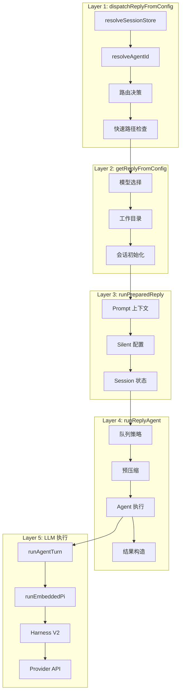
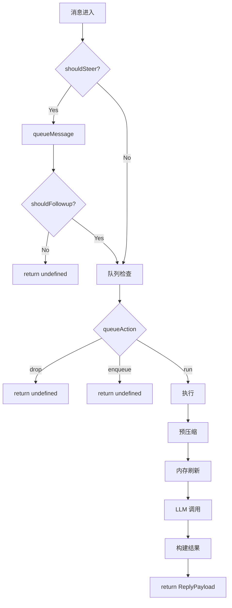

# 消息执行流程分析

> 本目录详细分析一条消息从接收到回复的完整执行流程。
>
> 分析日期：2026-05-04 | 版本：2026.5.3

---

## 目录结构

| 文件                                                                 | 函数                                | 作用                                   | 状态 |
| -------------------------------------------------------------------- | ----------------------------------- | -------------------------------------- | ---- |
| [README.md](README.md)                                               | -                                   | 详细目录和调用链                       | 完成 |
| [00-overview.md](00-overview.md)                                     | -                                   | **总览**：核心概念和流程概览           | 完成 |
| [01-monitor-transport.md](01-monitor-transport.md)                   | `monitorWebSocket`/`monitorWebhook` | **接入层**：WebSocket/Webhook 消息接收 | 完成 |
| [02-monitor-message-handler.md](02-monitor-message-handler.md)       | `createFeishuMessageReceiveHandler` | **解析层**：事件解析、去重、debounce   | 完成 |
| [03-handle-feishu-message.md](03-handle-feishu-message.md)           | `handleFeishuMessage`               | **业务层**：权限检查、路由解析         | 完成 |
| [04-run-channel-turn.md](04-run-channel-turn.md)                     | `runChannelTurn`                    | **编排层**：Turn 生命周期管理          | 完成 |
| [05-dispatch-reply-from-config.md](05-dispatch-reply-from-config.md) | `dispatchReplyFromConfig`           | **第 1 层**：分发协调器                | 完成 |
| [06-get-reply-from-config.md](06-get-reply-from-config.md)           | `getReplyFromConfig`                | **第 2 层**：回复准备器                | 完成 |
| [07-run-prepared-reply.md](07-run-prepared-reply.md)                 | `runPreparedReply`                  | **第 3 层**：执行准备器                | 完成 |
| [08-run-reply-agent.md](08-run-reply-agent.md)                       | `runReplyAgent`                     | **第 4 层**：Agent 编排器              | 完成 |
| [09-run-agent-turn.md](09-run-agent-turn.md)                         | `runAgentTurnWithFallback`          | **执行层**：Agent Turn 执行            | 完成 |
| [10-run-embedded-pi-agent.md](10-run-embedded-pi-agent.md)           | `runEmbeddedPiAgent`                | **Pi 层**：嵌入式 Pi Agent 运行        | 完成 |
| [11-run-agent-harness-attempt.md](11-run-agent-harness-attempt.md)   | `runAgentHarnessAttempt`            | **Harness 层**：Harness 尝试           | 完成 |
| [12-run-harness-v2-lifecycle.md](12-run-harness-v2-lifecycle.md)     | `runHarnessV2LifecycleAttempt`      | **V2 层**：Harness V2 生命周期         | 完成 |
| [13-provider-stream-completion.md](13-provider-stream-completion.md) | `Provider.streamCompletion`         | **Provider 层**：LLM API 调用          | 完成 |
| [14-reply-dispatcher.md](14-reply-dispatcher.md)                     | `ReplyDispatcher`                   | **分发层**：回复分发器                 | 完成 |
| [15-send-message-feishu.md](15-send-message-feishu.md)               | `sendMessageFeishu`                 | **发送层**：飞书消息发送               | 完成 |

---

## 四层调用架构

消息执行流程采用**四层调用架构**：

```
┌─────────────────────────────────────────────────────────────┐
│  Layer 1: dispatchReplyFromConfig                           │
│  文件: src/auto-reply/reply/dispatch-from-config.ts         │
│  作用: 分发协调 - 路由决策、快速路径、调用准备器             │
│  行数: ~1215                                                 │
└─────────────────────────────────────────────────────────────┘
                            │
                            ▼
┌─────────────────────────────────────────────────────────────┐
│  Layer 2: getReplyFromConfig                                 │
│  文件: src/auto-reply/reply/get-reply.ts                     │
│  作用: 回复准备 - 模型选择、会话初始化、调用执行器           │
│  行数: ~508                                                  │
└─────────────────────────────────────────────────────────────┘
                            │
                            ▼
┌─────────────────────────────────────────────────────────────┐
│  Layer 3: runPreparedReply                                    │
│  文件: src/auto-reply/reply/get-reply-run.ts                 │
│  作用: 执行准备 - prompt 构建、silent 处理、调用编排器       │
│  行数: ~717                                                  │
└─────────────────────────────────────────────────────────────┘
                            │
                            ▼
┌─────────────────────────────────────────────────────────────┐
│  Layer 4: runReplyAgent                                       │
│  文件: src/auto-reply/reply/agent-runner.ts                  │
│  作用: Agent 编排 - 队列管理、压缩、LLM 调用、结果构造       │
│  行数: ~980                                                  │
└─────────────────────────────────────────────────────────────┘
                            │
                            ▼
┌─────────────────────────────────────────────────────────────┐
│  Layer 5+: runAgentTurnWithFallback                          │
│           → runEmbeddedPiAgent                               │
│           → runAgentHarnessV2LifecycleAttempt                │
│           → Provider.streamCompletion                        │
│  作用: LLM 执行层 - 模型调用、流式响应、工具执行             │
└─────────────────────────────────────────────────────────────┘
```

---

## 完整调用链

```
dispatchReplyFromConfig (dispatch-from-config.ts:334)
    │
    ├── resolveSessionStoreLookup()        → 解析 Session Store
    ├── resolveSessionAgentId()            → 解析 Agent ID
    ├── resolveRoutingDecision()           → 路由决策
    ├── tryHandleFastPath()                → 快速路径 (/reset, /help)
    │
    ▼
getReplyFromConfig (get-reply.ts:173)
    │
    ├── resolveModelSelection()            → 模型选择 (provider/model)
    ├── resolveAgentWorkspaceDir()         → 工作目录
    ├── ensureAgentWorkspace()             → 创建工作空间
    ├── initSessionState()                 → 会话初始化
    ├── resolveReplyDirectives()           → 内联指令解析
    │
    ▼
runPreparedReply (get-reply-run.ts:343)
    │
    ├── resolvePromptSessionContext()      → Prompt 上下文
    ├── resolveSilentReplySettings()       → Silent 配置
    ├── prepareSessionState()              → Session 状态准备
    ├── buildPrefixedCommandBody()         → 前缀消息体
    │
    ▼
runReplyAgent (agent-runner.ts:888)
    │
    ├── createTypingSignaler()             → 打字指示器
    ├── resolveActiveRunQueueAction()      → 队列策略 (drop/enqueue/run)
    ├── [drop/enqueue]                     → 返回 undefined
    │
    ├── [run path]
    │   ├── createReplyOperation()         → 运行操作
    │   ├── runPreflightCompaction()       → 预压缩
    │   ├── runMemoryFlush()               → 内存刷新
    │   │
    │   ▼
    │   runAgentTurnWithFallback (agent-runner-execution.ts:871)
    │       │
    │       ├── resolveRuntimeConfig()     → 运行配置
    │       │
    │       ▼
    │       runEmbeddedPiAgent (pi-embedded-runner/run.ts:303)
    │           │
    │           ├── selectAgentHarness()   → 选择 Harness
    │           ├── resolveModelAsync()    → 模型解析
    │           ├── resolveRuntimePlan()   → 运行计划
    │           │
    │           ▼
    │           runAgentHarnessAttempt (harness/selection.ts:153)
    │               │
    │               ▼
    │               runAgentHarnessV2LifecycleAttempt (harness/v2.ts:187)
    │                   │
    │                   ├── prepare()      → buildPrompt/Tools
    │                   ├── start()        → initSession
    │                   ├── send()         → callAPI
    │                   │   │
    │                   │   ▼
    │                   │   Provider.streamCompletion() → LLM API
    │                   │       │
    │                   │       loop: StreamChunk → onBlockReply
    │                   │       │
    │                   │       ▼
    │                   │   resolveOutcome() → ReplyPayload
    │                   │
    │                   ▼
    │               返回: result + usage + meta
    │           │
    │           ▼
    │       返回: EmbeddedPiRunResult
    │   │
    │   ▼
    │   persistRunSessionUsage()           → 持久化 usage
    │   buildReplyPayloads()               → 构建 payload
    │   appendUsageLine()                  → 添加 usage 文本
    │   finalizeWithFollowup()             → 返回结果
    │
    ▼
dispatcher.sendFinalReply(reply)         → 发送最终回复
```

---

## 流程图

### 整体流程



### 队列决策分支



---

## 数据流演变

```
原始消息 (飞书事件)
    │
    ▼ parseFeishuMessageEvent
FeishuMessageContext
    { chatId, messageId, senderId, content, chatType }
    │
    ▼ buildFeishuAgentBody
Agent 输入文本
    "[message_id: xxx] GL: 国内模型和国外模型差距"
    │
    ▼ resolveSessionStoreLookup
Session Key
    "agent:main:feishu:direct:ou_xxx"
    │
    ▼ resolveModelSelection
模型选择
    { provider: "bailian", model: "glm-5" }
    │
    ▼ buildPromptSessionContext
API Payload
    { model, messages, tools, stream: true }
    │
    ▼ Provider.streamCompletion
StreamChunk (流式)
    { text: "国内模型...", finishReason: "stop" }
    │
    ▼ resolveOutcome
ReplyPayload
    { text, model, provider, usage }
    │
    ▼ dispatcher.sendFinalReply
飞书消息
    { receive_id, content, msg_type }
```

---

## 核心函数签名速查

### dispatchReplyFromConfig

```typescript
export async function dispatchReplyFromConfig(params: {
  ctx: FinalizedMsgContext;
  cfg: OpenClawConfig;
  dispatcher: ReplyDispatcher;
}): Promise<DispatchFromConfigResult>;
```

### getReplyFromConfig

```typescript
export async function getReplyFromConfig(
  ctx: MsgContext,
  sessionEntry: SessionEntry | undefined,
  opts?: GetReplyOptions,
): Promise<ReplyPayload | undefined>;
```

### runPreparedReply

```typescript
export async function runPreparedReply(params: {
  ctx: MsgContext;
  cfg: OpenClawConfig;
  agentId: string;
  sessionKey: string;
  storePath: string;
  modelState: ModelState;
  opts?: GetReplyOptions;
  // ... 更多参数
}): Promise<ReplyPayload | undefined>;
```

### runReplyAgent

```typescript
export async function runReplyAgent(params: {
  commandBody: string;
  followupRun: FollowupRun;
  queueKey: string;
  resolvedQueue: QueueSettings;
  sessionKey?: string;
  sessionEntry?: SessionEntry;
  defaultModel: string;
  sessionCtx: TemplateContext;
  typing: TypingController;
  blockStreamingEnabled: boolean;
  opts?: GetReplyOptions;
  // ... 更多参数
}): Promise<ReplyPayload | ReplyPayload[] | undefined>;
```

---

## 阅读顺序

推荐按以下顺序阅读：

1. **README.md**（本文）- 了解整体架构
2. **dispatch-reply-from-config.md** - 第 1 层分发协调
3. **get-reply-from-config.md** - 第 2 层回复准备
4. **run-prepared-reply.md** - 第 3 层执行准备
5. **run-reply-agent.md** - 第 4 层 Agent 编排（最复杂）

---

## 关键概念

| 概念                | 说明                                                                 |
| ------------------- | -------------------------------------------------------------------- |
| **Session Key**     | 会话标识，格式：`agent:<agentId>:<channel>:<peerKind>:<peerId>`      |
| **FollowupRun**     | 后续运行上下文，包含 agentId、sessionKey、provider、model 等         |
| **ReplyDispatcher** | 回复分发器，提供 sendBlockReply、sendFinalReply、sendToolResult 方法 |
| **Block Streaming** | 流式响应，实时更新飞书卡片                                           |
| **Compaction**      | 会话压缩，当历史超出 context window 时压缩旧消息                     |
| **Fallback**        | 模型降级，当主模型失败时尝试备用模型                                 |
| **ReplyOperation**  | 运行操作，管理运行生命周期（queued → running → completed）           |
| **TypingSignaler**  | 打字指示器控制器                                                     |

---

## 延伸阅读

- [../architecture.md](../architecture.md) - 项目整体架构
- [../session-management.md](../session-management.md) - 会话管理机制
- [../channel-routing.md](../channel-routing.md) - 渠道路由

---

> **文档版本**: 2026-05-04
> **分析基于**: OpenClaw v2026.5.3
